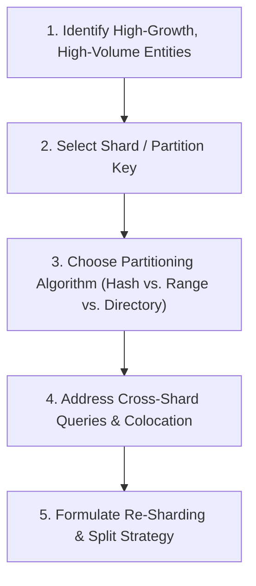
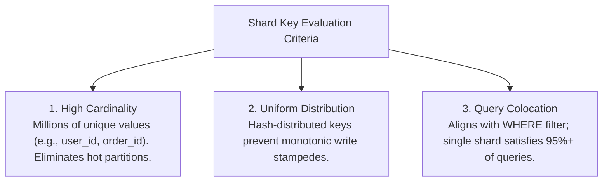

# 12 — Data Access Patterns & Sharding Strategy

## Purpose

Data Access Patterns and Sharding Strategy defines how an application reads, writes, partitions, and indexes data across physical storage instances to maximize throughput, minimize latency, prevent hot-spotting, and support unbounded data growth.

In distributed systems, the way an application accesses data dictates whether database storage can scale linearly or will succumb to lock contention and network saturation.

---

## Problem It Solves

- **The Monolithic Storage Ceiling**: Eliminates the hard vertical scaling wall where a single relational database exhausts CPU, RAM, or NVMe disk capacity.
- **The "Scatter-Gather" Anti-Pattern**: Prevents sharding data on a key that forces a simple read query to broadcast across 50 separate database shards to assemble a single result.
- **Hot Partition Collapse**: Prevents celebrity accounts or active enterprise tenants from overwhelming a single partition while other nodes sit idle.

---

## Inputs

- **Entity Data Model**: Primary entities, foreign keys, and relationships from Step 11.
- **Access Profiles**: Top 5 read queries and top 5 write mutations by frequency and SLA.
- **Scale Projections**: Total dataset size and annual growth rate from Step 07.

---

## Decision Process: Sharding Strategy Framework



---

## Partitioning & Sharding Key Selection

The choice of **Shard Key** is the most consequential decision in distributed data architecture:



### Partitioning Algorithms Compared

| Sharding Algorithm | Operational Mechanism | Pros | Cons / Risks | Best Used For |
|:---|:---|:---|:---|:---|
| **Hash-Based Sharding** | $\text{Shard} = \text{hash}(\text{key}) \pmod N$ or Consistent Hashing | Near-perfect uniform data distribution; eliminates hot spots | Range queries require querying all shards (Scatter-Gather) | User accounts, transactions, key-value stores |
| **Range-Based Sharding** | Partition by contiguous value ranges (e.g., Date: Jan, Feb, Mar) | Excellent range queries (`WHERE date BETWEEN X AND Y`) | Monotonic keys cause 100% of current writes to hit the latest shard | Time-series metrics, historical audit archives |
| **Directory-Based Sharding** | External lookup service maps entity ID to physical shard ID | Extreme flexibility; individual shards can be moved easily | Lookup service becomes a Single Point of Failure (SPOF) and latency hop | Multi-tenant B2B platforms, large enterprise accounts |

---

## Avoiding the Scatter-Gather Anti-Pattern

A distributed database query can be either **Single-Shard Routed** or **Scatter-Gather**:

```mermaid
flowchart TD
    subgraph SingleShard["1. Single-Shard Query: O(1) Network Hop (Target Architecture)"]
        Client1["Client Query: WHERE user_id = 42"] --> Router1["DB Router / Proxy"]
        Router1 -->|Direct Hash Route| ShardA["Shard A (Node 1)"]
        ShardA -->> Client1["Returns result in 2ms"]
    end

    subgraph ScatterGather["2. Scatter-Gather Query: O(N) Network Hops (Severe Bottleneck)"]
        Client2["Client Query: WHERE email = 'alice@corp.com'"] --> Router2["DB Router / Proxy"]
        Router2 -->|Broadcast| Shard1["Shard 1"]
        Router2 -->|Broadcast| Shard2["Shard 2"]
        Router2 -->|Broadcast| Shard3["Shard 3"]
        Router2 -->|Broadcast| ShardN["Shard N (50 Nodes)"]
        Note2["Router must wait for slowest node to finish.<br/>Latency collapses under load!"]
    end
```

### Mitigating Non-Shard-Key Queries
If a table is sharded by `user_id`, but users frequently log in using `email`:
1. **Global Secondary Index (GSI)**: Maintain an asynchronous lookup table mapping `email` $\rightarrow$ `user_id`.
2. **Search Index Offloading**: Index the entity in Elasticsearch/OpenSearch for ad-hoc search filters, retrieving the primary key to perform single-shard point lookups.

---

## Important Probing Questions

- *What is the primary filter in 90% of read queries? Does it match our proposed shard key?*
- *What happens when a single tenant grows from 1,000 records to 500 million records ("The Whale Problem")?*
- *Can we perform schema migrations across 64 database shards without downtime?*
- *How do we execute cross-shard aggregations (e.g., generating end-of-month financial reports)?*

---

## Common Mistakes

- **Sharding Too Early**: Adding sharding complexity when the total dataset is 50 GB and easily fits into a single $150/month PostgreSQL instance with read replicas.
- **Monotonic Shard Keys**: Sharding by auto-incrementing `id` or `created_at`, causing all concurrent writes to slam the single active shard holding the highest values.
- **Ignoring Distributed Transactions**: Expecting ACID transactions across multiple shards without designing compensating Saga workflows.

---

## Trade-offs

| Architecture | Benefit | Trade-off / Cost |
|:---|:---|:---|
| **Single High-Spec Database + Read Replicas** | Full ACID joins; zero sharding complexity; instant queries. | Vertical hardware limits (CPU/NVMe); failover latency. |
| **Distributed Sharded Architecture** | Theoretically unbounded horizontal write and storage capacity. | Cross-shard joins impossible; complex re-sharding and backup operations. |

---

## Production Considerations

- Use **Consistent Hashing with Virtual Nodes** (e.g., MurmurHash3) to minimize data movement when adding new physical shards to the cluster.
- Monitor **Shard Balance Metrics** continuously: alert on-call engineers if any single shard holds $> 20\%$ more data than the average shard.
