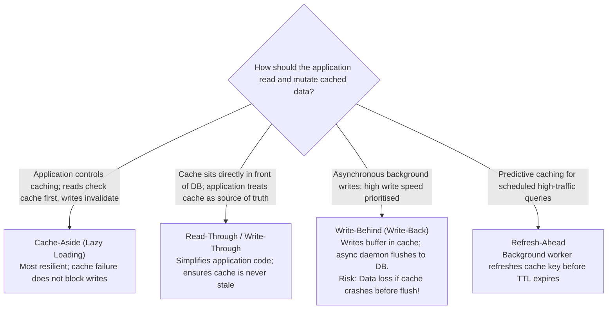
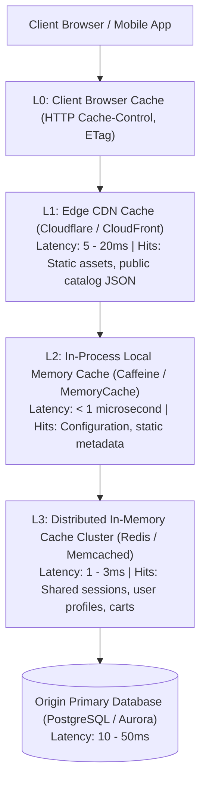

# 13 — Caching Strategy Architecture

## Purpose

Caching Strategy Architecture defines the patterns, topologies, invalidation mechanisms, and memory sizing rules used to temporarily store high-frequency data in ultra-fast, low-latency storage layers (in-memory RAM or edge CDN points of presence).

The primary objective is to **minimize read latency, maximize throughput, and protect backend relational databases and compute tiers from resource exhaustion**.

---

## Problem It Solves

- **Database CPU Thrashing**: Prevents repeated execution of identical, computationally expensive SQL queries across millions of concurrent users.
- **High Read Latency**: Reduces p99 data retrieval times from 50ms (disk I/O) to sub-millisecond (RAM / Redis).
- **Network Egress Bottlenecks**: Offloads origin server bandwidth by terminating static assets and cacheable JSON responses at edge CDNs.

---

## Inputs

- **Read/Write Asymmetry**: Throughput ratios and peak read QPS from Step 06.
- **Cache Capacity Sizing**: In-memory working set calculations (Pareto 80/20 rule) from Step 07.
- **Data Volatility & Stale Tolerance**: Acceptable time window before users must see newly updated records.

---

## Decision Process: Caching Patterns

---

## The Multi-Tier Caching Topology

Enterprise architectures deploy caching across multiple architectural tiers:

---

## Cache Invalidation Strategies

> *"There are only two hard things in Computer Science: cache invalidation and naming things."* — Phil Karlton

### 1. Time-to-Live (TTL) Expiration
Every cached key must have an explicit TTL. Keys without TTLs lead to memory exhaustion (OOM crashes) over time. Always add **Randomized Jitter to TTLs** (e.g., $300\text{s} \pm 30\text{s}$) to prevent thousands of keys from expiring at the exact same millisecond.

### 2. Explicit Event-Driven Invalidation
When an entity mutates (e.g., `UpdateUserProfile`), the application service publishes a domain event that explicitly issues a `DEL user:profile:102` command to Redis, ensuring immediate freshness.

---

## Mitigating Cache Failure Modes

| Cache Failure Mode | Failure Mechanism | Architectural Mitigation Strategy |
|:---|:---|:---|
| **Cache Stampede (Thundering Herd)**| A hot key expires; 10,000 concurrent requests miss the cache simultaneously and slam the database. | **Mutual Exclusion Mutex Lock**: Only the first thread acquires a lock to query the DB and warm the cache; remaining threads wait or return stale data. |
| **Cache Penetration** | Malicious requests query non-existent keys (`id = -9999`); queries bypass cache and repeatedly hit DB. | **Bloom Filter** in front of cache to reject non-existent keys; or **Negative Caching** (cache `null` with a short 60s TTL). |
| **Cache Breakdown** | Redis master node crashes or memory is completely evicted under memory pressure. | Redis Sentinel / Cluster automated failover; read replicas; circuit breaker with database rate limiter. |
| **Hot Key Saturation** | A single viral celebrity profile key overwhelms the network NIC of the single Redis shard holding that key. | Replicate the hot key across multiple key aliases (`user:102:shard_1`, `user:102:shard_2`) or cache in L2 local process memory. |

---

## Important Probing Questions

- *What is the business impact if a user sees data that is 5 seconds stale?*
- *What happens to the primary database if the entire Redis cache cluster is flushed or crashes? Can the DB survive the load?*
- *What is the cache eviction policy when memory fills up (e.g., LRU - Least Recently Used vs. LFU - Least Frequently Used)?*
- *Is sensitive customer PII stored in cache encrypted at rest and in transit (Redis TLS)?*

---

## Common Mistakes

- **Caching Un-sized Objects**: Storing large 50 MB binary files or complete serialized JSON object graphs in Redis, triggering high network latency and memory fragmentation.
- **The "Cache Everything" Trap**: Caching volatile data that changes on every request, wasting memory with a 0% cache hit ratio.
- **Assuming Redis Is 100% Reliable Storage**: Using Redis as a primary database without write-ahead append-only file (AOF) persistence or automated failover.

---

## Trade-offs

| Strategy | Benefit | Trade-off / Cost |
|:---|:---|:---|
| **High Caching Aggressiveness** | Microsecond response times; 90% reduction in database load. | High risk of stale data anomalies; complex invalidation pipelines. |
| **Zero Caching (Direct DB)** | 100% absolute data freshness and consistency at all times. | Poor read scalability; high database compute costs; vulnerable to traffic spikes. |

---

## Production Considerations

- Monitor **Cache Hit Ratio**: Trigger PagerDuty alerts if the hit ratio drops below **80%**.
- Enforce **Maxmemory Policies**: Configure `maxmemory-policy volatile-lru` or `allkeys-lru` in Redis to prevent out-of-memory crash loops.
