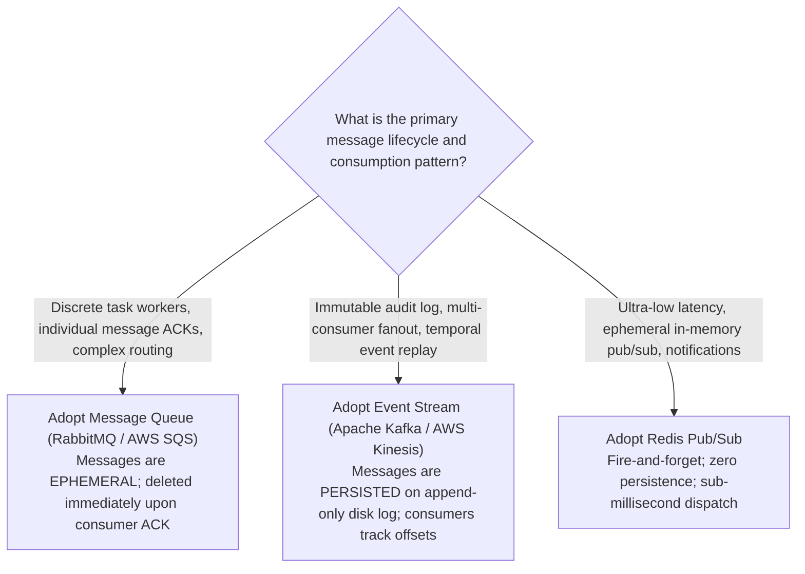
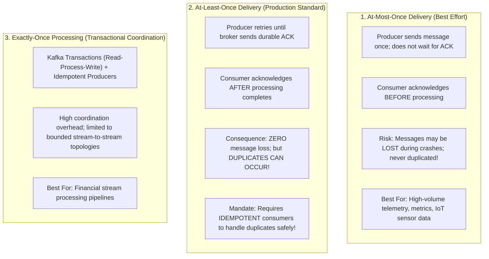
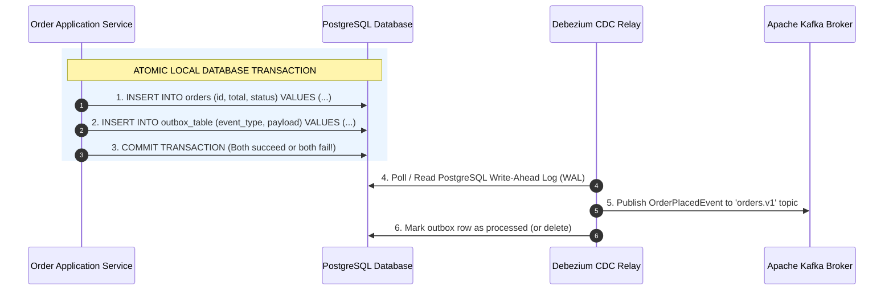
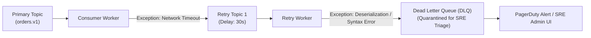

# 14 — Messaging & Event-Driven Architecture Strategy

## Purpose

Messaging and Event-Driven Architecture (EDA) Strategy defines the communication models, transport topologies, broker technologies, and delivery semantics used to exchange asynchronous messages and state-change events across distributed system components.

It achieves **extreme temporal and spatial decoupling**, enabling microservices to operate autonomously without blocking on the availability or latency of downstream systems.

---

## Problem It Solves

- **Cascading Outages**: Prevents a slow or offline third-party dependency (e.g., payment gateway or email vendor) from exhausting thread pools in upstream caller services.
- **Traffic Spikes & Surge Overload**: Acts as a massive shock absorber, flattening a spike of 50,000 requests/second into a smooth, steady stream that backend workers can process at a controlled rate.
- **Tight Coupling & Monolithic Release Trains**: Allows new business services to subscribe to existing event streams without requiring changes or redeployment of producer services.

---

## Inputs

- **Domain Events & Commands**: Domain boundaries and state transitions from Step 09.
- **Throughput & Retention Requirements**: Sizing numbers from Step 07.
- **Delivery Guarantee Requirements**: At-least-once vs. Exactly-once semantics.

---

## Decision Process: Queue vs. Stream Broker Selection

---

## The 3 Message Delivery Semantics

---

## Ensuring Zero Message Loss: The Transactional Outbox Pattern

A classic distributed systems failure occurs when an application commits a state change to its database, but crashes before publishing the event to Kafka ("Dual-Write Failure"):

---

## Consumer Error Handling: Dead Letter Queues (DLQ) & Retry Topics

Never let a malformed message ("poison pill") crash a consumer worker repeatedly, blocking the entire queue:

---

## Important Probing Questions

- *What happens if messages arrive out of order? Can consumers tolerate reordering, or is strict partition-key ordering mandatory?*
- *How are message schemas governed across teams? Are we using an Avro / Protobuf Schema Registry?*
- *What is the message retention policy on the broker (e.g., 7 days vs. 30 days vs. infinite)?*
- *What is the maximum acceptable consumer lag before alerting fires?*

---

## Common Mistakes

- **Assuming "Exactly-Once" is Magic**: Believing that setting `enable.idempotence=true` in Kafka eliminates the need to write idempotent consumer business logic. (End-to-end exactly-once requires idempotency keys at the application database layer).
- **Unbounded Queue Buildup**: Allowing queues to grow indefinitely without dead-letter limits, eventually exhausting broker disk space and causing total messaging collapse.
- **Mega-Payloads in Messages**: Sending 20 MB files through Kafka topics instead of uploading the binary to S3 and passing an S3 URI in the event payload (**Claim-Check Pattern**).

---

## Trade-offs

| Messaging Strategy | Advantage | Trade-Off / Cost |
|:---|:---|:---|
| **Event Streaming (Kafka)** | Immutable audit log; multi-consumer replay; extreme throughput. | High operational complexity (Zookeeper/KRaft, partition sizing, consumer lag). |
| **Simple Managed Queues (SQS)**| Zero server maintenance; simple pay-per-message pricing; auto-scaling. | Cannot replay historical messages; lacks multi-subscriber non-destructive reads. |

---

## Production Considerations

- Monitor **Consumer Lag**: Alert when the difference between the latest partition offset and the consumer group's committed offset exceeds defined thresholds.
- Enforce **Schema Compatibility Modes (BACKWARD / FULL)** in the Schema Registry to prevent producer deployments from breaking downstream consumers.
