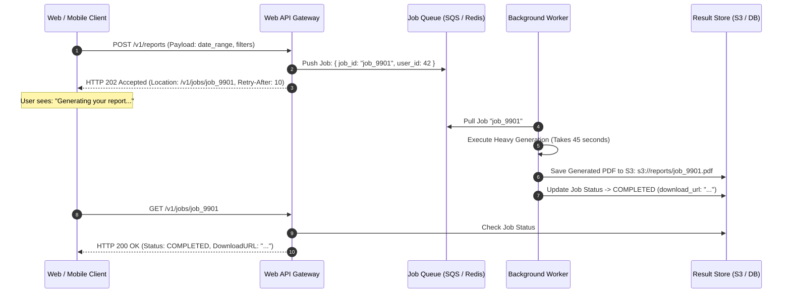

# 15 — Asynchronous Processing & Background Job Architecture

## Purpose

Asynchronous Processing Architecture defines the background execution models, distributed worker pools, job queues, schedulers, and coordination patterns used to execute long-running, resource-intensive, or deferred computational tasks outside the synchronous HTTP request-response lifecycle.

By offloading heavy computation (e.g., video transcoding, PDF invoice generation, batch credit reconciliation) to background workers, application web servers maintain sub-50ms latency and high availability.

---

## Problem It Solves

- **HTTP Request Timeout Errors**: Eliminates browser `HTTP 504 Gateway Timeout` errors caused by trying to execute 30-second tasks synchronously in web request threads.
- **Web Thread Pool Starvation**: Prevents computationally heavy tasks from hogging web server threads, ensuring web workers remain available to handle incoming user traffic.
- **Failure Isolation**: Allows background tasks to fail and retry independently without forcing user transactions to fail.

---

## Inputs

- **Task Workload Profiles**: Short tasks (< 5s) vs. heavy batch jobs (minutes to hours).
- **Scheduling Requirements**: Immediate trigger vs. delayed execution vs. recurring cron schedules.
- **Concurrency & Resource Profiles**: CPU-bound (video rendering) vs. I/O-bound (mass email dispatch).

---

## Decision Process: Asynchronous Execution Patterns

```mermaid
flowchart TD
    TaskNature{What is the execution duration and resource requirement?}
    
    TaskNature -->|Short tasks (< 30s), high volume, webhook dispatch, image resizing| WorkerQueue["Queue-Backed Worker Pool<br/>Celery / Sidekiq / Hangfire / BullMQ<br/>Stateless worker pods pull jobs from Redis/SQS"]
    
    TaskNature -->|Heavy computation (minutes to hours), video encoding, batch data ML| BatchCompute["Containerized Batch Compute<br/>AWS Batch / Kubernetes Jobs / Slurm<br/>Dynamically spins up dedicated GPU/CPU nodes; tears down upon completion"]
    
    TaskNature -->|Recurring temporal schedules (nightly billing, hourly sync)| DistScheduler["Distributed Scheduler<br/>Temporal / Quartz / AWS EventBridge Scheduler<br/>Enforces leader election to prevent duplicate cron executions"]
    
    TaskNature -->|Multi-step stateful workflows with compensations| WorkflowOrch["Workflow Orchestrator<br/>Temporal / Cadence / AWS Step Functions<br/>Durable execution preserving state across process crashes"]
```

---

## The Client Interaction Model for Long-Running Jobs

When an operation requires more than 500ms, the API must transition from synchronous execution to the **Asynchronous Polling or WebSocket Notification Pattern**:



---

## Distributed Cron Schedulers: Preventing Duplicate Execution

Running cron jobs in a multi-instance container environment (e.g., 5 replicas of an API pod) leads to a severe failure mode: **all 5 pods trigger the midnight billing cron simultaneously, charging customers 5 times**.

### Architectural Mitigations
1. **Distributed Locks (Redis Redlock / DB Lock)**: The cron task attempts to acquire a mutex lock (`SET cron:billing:2026-09-05 "LOCKED" NX EX 3600`). Only the winning pod executes the job; remaining pods exit.
2. **Dedicated Cloud Scheduler**: Decouple scheduling from application compute. Use **AWS EventBridge Scheduler** or a Kubernetes CronJob that publishes a single message to a job queue at midnight, ensuring exactly one queue consumer picks up the task.
3. **Durable Workflow Engines (Temporal)**: Use Temporal schedules; Temporal's distributed consensus engine guarantees single execution with automated retries.

---

## Important Probing Questions

- *Is the background task idempotent? What happens if a worker crashes halfway through and the task is picked up by another worker?*
- *How is job progress communicated to the end user (polling vs. WebSockets vs. push notifications)?*
- *What is the maximum job execution time before the worker is assumed dead and the job is re-queued?*
- *How are worker pools auto-scaled? Are they scaled on CPU or queue backlog depth?*

---

## Key Metrics

- **Queue Depth / Backlog Size**: Number of pending jobs waiting to be processed.
- **Job Dwell Time (Lag)**: Time elapsed from when a job is enqueued to when a worker begins processing it.
- **Job Processing Duration**: Average and p99 time required to execute the job.
- **Job Failure & Retry Rate**: % of jobs failing and routing to Dead Letter Queues.

---

## Common Mistakes

- **Non-Idempotent Workers**: Writing workers that assume they will only execute once, causing double-payouts or duplicate emails when network timeouts trigger job retries.
- **Scaling Workers on CPU Instead of Queue Lag**: Scaling worker pods on CPU utilization when the queue is backing up with 500,000 jobs. Workers must be scaled using **KEDA (Kubernetes Event-driven Autoscaling)** based on queue depth.
- **Passing Large Payloads through Job Queues**: Serializing large data arrays into queue payloads instead of storing state in the database/S3 and passing only the Entity ID in the job payload.

---

## Trade-offs

| Strategy | Advantage | Trade-Off / Cost |
|:---|:---|:---|
| **Asynchronous Job Offloading** | Instant sub-50ms web API latency; complete web resilience. | Complex client interaction model (requires polling or WebSockets). |
| **Synchronous Execution** | Simple client mental model; immediate pass/fail result. | High risk of HTTP gateway timeouts; web thread pool exhaustion. |

---

## Production Considerations

- Deploy **Graceful Shutdown Handlers** in worker pods (intercepting `SIGTERM`): allow active jobs up to 30 seconds to finish processing before terminating during deployments.
- Set up automated **Dead-Letter Job Dashboards** to allow SRE teams to inspect failed payloads and trigger one-click bulk re-queueing.
