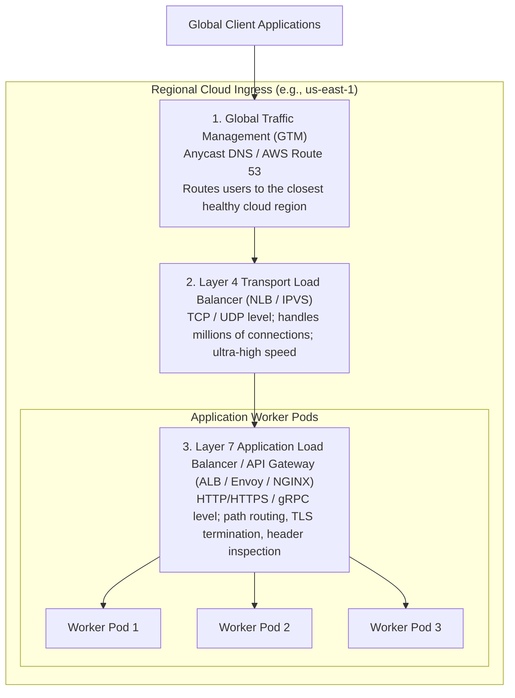
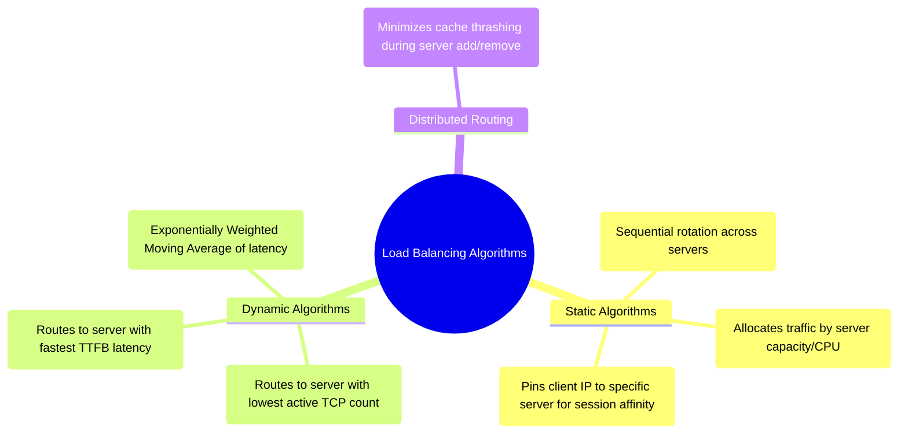
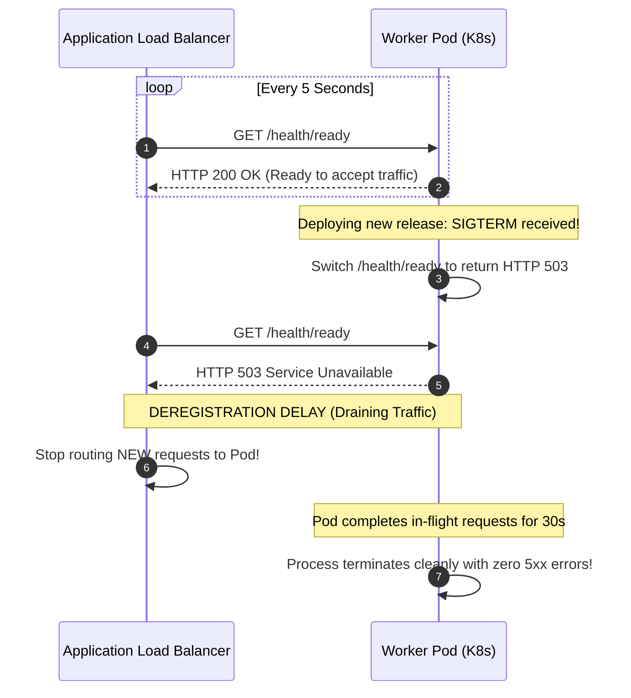

# 17 — Load Balancing & Traffic Routing Strategy

## Purpose

Load Balancing and Traffic Routing Strategy defines how incoming network traffic from client devices, web browsers, and external APIs is distributed across available compute instances, microservices, and geographic data centers.

The primary goal is to **prevent server overload, minimize latency, maximize hardware utilization, and ensure zero-downtime failover** when individual backend instances or entire availability zones fail.

---

## Problem It Solves

- **Server Hot-Spotting**: Prevents one application server from being overwhelmed with 10,000 connections while adjacent servers sit idle.
- **Single Points of Failure (SPOF)**: Automatically detects dying or unresponsive backend pods and reroutes traffic within milliseconds without user disruption.
- **Geographic Network Latency**: Routes global users to the nearest physical data center or cloud region using Anycast and geo-DNS routing.

---

## Inputs

- **Network Protocol Requirements**: TCP/UDP (L4) vs. HTTP/HTTPS/gRPC (L7).
- **Session State Requirements**: Stateless tokens (JWT) vs. Stateful sticky sessions.
- **Traffic Volume & Surge Multipliers**: Sizing calculations from Step 06.

---

## Decision Process: The Load Balancing Layer Hierarchy

---

## Layer 4 vs. Layer 7 Load Balancing

| Architectural Vector | Layer 4 Load Balancing (NLB / IPVS) | Layer 7 Load Balancing (ALB / Envoy / Kong) |
|:---|:---|:---|
| **OSI Layer** | Layer 4 (Transport Layer: TCP / UDP) | Layer 7 (Application Layer: HTTP, HTTPS, gRPC, WebSockets) |
| **Payload Inspection**| None; packet bytes are routed blindly based on IP and port | Full inspection of HTTP headers, cookies, query parameters, path |
| **Throughput & Latency**| Extreme throughput; microsecond latency; ultra-low CPU | Higher CPU consumption; adds 1–5ms for TLS and header parsing |
| **Routing Intelligence**| Simple: IP hash, Round Robin, Least Connections | Sophisticated: Path-based (`/orders` vs `/billing`), Host-based, Canaries |
| **TLS Termination** | Passes raw encrypted TCP bytes to backends, or basic TLS offload | Full TLS 1.3 termination, certificate management, mTLS inspection |
| **gRPC Multiplexing** | Poor (Pins all multiplexed RPCs to a single backend pod) | Native (Distributes individual gRPC RPC streams across pods) |

---

## Load Balancing Algorithms Compared

1. **Round Robin**: Distributes requests sequentially. Ideal only when all backend servers have identical hardware and all requests require identical processing time.
2. **Least Connections**: Dynamically routes to the server currently handling the fewest active connections. **The recommended default for long-lived HTTP/1.1 or WebSocket connections.**
3. **Peak EWMA (Exponentially Weighted Moving Average)**: Tracks real-time latency percentiles; routes traffic away from servers experiencing garbage collection (GC) pauses or disk I/O wait.

---

## Health Checks & Graceful Drain Mechanics

A load balancer is only as effective as its health-checking mechanism:

---

## Important Probing Questions

- *Are client sessions strictly stateless (JWT), or does the architecture require sticky sessions? (Sticky sessions degrade load distribution).*
- *How does the load balancer handle gRPC over HTTP/2? (Requires L7 load balancing to avoid pinning all traffic to one pod).*
- *What is the configured health check timeout, retry count, and deregistration delay?*
- *Is Cross-Zone Load Balancing enabled to distribute traffic evenly across Availability Zones?*

---

## Common Mistakes

- **Routing gRPC over L4 Load Balancers**: Placing a TCP-level L4 load balancer in front of gRPC microservices. Because HTTP/2 multiplexes all requests across a single persistent TCP connection, L4 routes **100% of all client requests to a single backend pod**, leaving the rest completely idle.
- **Overly Aggressive Health Checks**: Setting health probes to execute every 500ms with a 1-strike failure threshold, causing transient network blips to eject healthy servers and trigger cascading cluster collapse.
- **Deep Health Check Cascades**: Writing health checks that query the primary database, Redis, and downstream payment APIs. If a downstream payment gateway goes down, the health check fails, **causing the load balancer to kill all application web pods**! (Health checks must evaluate only local pod readiness).

---

## Trade-offs

| Load Balancer Tier | Advantage | Trade-Off / Cost |
|:---|:---|:---|
| **Layer 4 (NLB)** | Massive throughput (millions of connections); ultra-low latency. | Zero application-layer routing intelligence; cannot inspect HTTP headers. |
| **Layer 7 (ALB / Envoy)**| Rich path routing, header-based canaries, TLS offloading, WAF integration. | Higher latency overhead; higher CPU and cloud infrastructure cost. |

---

## Production Considerations

- Deploy **Envoy / Service Mesh Sidecars** for internal microservice-to-microservice RPC to achieve client-side L7 load balancing with sub-millisecond overhead.
- Ensure all backend pods implement separate **`/health/live` (Liveness)** and **`/health/ready` (Readiness)** endpoints.
