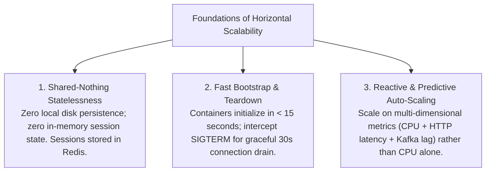
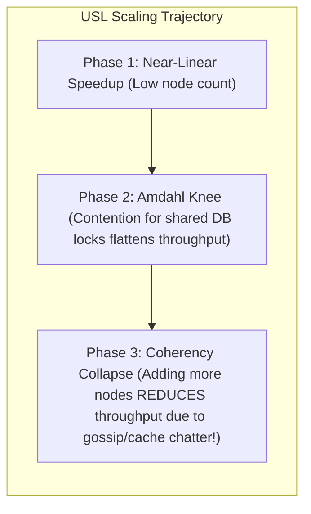

# 18 — Horizontal & Vertical Scaling Strategy

## Purpose

Scaling Strategy defines the engineering mechanisms, architectural boundaries, and automation policies used to expand a system's computational and data processing capacity in response to increasing user demand, data accumulation, and traffic volatility.

It establishes how the architecture scales **both horizontally (scaling out across distributed nodes) and vertically (scaling up single-node hardware)** while maintaining predictable latency and linear cost economics.

---

## Problem It Solves

- **The Monolithic Hardware Ceiling**: Prevents systems from stalling when the largest commercially available cloud instance (e.g., 128 vCPUs, 1 TB RAM) is fully saturated.
- **Unbounded Cloud Inefficiency**: Prevents super-linear cost expansion, ensuring that a 10x increase in user traffic does not cause a 40x explosion in cloud hosting spend.
- **Scaling Lag & Dropped Packets**: Eliminates traffic dropouts during sudden surges by establishing pre-warmed headroom buffers and predictive auto-scaling policies.

---

## Inputs

- **Traffic Profiles & Diurnal Curves**: Peak-to-average multipliers from Step 06.
- **Capacity Knee-Points**: Saturation metrics from Step 08.
- **Statefulness Classification**: Stateless compute vs. stateful storage tiers.

---

## Decision Process: Scaling Dimensions

```mermaid
flowchart TD
    TierClassification{What is the architectural layer being scaled?}
    
    TierClassification -->|Stateless Compute (Web APIs, Microservices, Worker Daemons)| H_Scale["Horizontal Auto-Scaling (Scale-Out)<br/>Kubernetes HPA / AWS Auto-Scaling Groups<br/>Add/remove commodity container pods dynamically based on CPU/Queue Lag"]
    
    TierClassification -->|Relational Database Primary (Writes & ACID Invariants)| V_Scale["Vertical Scaling (Scale-Up) + Read Replicas<br/>Upgrade instance family (e.g., db.r6g.xlarge -> 4xlarge)<br/>Offload read queries to horizontal read replicas"]
    
    TierClassification -->|Distributed Storage (NoSQL, Key-Value, Caches)| P_Scale["Partition-Based Horizontal Scaling<br/>Consistent Hashing across shards<br/>Add storage nodes to the cluster and rebalance hash rings"]
```

---

## The 3 Foundations of Horizontal Compute Scalability

Horizontal scalability is physically impossible unless compute nodes adhere to three strict architectural rules:



---

## The Universal Scalability Law (USL - Neil Gunther)

Adding nodes to a distributed system does not yield infinite linear throughput. The **Universal Scalability Law** calculates the real-world mathematical throughput ceiling by incorporating **Concurrency Contention ($\sigma$)** and **Cross-Node Coherency Penalty ($\kappa$)**:

$$C(N) = \frac{N}{1 + \sigma(N - 1) + \kappa N(N - 1)}$$



> [!CAUTION]
> **Architectural Law**: In poorly decoupled systems with high cross-node synchronization ($\kappa$), adding more servers can actually make the system **slower**, not faster!

---

## Auto-Scaling Metrics & Policies

Never configure auto-scaling based solely on a single metric (like CPU utilization). A system with high database connection pool waiting can experience severe latency spikes while CPU sits idle at 30%.

| Architectural Tier | Primary Auto-Scaling Metric | Target Threshold | Cooldown / Stabilization Window |
|:---|:---|:---:|:---:|
| **Public REST API Pods** | Ingress Request Rate (RPS) + CPU | 65% CPU or 1,200 RPS/pod | 60s scale-up / 300s scale-down |
| **Asynchronous Event Workers**| **Kafka Consumer Lag / SQS Queue Depth** | $> 500$ messages unconsumed per pod | 30s scale-up / 600s scale-down |
| **Relational Read-Replicas** | Database CPU Utilization + Replica Lag | 70% CPU or $< 100\text{ms}$ lag | 300s scale-up / 900s scale-down |
| **Distributed Cache (Redis)** | Memory Saturation (`maxmemory`) | 75% memory used | Proactive cluster shard addition |

---

## Important Probing Questions

- *What is the cold-start initialization duration of an application container pod? (Must be $< 30\text{ seconds}$).*
- *How does the system handle down-scaling during low-traffic overnight hours? Are active in-flight user requests gracefully drained?*
- *What is the maximum instance scale limit configured in cloud auto-scaling policies to prevent runaway billing during DDoS attacks?*
- *Can our relational database primary scale vertically without requiring scheduled downtime? (e.g., Aurora zero-downtime compute scaling).*

---

## Common Mistakes

- **Storing User Sessions in Container Memory**: Storing session tokens or shopping carts in local application memory (`HttpContext.Session`), which causes users to be logged out whenever the auto-scaler kills or adds a pod.
- **Asymmetric Scaling Loops (Flapping)**: Setting scale-up and scale-down thresholds too close together (e.g., scale up at 70% CPU, scale down at 65%), causing pods to be continuously created and destroyed every 2 minutes.
- **Ignoring Database Connection Exhaustion during Scale-Out**: Allowing an auto-scaling group to scale from 10 to 100 pods, which slams PostgreSQL with 10,000 connections and instantly crashes the database.

---

## Trade-offs

| Scaling Vector | Advantage | Trade-Off / Cost |
|:---|:---|:---|
| **Vertical Scaling (Scale-Up)** | Zero distributed complexity; instant ACID; simple local architecture. | Hard hardware ceilings; exponential hardware pricing at the high end; single point of failure during maintenance. |
| **Horizontal Scaling (Scale-Out)**| Virtually unbounded scale; high fault isolation; commodity cloud pricing. | Distributed systems complexity; eventual consistency; requires container orchestrators. |

---

## Production Considerations

- Deploy **KEDA (Kubernetes Event-driven Autoscaling)** to scale background workers directly against queue depth and Kafka consumer lag.
- Implement **Capacity Over-Provisioning (Pause Pods)**: Keep 2–3 idle "balloon pods" running in the Kubernetes cluster with low priority; when real traffic spikes, Kubernetes evicts the balloon pods instantly to give immediate compute to incoming traffic while cloud nodes provision.
