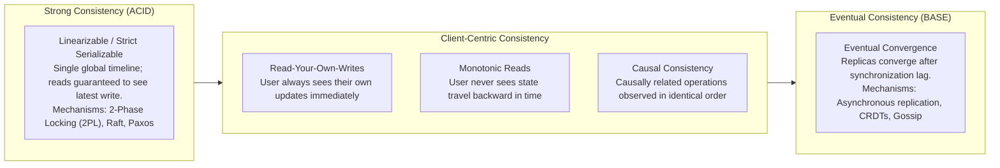
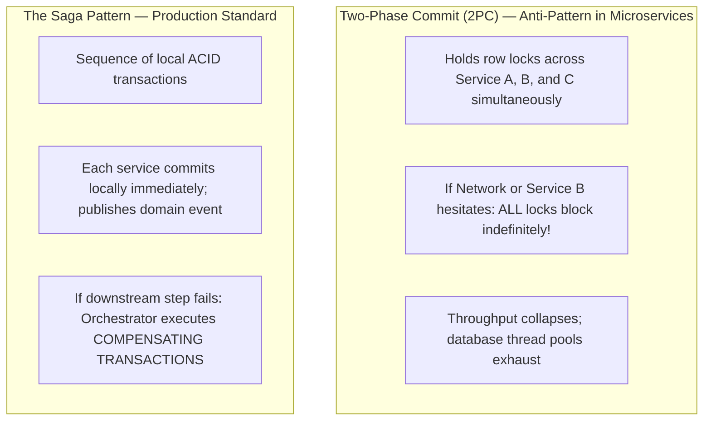

# 19 — Consistency & Transaction Strategy

## Purpose

Consistency and Transaction Strategy defines the mathematical and architectural rules governing how state changes are coordinated, replicated, validated, and observed across distributed database nodes and independent microservices.

It reconciles the eternal tension between **Data Correctness (Linearizability/ACID)** and **System Availability and Low Latency (BASE/Eventual Consistency)** as articulated by the CAP and PACELC theorems.

---

## Problem It Solves

- **Double-Spend & Overdraft Anomalies**: Prevents race conditions where concurrent requests concurrently withdraw money from an account, corrupting financial balances.
- **The "Read-Your-Own-Writes" Disconnect**: Prevents the classic user experience glitch where a customer updates their profile or creates a post, refreshes the page, and sees their old data because of asynchronous read-replica lag.
- **Distributed Two-Phase Commit (2PC) Paralysis**: Prevents adopting synchronous distributed locks across microservices that freeze the entire platform whenever a network partition occurs.

---

## Inputs

- **Business Consistency Invariants**: Requirements from Step 03 and Step 04 (e.g., "Ledger must never be negative" vs. "Like counter can be slightly stale").
- **Persistence Engines & Topologies**: Database selections from Step 16.
- **Network Latency & Geo-Distribution**: Multi-region requirements from Step 06.

---

## Decision Process: The Consistency Spectrum



---

## CAP Theorem & The PACELC Trade-Off

The **PACELC Theorem** defines the exact architectural choices available during normal operation and during network partitions:

$$\text{If } \mathbf{P} \text{ (Partition): } \mathbf{A} \lor \mathbf{C}, \quad \text{EL} \text{se: } \mathbf{L} \lor \mathbf{C}$$

```
+-------------------------------------------------------------------------------+
|                               PACELC THEOREM                                  |
+-------------------------------------------------------------------------------+
| Under Network Partition (P):                                                  |
|   - Choose AVAILABILITY (A): Return potentially stale data (AP system)        |
|   - Choose CONSISTENCY (C): Reject writes rather than risk divergence (CP)   |
|                                                                               |
| Under Normal Operational Health (E - Else):                                   |
|   - Choose LATENCY (L): Replicate asynchronously; sub-millisecond writes      |
|   - Choose CONSISTENCY (C): Replicate synchronously; wait on cross-node quorum|
+-------------------------------------------------------------------------------+
```

### System Classifications
- **PC/EC (e.g., Google Spanner, CockroachDB)**: Chooses Consistency under partition; chooses Consistency (quorum sync) under normal health. Maximum correctness at the cost of higher latency.
- **PA/EL (e.g., Amazon DynamoDB with eventual consistency, Apache Cassandra)**: Chooses Availability under partition; chooses Low Latency (asynchronous replication) under normal health. Blazing performance with eventual convergence.

---

## The Distributed Transaction Dilemma: 2PC vs. Sagas

In a microservices architecture, traditional database transactions (ACID) cannot span independent service databases without catastrophic performance collapse:



---

## Ensuring "Read-Your-Own-Writes" Consistency

When using read-replicas, asynchronous replication lag (e.g., 50ms to 2 seconds) causes users to see stale data immediately after mutating their account.

### Architectural Solutions
1. **Primary Routing Window**: When a user executes a write operation, set a temporary cookie or Redis token (`user:last_write:timestamp`). For the next **5 seconds**, route all read queries for that user directly to the **Primary Database**, bypassing read replicas.
2. **Version Matching**: Return a `version` or `timestamp` in the mutation API response. The client passes this version in subsequent `GET` requests; the read replica answers only if its replicated version is $\ge \text{target version}$.

---

## Important Probing Questions

- *What is the financial, legal, or operational impact if a user observes data that is 2 seconds out of date?*
- *Are we attempting to force strong consistency on non-critical metadata (e.g., video view counts, review likes)?*
- *How does the system resolve conflicting concurrent writes in an eventual consistency model (Last-Write-Wins vs. CRDTs vs. manual human review)?*
- *Are all Sagas designed with idempotent compensating actions?*

---

## Common Mistakes

- **Assuming "Eventual Consistency" Means "Inconsistent Forever"**: Failing to design conflict resolution strategies or monitoring replication lag, allowing data to permanently diverge across replicas.
- **Using Last-Write-Wins (LWW) with Unsynchronized System Clocks**: Relying on server system clocks (`DateTime.UtcNow`) for conflict resolution across distributed nodes, leading to silent data deletion due to **clock skew**.
- **Distributed 2PC Across Microservices**: Attempting to use distributed transaction managers across independent cloud microservices.

---

## Trade-offs

| Consistency Level | Advantage | Trade-Off / Cost |
|:---|:---|:---|
| **Strong Linearizable Consistency** | Perfect correctness; zero stale reads; simple mental model. | Higher write latency; lower throughput; reduced availability under network partitions. |
| **Eventual Consistency** | Maximum horizontal scalability; sub-millisecond writes; high availability. | Complex application logic (requires Sagas, compensations, optimistic client UIs). |

---

## Production Considerations

- Use **Optimistic Concurrency Control (OCC)** with version numbers (`WHERE version = 5`) on critical entities to catch concurrent mutation race conditions without pessimistic database row locking.
- Standardize on **Conflict-Free Replicated Data Types (CRDTs)** for distributed collaborative data models (e.g., collaborative document editing, shopping cart additions).
