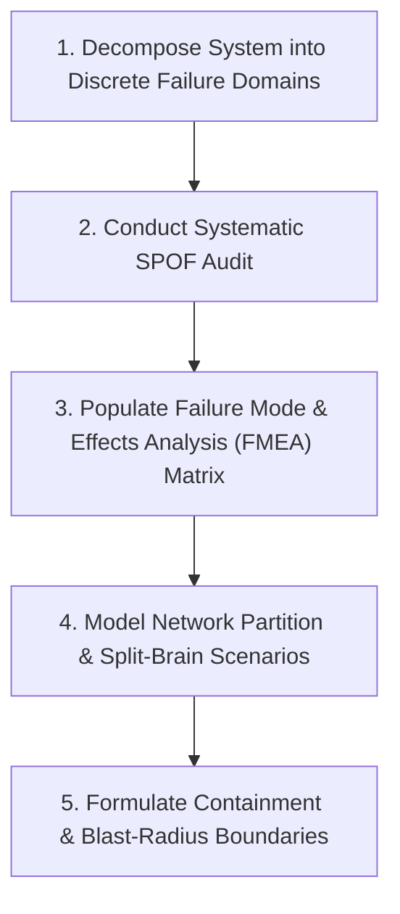
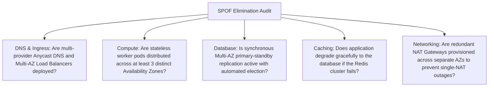
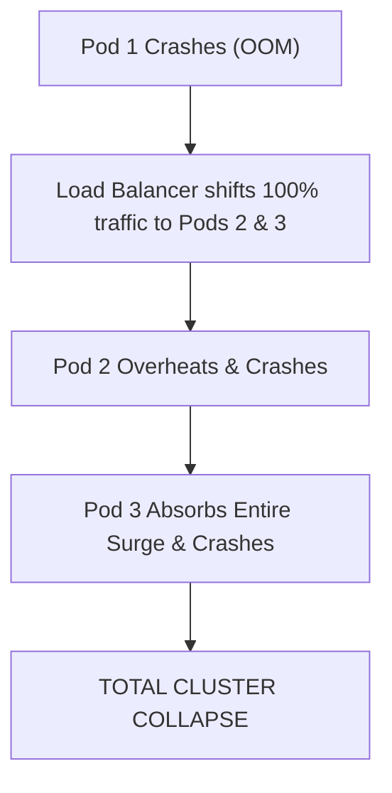

# 20 — Failure Mode & Single Point of Failure (SPOF) Analysis

## Purpose

Failure Analysis is the systematic architectural practice of stress-testing a system design against potential hardware crashes, network partitions, software defects, downstream provider outages, and human operational errors before implementation.

It operationalizes the fundamental axiom of distributed systems engineering: **Failure is not an exception; in large-scale distributed architectures, component failure is a continuous statistical certainty.**

---

## Problem It Solves

- **The "Happy-Path" Delusion**: Prevents teams from building architectures that function only under ideal lab conditions and experience catastrophic total blackouts during the first minor network blip.
- **Single Points of Failure (SPOF)**: Identifies and eliminates un-replicated components whose failure halts the entire enterprise business operation.
- **Uncontrolled Cascading Collapses**: Prevents a minor glitch in an auxiliary service (e.g., product reviews) from exhausting threads and taking down core revenue paths (e.g., checkout).

---

## Inputs

- **C4 Container & Component Diagrams**: Architectural topologies from Step 09 and Step 10.
- **External Dependency Specifications**: Third-party APIs, SaaS vendors, payment gateways, legacy mainframes from Step 02.
- **Hardware & Cloud Infrastructure Topology**: Virtual networks, AZs, subnets, and database clusters from Step 16 and Step 17.

---

## Decision Process: Failure Mode and Effects Analysis (FMEA)

---

## The SPOF Elimination Checklist

Every architectural tier must be audited for hidden Single Points of Failure:

---

## Enterprise FMEA Matrix (Failure Mode & Effects Analysis)

| Component | Failure Mode | Root Cause | Blast Radius (Impact) | Severity (1-5) | Architectural Mitigation Strategy |
|:---|:---|:---|:---|:---:|:---|
| **API Gateway** | Complete Ingress Blackout | Memory leak during sudden traffic spike | 100% of external customer traffic dropped | **5 (Catastrophic)** | Multi-AZ auto-scaling pod group; Cloudflare edge static fallback error page. |
| **Primary Database** | Primary Node Crash / Disk Failure | Hypervisor termination / kernel panic | All write transactions stall | **5 (Catastrophic)** | AWS Aurora Multi-AZ automated failover elects standby within 30s; write buffering in Kafka. |
| **Distributed Cache (Redis)**| Complete Cluster Flush / OOM | Master node crash / memory eviction | Sudden surge of 25k QPS slams DB, crashing DB | **4 (Major)** | Mutex locks on cache misses (XFetch algorithm); circuit breakers with database rate limiters. |
| **Third-Party Payment API** | Hanging / Latency Spike (30s) | Partner bank network congestion | Web worker threads exhaust waiting on sockets | **4 (Major)** | Circuit Breaker (Polly/Resilience4j) trips after 5 timeouts; async queue buffers requests. |
| **Search Engine (Elasticsearch)**| Cluster Split-Brain / Crash | Unbalanced JVM garbage collection pause | Full-text catalog searches fail | **3 (Moderate)** | Graceful fallback to basic PostgreSQL B-Tree indexed search for core SKU lookups. |

---

## Distributed Failure Scenarios

### Scenario 1: The Cascading Death Spiral
When one container instance crashes under load, the load balancer immediately redirects its traffic to surviving instances. Overloaded, the surviving instances crash in rapid succession:

- **Architectural Resolution**: **Load Shedding & Adaptive Rate Limiting**. Surviving nodes monitor their own CPU and queue latency; when saturation exceeds 85%, they aggressively reject low-priority traffic with `HTTP 503` rather than attempting to process everything and crashing.

### Scenario 2: Split-Brain Condition during Network Partition
In a 3-node database cluster, if network communication between Node A and Nodes B/C is severed:
- **Architectural Resolution**: **Strict Quorum Consensus ($Q = \lfloor N/2 \rfloor + 1$)**. A partition can only elect a leader or accept writes if it possesses a strict majority of votes ($2 \text{ out of } 3$). Node A (minority) immediately steps down to read-only mode, preventing data divergence.

---

## Important Probing Questions

- *What happens when a downstream microservice experiences a 10-second GC pause? Does our caller service fail gracefully?*
- *Can our system survive the complete loss of an entire AWS Availability Zone (power loss or fiber cut)?*
- *What is the blast radius if an unauthenticated user injects a "poison pill" malformed payload into our queue?*
- *If our cloud identity provider (Okta/Auth0) suffers a global outage, can existing authenticated sessions continue operating?*

---

## Common Mistakes

- **Assuming Clouds Don't Fail**: Trusting cloud provider marketing and assuming managed services (S3, RDS, DynamoDB) never experience regional outages.
- **Missing Socket Timeouts**: Leaving HTTP client socket timeouts at default (often infinite or 60 seconds), allowing slow dependencies to tie up caller threads indefinitely.
- **Deep Health Check Cascades**: Having service health endpoints ping third-party dependencies, causing a third-party glitch to kill all internal service pods simultaneously.

---

## Trade-offs

| Strategy | Advantage | Trade-Off / Cost |
|:---|:---|:---|
| **Multi-Region Active-Active Topology** | Immunity to single-region cloud blackouts; near-zero RTO. | 3x to 4x infrastructure cost; multi-region data conflict resolution complexity. |
| **Single-Region Multi-AZ Topology** | Simpler data consistency; cost-effective; 99.99% availability. | Vulnerable to rare full-region cloud outages until DR failover triggers. |

---

## Production Considerations

- Subject the architecture to regular **Automated Chaos Engineering (Chaos Mesh / Gremlin)** in pre-production, validating that killing random pods or injecting 500ms network latency does not trigger SLA violations.
