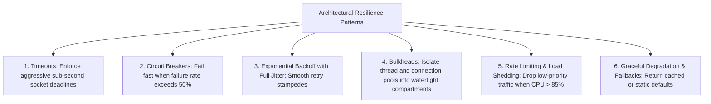
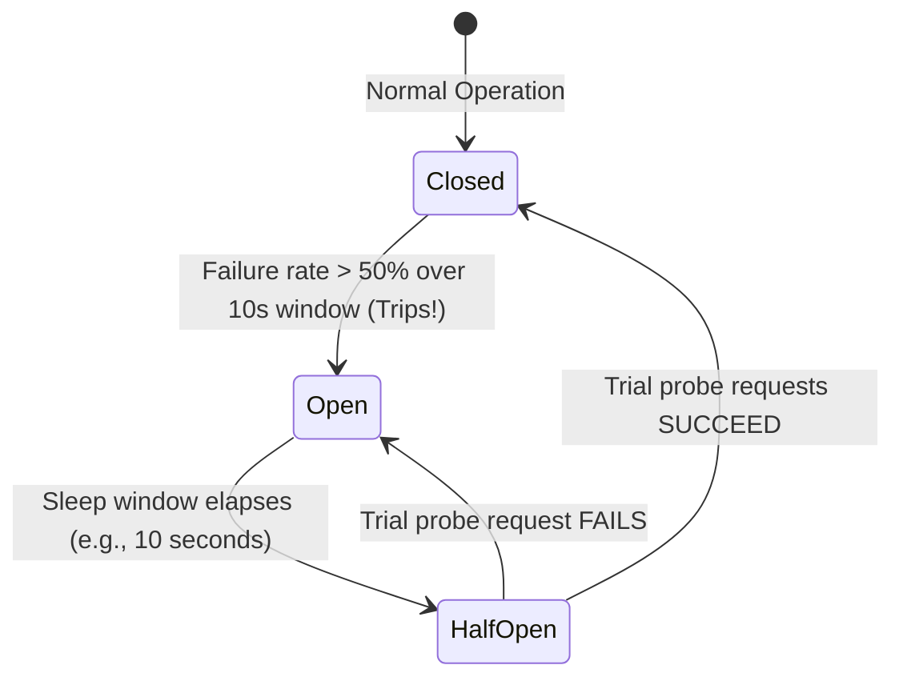
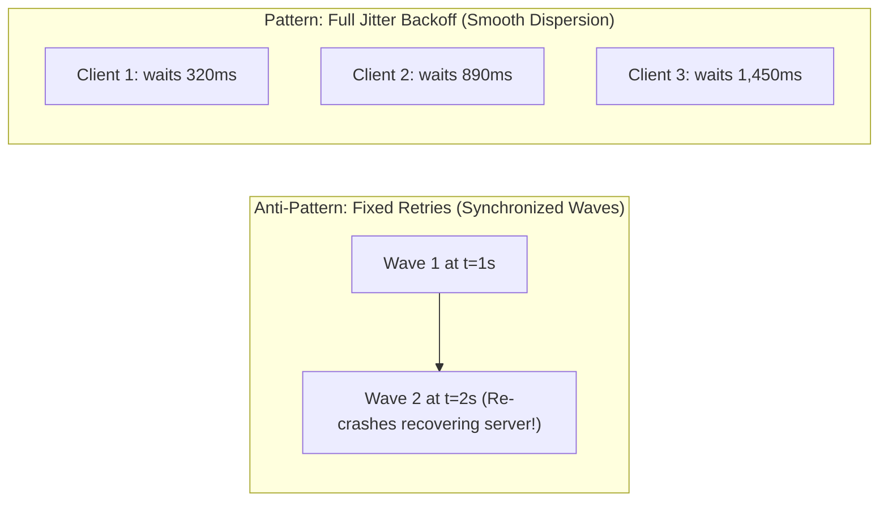
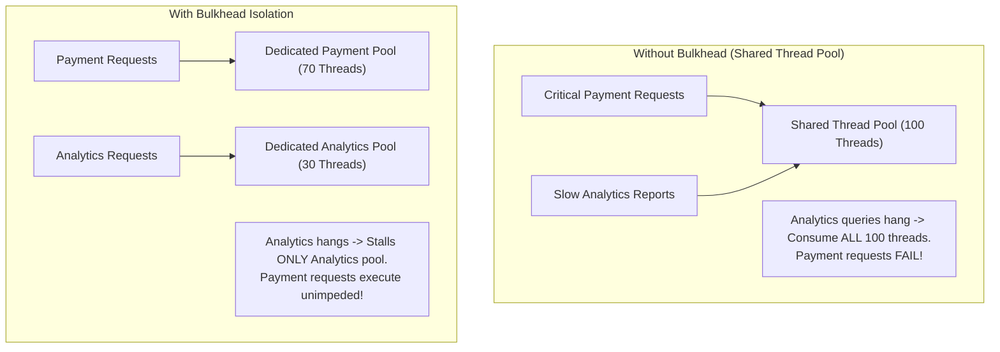

# 21 — Resilience & Fault Tolerance Strategy

## Purpose

Resilience Strategy defines the architectural patterns, protective mechanisms, and fault-tolerance policies that enable a distributed system to withstand, contain, adapt to, and gracefully recover from component crashes, network partitions, third-party outages, and traffic surges without suffering total catastrophic collapse.

Where traditional engineering focused on "fault prevention" (trying to build unbreakable servers), modern resilience architecture focuses on **"fault containment and graceful degradation"**.

---

## Problem It Solves

- **Cascading Outages**: Prevents a minor failure in an auxiliary service from propagating upward and bringing down the entire enterprise portal.
- **The "Thundering Herd" Effect**: Prevents recovering backend systems from being immediately re-crashed by millions of synchronized client retries.
- **Thread & Memory Exhaustion**: Prevents hanging remote network sockets from consuming all available application threads.

---

## Inputs

- **Failure Modes & FMEA Matrix**: Identified vulnerabilities from Step 20.
- **SLA & Availability Targets**: Target nines (99.9% vs. 99.99%) from Step 04.
- **Downstream Dependency Contracts**: Third-party latency profiles and failure behaviors from Step 02.

---

## Decision Process: The Core Resilience Toolkit

---

## 1. Circuit Breaker Pattern State Machine

The Circuit Breaker (implemented via Resilience4j, Polly, or Envoy sidecars) monitors outbound calls to remote dependencies:

- **Closed State**: Normal operation. Requests flow through to dependency. Failures are counted.
- **Open State**: Dependency is assumed dead. **Calls fail fast immediately** without placing any network load on the dying dependency. Fallback logic (e.g., cached data) executes in 1ms.
- **Half-Open State**: After a configurable cooldown period, a small percentage of trial requests are allowed through to probe whether the downstream service has recovered.

---

## 2. Exponential Backoff with Full Jitter

Retrying a failed network call immediately at fixed intervals (e.g., retry every 1 second) causes all client instances to synchronize their retries into massive destructive waves ("Retry Storms"):

### The Full Jitter Formula (Amazon AWS Architecture)
$$t_{\text{sleep}} = \text{random}(0, \min(t_{\text{max}}, t_{\text{base}} \times 2^{\text{attempt}}))$$
By randomizing the sleep window between 0 and the exponential ceiling, client retries are uniformly dispersed across the timeline, allowing downstream servers to recover smoothly.

---

## 3. Bulkhead Pattern: Compartmentalization

Like watertight compartments in a ship that prevent the vessel from sinking if one section is punctured, bulkheads isolate critical resource pools:

---

## Important Probing Questions

- *What is the fallback behavior when the third-party credit card gateway is unreachable? Can we buffer charges offline?*
- *Are all API mutations idempotent so that automated retries cannot cause duplicate transactions?*
- *What is the maximum retry budget configured in our service mesh (Envoy/Istio)? (Should never exceed 3 retries).*
- *Do application web pods shed load by rejecting low-priority background requests when CPU exceeds 85%?*

---

## Common Mistakes

- **Infinite Retries**: Configuring background workers to retry failed API calls indefinitely without exponential backoff or dead-letter limits, causing permanent queue congestion.
- **Missing Circuit Breakers on External APIs**: Allowing an external SaaS provider's 30-second latency degradation to tie up all internal web server threads.
- **Retrying Non-Idempotent Operations**: Automatically retrying a failed `POST /v1/transfers` request without an `Idempotency-Key`, charging the user twice.

---

## Trade-offs

| Resilience Mechanism | Advantage | Trade-Off / Cost |
|:---|:---|:---|
| **Aggressive Circuit Breakers** | Protects caller threads; sub-millisecond fail-fast. | Requires designing and maintaining fallback logic and stale data states. |
| **Bulkhead Resource Isolation** | Quarantines failures to specific domains. | Slightly lower overall hardware efficiency under normal non-failing operation. |

---

## Production Considerations

- Use **Resilience4j (Java), Polly (.NET), or Envoy Service Mesh** to configure circuit breakers, rate limits, and retries declaratively via configuration rather than custom code.
- Validate resilience postures using **Chaos Engineering (Chaos Mesh / AWS Fault Injection Simulator)** to verify circuit breakers trip as expected under real latency injection.
