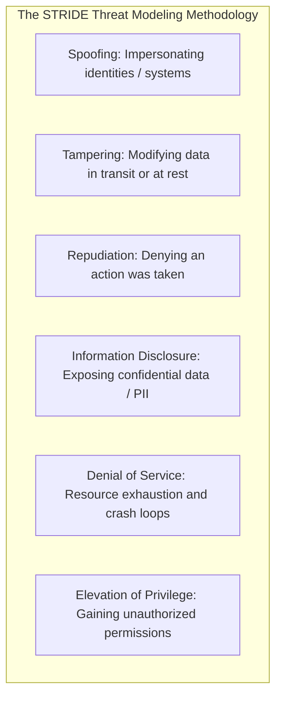
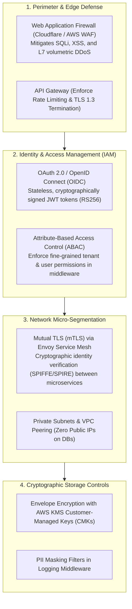
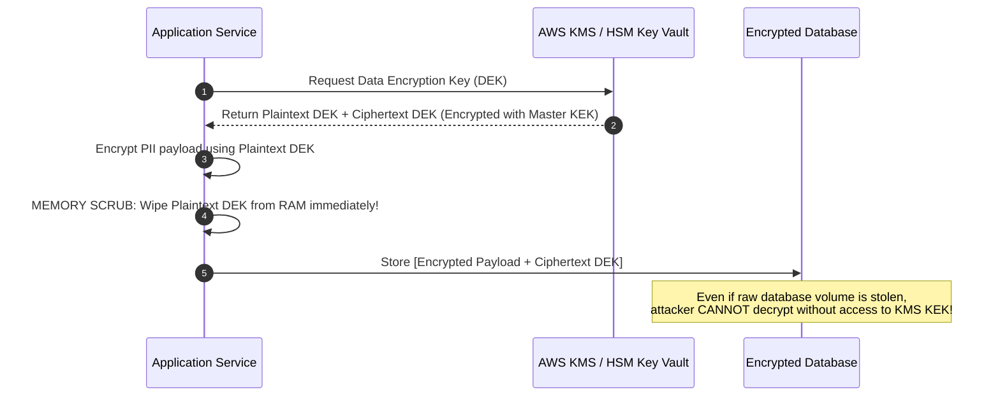

# 22 — Security Architecture & Threat Modeling

## Purpose

Security Architecture and Threat Modeling defines the defensive topologies, cryptographic controls, identity boundaries, access governance rules, and automated compliance gates used to protect enterprise data and computational resources against unauthorized access, exfiltration, tampering, and denial-of-service.

It enforces the foundational paradigm of **Zero Trust Architecture (ZTA)**: *"Never Trust, Always Verify."*

---

## Problem It Solves

- **Perimeter Security Obsolescence**: Replaces vulnerable "castle-and-moat" architectures (which trust all internal network traffic behind a VPN) with ubiquitous identity and cryptographic verification across every microservice hop.
- **Catastrophic Data Breaches**: Prevents cleartext data exfiltration by enforcing envelope encryption and cryptographic erasure (crypto-shredding).
- **Regulatory Penalties**: Ensures systems comply with GDPR (up to 4% global turnover fine), PCI DSS 4.0, HIPAA, and SOC 2 from day one.

---

## Inputs

- **Data Classification Catalog**: Categorized data attributes (Public vs. Internal vs. Confidential PII vs. Restricted PCI) from Step 02.
- **C4 Architecture Diagrams**: Ingress points, trust boundaries, and network flows from Step 10 and Step 17.
- **Identity & Compliance Standards**: Corporate enterprise identity providers (Okta, Azure AD) and regulatory scopes.

---

## Decision Process: STRIDE Threat Modeling

---

## The Zero-Trust Multi-Layer Defense Matrix

---

## Envelope Encryption in Practice

Never encrypt millions of database records with a single hardcoded master key. Enforce **Envelope Encryption**:

---

## Important Probing Questions

- *Are internal microservice-to-microservice calls encrypted via mTLS, or are they transmitting cleartext HTTP inside the VPC?*
- *How are secrets (database passwords, API keys) managed and rotated? Are they dynamically fetched from Vault/AWS Secrets Manager?*
- *What happens when an employee departs or an API key is compromised? Can credentials be revoked in $< 60\text{ seconds}$?*
- *Does the system log full credit card numbers, passwords, or social security numbers in application debug logs?*

---

## Key Metrics

- **Vulnerability MTTR**: Mean time to remediate critical CVEs (target: $< 24\text{ hours}$).
- **Secret Scanning Pass Rate**: % of commits passing automated pre-commit secret scanners (target: 100%).
- **Encryption Coverage**: % of data at rest and data in transit encrypted using approved ciphers (target: 100%).

---

## Common Mistakes

- **Hardcoding Secrets in Git Repositories**: Checking AWS access keys or database connection strings into source code or Dockerfiles.
- **Missing Token Expiration & Revocation**: Issuing JWT tokens with 30-day expiration windows that cannot be revoked if a user's laptop is stolen.
- **Insecure Direct Object References (IDOR)**: Allowing an authenticated user to fetch another user's invoice simply by altering the URL (`GET /v1/invoices/1042` instead of verifying that user 42 owns invoice 1042).

---

## Trade-offs

| Security Measure | Advantage | Trade-Off / Cost |
|:---|:---|:---|
| **mTLS Across All Internal RPCs** | Zero-trust cryptographic security; prevents lateral network eavesdropping. | Adds 2–5ms handshake overhead; requires managing internal x509 certificate CA lifecycles. |
| **Deep KMS Envelope Encryption** | Maximum protection against database volume exfiltration. | Introduces KMS API call latency and per-request KMS billing fees. |

---

## Production Considerations

- Embed **Static Application Security Testing (SAST)** and **Software Composition Analysis (SCA - Snyk/Mend)** into CI/CD pipelines to block builds containing critical vulnerabilities.
- Enforce **Crypto-Shredding** for GDPR "Right-to-be-Forgotten" compliance: encrypt each user's PII with a unique user key; deleting the key renders all backups mathematically unreadable.
