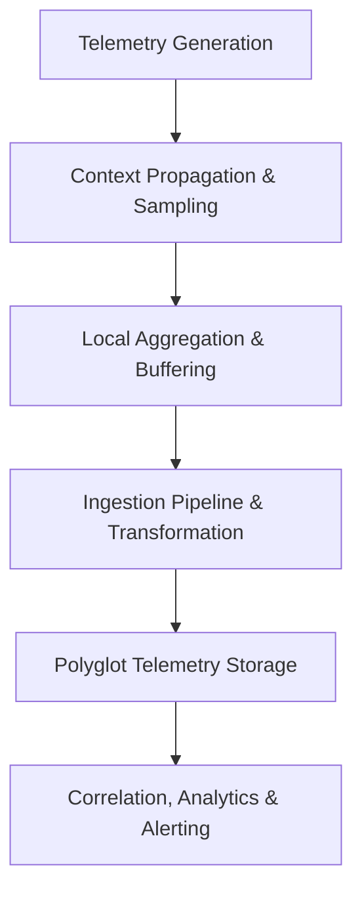
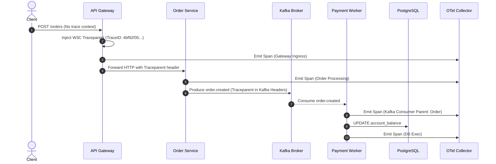

# Observability Analysis

## 1. Purpose
Observability analysis establishes the architectural framework for measuring, understanding, and diagnosing the internal states of distributed systems based entirely on their external outputs (metrics, logs, traces, and profiles). Its purpose is to guarantee that when complex, asynchronous, or multi-region failures occur, engineering teams can pinpoint root causes without deploying ad-hoc debugging code.

---

## 2. Problem It Solves
In monolithic applications, call stacks and localized logging suffice for troubleshooting. In modern distributed systems spanning dozens of microservices, event streams, and polyglot persistence engines:
* **The "Unknown Unknowns" Problem**: Complex failures emerge from unexpected subsystem interactions rather than single-component errors.
* **Distributed Latency Attribution**: Requests traverse load balancers, service meshes, caches, databases, and third-party APIs without a clear attribution of where latency was introduced.
* **Alert Fatigue & Noise**: Thousands of raw logs and uncalibrated threshold alerts overwhelm operations teams during incidents.
* **Debugging in Production**: Distributed race conditions and data corruption cannot be reproduced in synthetic staging environments.

---

## 3. Inputs
* **Service Dependency Graph**: Topographical map of upstream callers and downstream dependencies.
* **Service Level Objectives (SLOs)**: Quantified targets for availability, latency, and throughput per boundary.
* **Traffic & Request Rate Profiles**: Peak requests per second (RPS) and concurrency characteristics.
* **Compliance & Data Privacy Policies**: Constraints regarding PII/PHI redaction in telemetry streams (e.g., GDPR, HIPAA, PCI-DSS).
* **Cost Constraints**: Budget limits for telemetry ingestion, indexing, and long-term storage.

---

## 4. Decision Process
Architects evaluate observability infrastructure using a phased lifecycle:

1. **Instrumentation Standard**: Standardize on vendor-neutral OpenTelemetry (OTel) APIs and SDKs to avoid vendor lock-in.
2. **Context Propagation Strategy**: Enforce W3C Trace Context (`traceparent`, `tracestate`) across all HTTP, gRPC, and asynchronous message headers (e.g., Kafka record headers).
3. **Sampling Architecture**:
   * *Head-based sampling*: Probabilistic decision made at the ingress gateway (e.g., sample 5% of traffic). Cheap, but risks missing anomalous long-tail errors.
   * *Tail-based sampling*: Collector evaluates the entire trace trajectory before deciding whether to persist it (100% of HTTP 5xx or traces exceeding $p99$ latency retained). Requires collector memory buffering.
4. **Data Redaction & Scrubbing**: Edge gateway/sidecar sanitizes PII before payloads or trace attributes exit service perimeters.
5. **Storage Tiering**: Hot tiered indices (7–14 days SSD) for real-time querying, transitioning to warm/cold object storage (e.g., S3/GCS) with parquet/compressed columnar formats for audits.

---

## 5. Important Questions
1. How is context propagated across asynchronous message brokers (e.g., Kafka, SQS, RabbitMQ)?
2. What tail-sampling strategy ensures that rare $p99.9$ latency regressions and 5xx errors are never discarded?
3. How are cardinality explosions prevented in Prometheus/M3 metrics (e.g., avoiding raw user IDs or order IDs in metric labels)?
4. What is the network and CPU overhead of the observability agent/sidecar relative to application workloads?
5. How do we correlate an APM trace directly to database query execution plans and localized container CPU spikes?

---

## 6. Metrics

### Core Telemetry Dimensions
* **The Four Golden Signals**:
  $$\text{Latency} \quad (\text{ms}), \quad \text{Traffic} \quad (\text{RPS}), \quad \text{Errors} \quad (\text{rate/ratio}), \quad \text{Saturation} \quad (\%)$$
* **RED Method** (for request-driven services): Rate, Errors, Duration.
* **USE Method** (for infrastructure & resources): Utilization, Saturation, Errors.
* **Tracing Ingestion Efficiency**:
  $$\text{Sampling Ratio} = \frac{\text{Persisted Traces}}{\text{Total Ingress Requests}}$$
* **Cardinality Metric Count**: Total unique time-series generated per service:
  $$\text{Total Time Series} = \prod_{i=1}^{k} |\text{Label}_i|$$

---

## 7. Common Mistakes
* **High Cardinality Explosions**: Injecting unbounded dynamic values (e.g., `UUID`, email, timestamp) as metric tags, crashing Prometheus TSDB or multiplying Datadog billing by $10\times$.
* **Uniform Head-Based Sampling**: Retaining only 1% of random requests, resulting in the loss of critical trace trails for rare, high-severity transaction rollbacks.
* **Synchronous Telemetry Forwarding**: Writing logs or metrics synchronously across network boundaries, causing downstream logging outages to cascade into application outages.
* **Unstructured Logging**: Emitting plain-text `printf` statements rather than structured JSON with embedded `trace_id` and `span_id`.

---

## 8. Architecture Implications
* **Network & Overhead**: Telemetry agents must run as out-of-process daemons or Kubernetes sidecars communicating over local domain sockets or UDP.
* **Resource Budgeting**: Sidecars must have strict CPU/memory limits (e.g., max 256MB RAM, 0.2 vCPU) with memory-bounded buffers that drop data under pressure rather than degrading the host service.
* **Zero-Trust Security**: Observability pipelines must enforce role-based access control (RBAC), TLS in transit, and client-side masking of cryptographic tokens and payment credentials.

---

## 9. Example: End-to-End Distributed Trace Flow

---

## 10. Trade-offs
* **Tail Sampling vs. Infrastructure Overhead**: Tail sampling captures 100% of errors and outliers but requires a stateful cluster of collectors with substantial RAM to buffer trace graphs until request completion.
* **Granular Tracing vs. Application Throughput**: Method-level tracing introduces function call overhead; coarse-grained boundary tracing maintains sub-millisecond overhead but lacks microsecond internal visibility.
* **Retention Length vs. Storage Cost**: Indexing full-text logs for 90 days provides deep historical auditability but costs orders of magnitude more than cold parquet data lake dumps.

---

## 11. Production Considerations
* **Fail-Open Policy**: Telemetry buffers must immediately drop spans/logs if the local collector is unreachable. Never block request execution for observability.
* **Automated Alert Grouping**: Implement alert deduplication and correlation algorithms to ensure a downstream database failure generates one primary alert rather than hundreds of cascading alerts across all callers.
* **Runbook Linkage**: Every operational alert must contain a direct link to its associated Grafana dashboard and an executable standard operating procedure (SOP) runbook.
