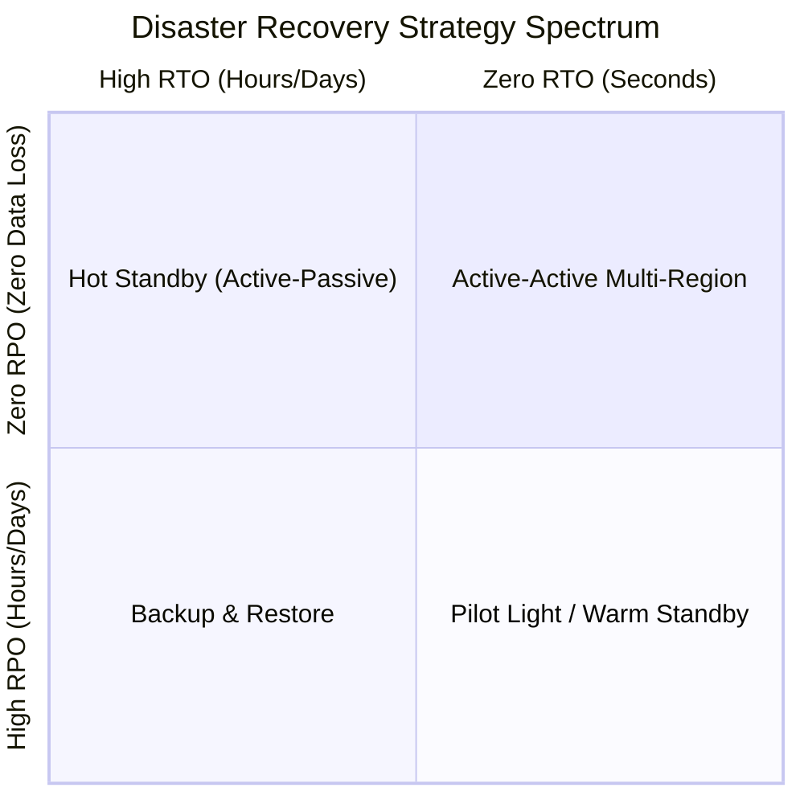
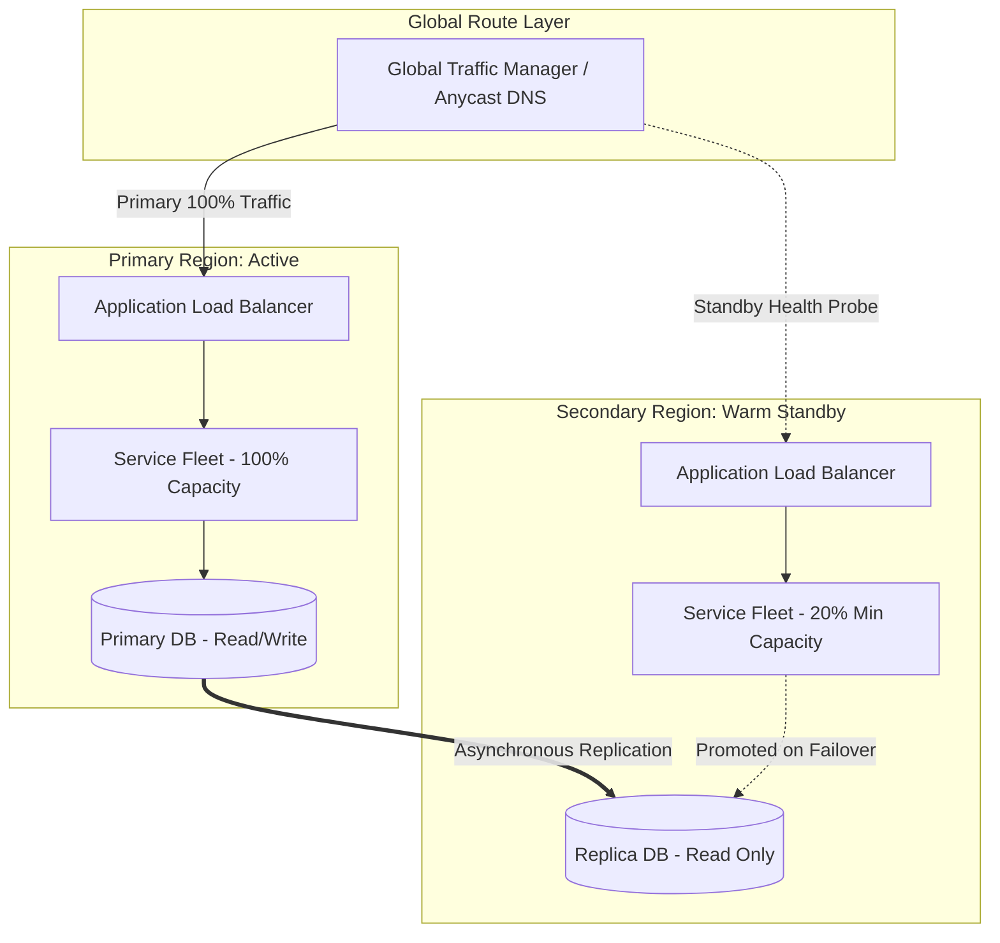

# Disaster Recovery Analysis

## 1. Purpose
Disaster Recovery (DR) analysis establishes architectural patterns, operational runbooks, and automated failover mechanics required to survive catastrophic infrastructure failures (e.g., total cloud region blackout, optical fiber severing, ransomware encryption, or wholesale data center loss) while upholding enterprise Recovery Point Objectives (RPO) and Recovery Time Objectives (RTO).

---

## 2. Problem It Solves
Enterprises face unavoidable physical and logical disruptions:
* **Cloud Region Outages**: Power grid collapses, weather disasters, or control plane failures impacting entire AWS/Azure/GCP regions.
* **Catastrophic Data Corruption & Ransomware**: Malicious actors or faulty migrations destroying databases across read-replicas synchronously.
* **Human Error at Scale**: Accidental execution of recursive drop commands or faulty global network configuration updates.
* **Regulatory Non-Compliance**: Inability to demonstrate automated cross-region failover required by regulatory authorities (SEC, FINRA, MAS, EBA).

---

## 3. Inputs
* **Business Impact Analysis (BIA)**: Financial loss per minute/hour of downtime per tier of service.
* **Target RPO (Data Loss Tolerance)**: Maximum acceptable time delta between the last valid transaction and the disaster event.
* **Target RTO (Downtime Tolerance)**: Maximum acceptable duration to restore operational availability.
* **Data Classification**: Identification of tier-0 systems of record vs. tier-2 transient processing engines.
* **Network & Topology Constraints**: Intersite latency, cross-region bandwidth costs, and egress rate limits.

---

## 4. Decision Process
Architects determine the DR tier based on the RTO/RPO trade-off matrix:

1. **Classify Workload Tiers**:
   * *Tier 0 (Core Transactions)*: RPO = 0, RTO < 1 min $\rightarrow$ Active-Active or Synchronous Multi-Region Hot Standby.
   * *Tier 1 (Business Critical)*: RPO < 15 min, RTO < 1 hour $\rightarrow$ Warm Standby / Pilot Light.
   * *Tier 2 (Internal/Reporting)*: RPO < 24 hours, RTO < 24 hours $\rightarrow$ Automated Backup & Restore.
2. **Replication Topology Design**:
   * *Synchronous Replication*: Guarantees zero RPO but introduces latency penalties ($L_{\text{sync}} \ge 2 \times \text{RTT}_{\text{network}}$). Constrained by speed-of-light physical limits (typically $<100\text{ km}$ distance).
   * *Asynchronous Replication*: Decouples application write latency from network transit times; carries non-zero RPO risk equal to the replication lag.
3. **Traffic Routing & DNS Cutover**:
   * Anycast IP routing vs. DNS-based geo-routing with low TTL (e.g., Route53 / Cloudflare).
   * Health check automation: Decouple failure detection from automated failover to avoid "split-brain" flap scenarios.
4. **Immutability & Air-Gapped Vaults**:
   * Cryptographically locked write-once-read-many (WORM) storage for disaster backups to survive insider ransomware attacks.

---

## 5. Important Questions
1. How does the system prevent the "Split-Brain" phenomenon where both primary and secondary regions believe they own write authority?
2. What is the impact of speed-of-light network latency on synchronous multi-region transactions?
3. How is database sequence generation (e.g., auto-increment, Snowflake IDs) handled during cross-region failover to avoid key collisions?
4. How often is the DR plan tested under real production load (e.g., Chaos GameDay simulations)?
5. What are the dependencies on external third-party identity providers (e.g., Okta, Entra ID) during an outage?

---

## 6. Metrics
* **Recovery Point Objective (RPO)**:
  $$\text{RPO} = t_{\text{disaster}} - t_{\text{last\_persisted\_commit}}$$
* **Recovery Time Objective (RTO)**:
  $$\text{RTO} = t_{\text{service\_restored}} - t_{\text{disaster}}$$
* **Replication Lag ($L_{\text{lag}}$)**:
  $$L_{\text{lag}} = \text{LSN}_{\text{primary}} - \text{LSN}_{\text{replica}} \quad (\text{bytes or time})$$
* **Disaster Recovery Cost Ratio ($C_{\text{DR}}$)**:
  $$C_{\text{DR}} = \frac{\text{Infrastructure Cost (Standby Regions)}}{\text{Infrastructure Cost (Primary Region)}}$$
  *(For Active-Active, $C_{\text{DR}} \ge 1.0$; for Pilot Light, $C_{\text{DR}} \approx 0.15 - 0.30$)*.

---

## 7. Common Mistakes
* **Untested Backups**: Assuming successful snapshot creation implies successful restoration without executing recurring automated restore-to-sandbox validations.
* **Ignoring Asynchronous Queue Draining**: Failing over database traffic without draining or reconciling flight messages in regional message brokers (Kafka/SQS), causing silent message loss.
* **DNS Caching Flaws**: Relying on 60-second DNS TTLs during failover, ignoring stubborn client/ISP resolvers that cache IP addresses for hours or days.
* **Automated Failover Flapping**: Triggering cross-region failover based on transient network blips, inducing heavy data reconciliation overheads across regions.

---

## 8. Architecture Implications
* **State Management**: Stateless compute layers can scale dynamically in secondary regions; data layers require dedicated cross-region replication bandwidth and pre-allocated IOPS.
* **Data Conflict Resolution**: Active-Active multi-write setups require conflict-free replicated data types (CRDTs) or strict distributed consensus (e.g., Spanner, CockroachDB).
* **Configuration Drift**: Infrastructure as Code (Terraform, Pulumi) must maintain strict parity between primary and secondary regions via CI/CD automation.

---

## 9. Example: Active-Passive Warm Standby Failover Topology

---

## 10. Trade-offs
* **Active-Active vs. Active-Passive**: Active-Active delivers near-zero RTO and RPO with continuous verification of both regions, but introduces immense architectural complexity (conflict resolution, cross-region latency) and doubled infrastructure cost.
* **Synchronous vs. Asynchronous Replication**: Synchronous guarantees zero data loss (RPO = 0) but binds application write latency to cross-region round-trip times ($50\text{--}100\text{ ms}$). Asynchronous keeps write latency low ($<5\text{ ms}$) but risks data loss during ungraceful failover.
* **Automated vs. Manual Promotion**: Automated failover minimizes RTO but risks false-positive split-brain scenarios. Manual promotion guarantees operational validation but increases RTO to 15–30 minutes.

---

## 11. Production Considerations
* **Split-Brain Mitigation**: Utilize an external third-party consensus arbitrator (e.g., witness node in a third independent region) to approve primary promotion.
* **Automated Rollback (Failback) Runbooks**: Restoring the primary region after an incident is frequently more dangerous than the original failover due to bidirectional delta synchronization.
* **Chaos Engineering DR Drills**: Conduct scheduled blackhole drills (e.g., dropping all egress from primary region) quarterly during low-traffic windows.
