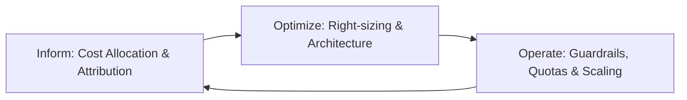
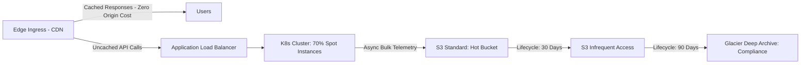

# Cost Analysis & FinOps Architecture

## 1. Purpose
Cost analysis in system design provides an architectural framework to estimate, model, optimize, and govern infrastructure expenditures across compute, memory, storage, network egress, and managed cloud services. Its purpose is to ensure that system scalability does not produce super-linear or uncontrolled operational expenditure (OpEx), embedding unit economics directly into architectural decisions.

---

## 2. Problem It Solves
Architectures designed solely for raw performance or theoretical resilience often lead to financial insolvency:
* **The "Cloud Bill Shock" Syndrome**: Unconstrained autoscaling fleets scale horizontally to absorb traffic spikes or malicious DDoS attacks without budget ceilings.
* **Hidden Network Egress Costs**: Multi-AZ and multi-region data transfer charges quietly eclipsing compute and storage budgets.
* **Over-Provisioned Persistent Tiers**: Paying for provisioned IOPS (e.g., AWS io2, Azure Ultra Disk) and SSD caching tiers for data that transitions to cold access within 48 hours.
* **Decoupled Engineering & Finance**: Development teams making architectural choices (e.g., choosing managed Kafka or serverless functions) with zero visibility into cost-per-transaction implications.

---

## 3. Inputs
* **Traffic & Request Projections**: Expected average, peak, and seasonal requests per second (RPS).
* **Storage Growth Rates**: Ingestion volume per day, retention windows, and compaction ratios.
* **Network Data Transfer Patterns**: Cross-zone, cross-region, and internet egress payload sizes.
* **Unit Economics Targets**: Maximum allowed cost per active user, cost per payment transaction, or cost per gigabyte indexed.
* **Licensing & Managed Service Pricing**: Consumption-based pricing vs. reserved instance commitments.

---

## 4. Decision Process
Cost-aware architecture follows a continuous FinOps optimization loop:

1. **Unit Cost Modeling**:
   Calculate the total cost of ownership (TCO) per business transaction:
   $$\text{Cost per Transaction} = \frac{\text{Total Infrastructure Spend}}{\text{Total Completed Transactions}}$$
2. **Compute Sizing & Procurement Optimization**:
   * Baseline load $\rightarrow$ Reserved Instances (RI) / Savings Plans (30–60% discount).
   * Variable diurnal peaks $\rightarrow$ On-Demand Auto-scaling.
   * Batch/Asynchronous processing $\rightarrow$ Spot / Preemptible instances with checkpointing (70–90% discount).
3. **Storage Tiering Architecture**:
   * Hot Tier (NVMe / SSD): 0–30 days. High IOPS, premium cost.
   * Warm Tier (Standard Cloud Object Store): 31–90 days. Standard access.
   * Cold Tier (Infrequent Access): 91–365 days.
   * Archive Tier (Glacier / Deep Archive): 1+ years for compliance. Sub-cent per GB/month.
4. **Network Topology & Egress Containment**:
   * Keep high-bandwidth service-to-service communication within the same Availability Zone where possible.
   * Leverage CDNs (Cloudflare, CloudFront) to cache static assets and API responses at the edge to eliminate origin egress fees.
   * Use VPC Peering or PrivateLink rather than public NAT gateways for internal transit.

---

## 5. Important Questions
1. What is the marginal infrastructure cost of onboarding the next 100,000 users or 1,000,000 transactions?
2. Are network egress fees factored into data replication designs across cloud availability zones and regions?
3. Where is the tipping point where managed serverless services (e.g., AWS Lambda, DynamoDB) become more expensive than provisioned containers (Kubernetes) or open-source databases?
4. How are idle development and staging environments decommissioned outside business hours?
5. Are all infrastructure resources tagged with ownership, domain, and environment metadata for granular cost attribution?

---

## 6. Metrics
* **Total Cost of Ownership (TCO)**:
  $$\text{TCO} = \text{Compute} + \text{Storage} + \text{Network Egress} + \text{Licensing} + \text{Operational Overhead}$$
* **Compute Utilization Efficiency**:
  $$\text{Efficiency} = \frac{\text{Average CPU / Memory Used}}{\text{Total CPU / Memory Allocated}}$$
* **Storage Cost per Gigabyte-Month ($C_{\text{storage}}$)**:
  $$C_{\text{storage}} = \sum_{i=1}^{n} (\text{Volume}_i \times \text{Rate}_i)$$
* **Egress Data Ratio ($R_{\text{egress}}$)**:
  $$R_{\text{egress}} = \frac{\text{Total Egress Bandwidth Cost}}{\text{Total Cloud Spend}}$$

---

## 7. Common Mistakes
* **Neglecting Public NAT Gateway Transfer Costs**: Routing massive internal microservice or telemetry traffic through managed NAT gateways at $0.045/GB + hourly charges instead of VPC endpoints.
* **Premature Serverless Overuse at Scale**: Adopting Function-as-a-Service (FaaS) for sustained, predictable, high-throughput microservices where provisioned containers are $5\times\text{--}10\times$ cheaper.
* **Unbounded Log Retention**: Storing multi-terabyte uncompressed debug logs in high-performance search indices (e.g., Elasticsearch) indefinitely.
* **Ignoring Autoscaling Minimum Fleet Limits**: Setting autoscaling groups with high minimum replica counts during quiet overnight periods.

---

## 8. Architecture Implications
* **Caching as a Cost Shield**: In-memory caching (Redis/Memcached) and edge caching do not merely reduce latency; they prevent costly read IOPS on provisioned relational databases.
* **Compression & Serialization**: Switching from JSON over HTTP to Protocol Buffers / gRPC reduces network payload size by 60–80%, directly cutting cross-AZ and internet egress bills.
* **Tenant Quotas & Rate Limiting**: Multi-tenant architectures must enforce hard or soft token-bucket rate limits to prevent rogue tenants from inflating shared compute/storage infrastructure bills.

---

## 9. Example: Cost-Optimized Data Pipeline Sizing

### Cost Comparison Table (Monthly Basis)

| Tier | Raw Data Volume | Storage Class | Cost / GB / Month | Monthly Cost |
| :--- | :--- | :--- | :--- | :--- |
| **Hot (Active Analytics)** | 50 TB | S3 Standard / SSD | $0.023 | $1,150 |
| **Warm (Monthly Audit)** | 200 TB | S3 Infrequent Access | $0.0125 | $2,500 |
| **Cold (Compliance)** | 1,000 TB | Glacier Deep Archive | $0.00099 | $990 |
| **Total Blended** | **1,250 TB** | **Tiered Lifecycle** | **Blended: ~$0.0037** | **$4,640** |
| *(Without Tiering)* | *1,250 TB* | *All S3 Standard* | *$0.023* | *$28,750* |

$$\text{Net Monthly Savings} = \$28,750 - \$4,640 = \$24,110 \quad (\approx 83.9\% \text{ reduction})$$

---

## 10. Trade-offs
* **Spot Instances vs. Workload Predictability**: Spot instances reduce compute costs by up to 90% but introduce involuntary preemption terminations with 2-minute notice warnings, requiring robust stateless or checkpointed worker architecture.
* **Managed Services vs. Self-Hosted Operations**: Managed services (e.g., Amazon Aurora, Confluent Cloud) cost 2–3× more in direct infrastructure fees but eliminate human operational and maintenance overhead.
* **Multi-AZ High Availability vs. Network Transit Cost**: Cross-AZ traffic incurs data transfer charges ($0.01/GB each direction). Eliminating multi-AZ saves costs but introduces single-datacenter failure vulnerability.

---

## 11. Production Considerations
* **Automated Anomaly Alerts**: Configure FinOps budgets with real-time alerting when actual daily spend exceeds the rolling 7-day average by $>20\%$.
* **Tagging Enforcement via CI/CD**: Enforce strict infrastructure-as-code linting; fail any pull request provisioning cloud resources lacking `CostCenter`, `Environment`, `Owner`, and `Service` tags.
* **Scheduled Rightsizing Reviews**: Conduct monthly automated compute/disk utilization audits to terminate orphaned EBS volumes, unattached Elastic IPs, and idle RDS staging instances.
