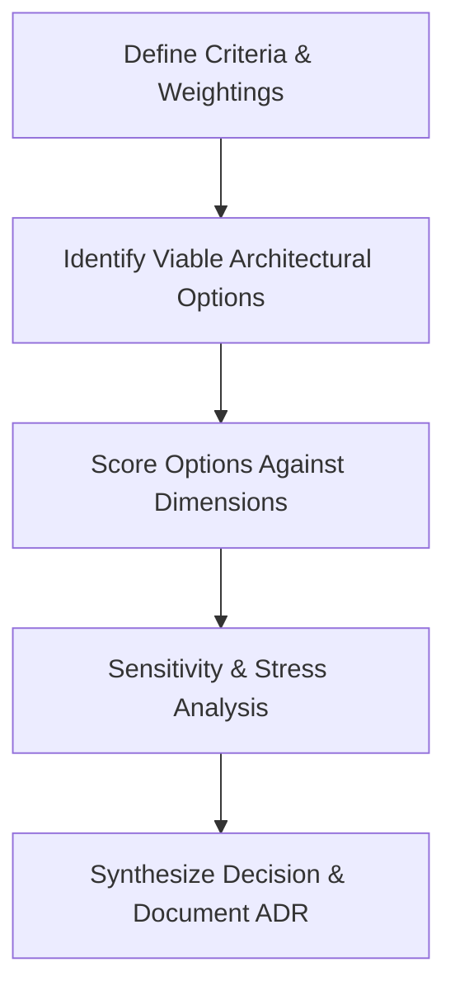

# Trade-off Analysis

## 1. Purpose
Trade-off analysis is the foundational discipline of software and system architecture. Because there are no absolute "best" designs—only sets of compromises—trade-off analysis provides a structured, quantitative, and reproducible decision-making methodology to evaluate competing architectural alternatives against business requirements, organizational constraints, and non-functional goals.

---

## 2. Problem It Solves
Engineering teams frequently suffer from anti-patterns that undermine architecture:
* **"Best Practice" Dogmatism**: Blindly adopting trends (e.g., event-driven microservices, multi-region Spanner) without analyzing whether their inherent operational overhead aligns with organizational scale.
* **Analysis Paralysis**: Stalling engineering momentum because team members evaluate solutions through purely subjective opinions rather than objective architectural trade-offs.
* **Invisible Technical Debt**: Choosing convenience in the present (e.g., synchronous monolith database joins) without documenting the future penalties on scalability and team decoupling.
* **Misaligned Stakeholder Expectations**: Business executives expecting sub-second latency, zero downtime, zero data loss, and minimal cost simultaneously, violating fundamental computer science theorems (CAP, PACELC).

---

## 3. Inputs
* **Business Drivers & Priorities**: Strategic business goals (e.g., time-to-market vs. long-term multi-year scale).
* **Quantified NFRs / SLOs**: Target latencies ($p99 < 50\text{ ms}$), availability ($99.99\%$), RPO/RTO.
* **Engineering Team Maturity**: Experience with distributed systems, Kubernetes, asynchronous messaging, and on-call operational load.
* **Compliance & Legal Mandates**: Data sovereignty, GDPR, PCI-DSS, SOC2 requirements.
* **Financial & Infrastructure Budget**: Maximum allowable CapEx and OpEx.

---

## 4. Decision Process
A structured trade-off evaluation follows a 5-step quantitative scoring process:

1. **Establish Decision Criteria & Weights**:
   Assign weights ($w_i \in [1, 5]$) to architectural dimensions such as Latency, Consistency, Operational Simplicity, Cost, and Developer Velocity.
2. **Identify Mutually Exclusive Options**:
   Document 2 to 4 viable architectural patterns (e.g., Option A: Synchronous REST with PostgreSQL read-replicas; Option B: Event-driven CQRS with Kafka and DynamoDB).
3. **Execute Weighted Scoring Matrix**:
   Calculate the composite score for each candidate:
   $$\text{Score}_{\text{total}} = \sum_{i=1}^{n} (w_i \times s_i)$$
   Where $s_i \in [1, 5]$ represents the option's performance score on criterion $i$.
4. **Evaluate Boundary Conditions & Inversion Points**:
   Determine at what scale or change in assumptions Option A ceases to be viable and Option B must be adopted.
5. **Formalize in an Architecture Decision Record (ADR)**:
   Capture Context, Decision, Alternatives Considered, and Consequences (positive, negative, neutral).

---

## 5. Important Questions
1. What fundamental architectural quality (e.g., immediate consistency) are we sacrificing to gain another (e.g., high availability during network partitions)?
2. What is the operational burden (cognitive load, tooling, monitoring) on the engineering team to sustain this choice?
3. How difficult is it to reverse this architectural decision if traffic or requirements diverge significantly in 18 months?
4. Does this decision optimize for developer velocity today at the expense of runtime operational cost tomorrow?
5. How does this decision behave under sudden degradation or external dependency outages?

---

## 6. Metrics
* **Weighted Evaluation Score**:
  $$S = \sum_{j=1}^{m} w_j \cdot r_{ij} \quad \text{subject to} \quad \sum_{j=1}^{m} w_j = 1.0$$
* **Reversibility Factor ($R_{\text{rev}}$)**:
  Estimated engineering weeks and risk profile required to migrate away from the chosen design.
* **Operational Complexity Ratio**:
  $$\text{Complexity Index} = \frac{\text{Number of Stateful Systems} + \text{Async Boundaries}}{\text{Engineering Team Size}}$$

---

## 7. Common Mistakes
* **Treating Trade-offs as Binary**: Assuming an architecture is either "good" or "bad" in a vacuum, ignoring context and operational maturity.
* **Ignoring the Operational Penalty**: Focusing solely on elegant algorithms or throughput benchmarks while ignoring the day-to-day cost of troubleshooting, on-call paging, and maintenance.
* **Evaluating in Isolation**: Comparing database performance without considering application connection pooling, ORM overhead, and network serializations.
* **Confirmation Bias in Scoring**: Arbitrarily inflating scores in a decision matrix to justify an architect's pre-existing emotional preference.

---

## 8. Architecture Implications
* **PACELC Theorem Reality**:
  * If there is a Partition ($P$), choose Availability ($A$) or Consistency ($C$).
  * Else ($E$), choose Latency ($L$) or Consistency ($C$).
* **Conway's Law Alignment**: Any trade-off that splits a single service across two independent engineering teams without clear interface contracts will result in organizational friction.
* **Evolutionary Architecture**: Architectures must include loose coupling boundaries so that trade-off choices can be re-evaluated as business scale expands.

---

## 9. Example: Synchronous Monolith vs. Event-Driven Microservices

### Architecture Decision Trade-off Matrix

| Dimension | Weight ($w_i$) | Option A: Monolith + Postgres | Option B: Event-Driven Microservices |
| :--- | :--- | :--- | :--- |
| **Development Velocity (Year 1)** | 5 | 5 ($5 \times 5 = 25$) | 2 ($5 \times 2 = 10$) |
| **Operational Simplicity** | 4 | 5 ($4 \times 5 = 20$) | 2 ($4 \times 2 = 8$) |
| **Independent Deployability** | 3 | 2 ($3 \times 2 = 6$) | 5 ($3 \times 5 = 15$) |
| **Data Consistency (ACID)** | 4 | 5 ($4 \times 5 = 20$) | 2 ($4 \times 2 = 8$) |
| **Ultra-High Scale (>100k RPS)** | 2 | 2 ($2 \times 2 = 4$) | 5 ($2 \times 5 = 10$) |
| **Infrastructure Cost Efficiency** | 3 | 4 ($3 \times 4 = 12$) | 2 ($3 \times 2 = 6$) |
| **Total Composite Score** | — | **87 / 105 (Winner for current scale)** | **57 / 105** |

*Analysis*: At the organization's current scale (15 engineers, 2,000 RPS), Option A maximizes velocity and eliminates distributed tracing and eventual consistency complexities. A clear migration threshold is defined for $>25,000\text{ RPS}$.

---

## 10. Trade-offs
* **Latency vs. Reliability (Bulkheads & Retries)**: Adding retries with exponential backoff and circuit breakers increases the probability of request success but inflates tail latency ($p99.9$) during service degradation.
* **Throughput vs. Freshness (Caching & Batching)**: Batching writes and caching queries achieves astronomical throughput at the cost of serving stale data to end users.
* **Normalization vs. Read Performance**: 3NF relational schemas prevent anomalies and minimize write amplification but require expensive multi-table joins; denormalized document/NoSQL models maximize read speeds at the expense of update anomalies.

---

## 11. Production Considerations
* **ADR Lifecycle Governance**: Store ADRs directly in version control alongside code repositories (`/docs/architecture/decisions/XXXX-*.md`).
* **Periodic Retrospective Reviews**: Revisit major trade-off decisions every 12 months or when system traffic doubles to verify if foundational assumptions remain valid.
* **Escape Hatches**: Ensure high-stakes architectural choices (e.g., proprietary cloud databases like DynamoDB or CosmosDB) include a tested path to generic standards (e.g., Cassandra, PostgreSQL) if cost or compliance shifts.
