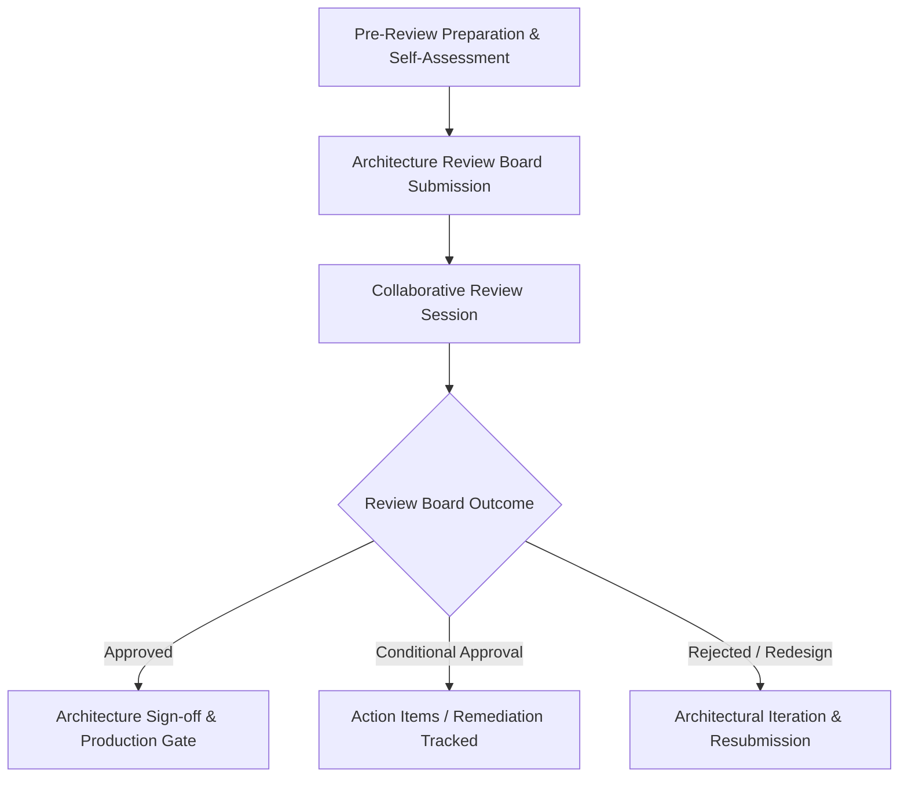
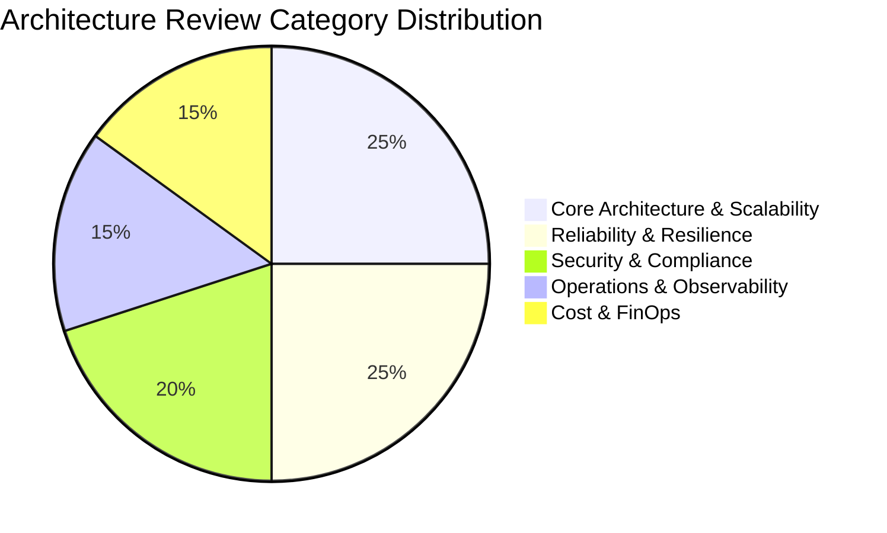

# Architecture Review

## 1. Purpose
The Architecture Review is a formal governance and peer-review process designed to evaluate proposed system designs against enterprise standards, non-functional requirements (NFRs), security baselines, cost constraints, and operational readiness prior to significant capital expenditure or production deployment.

---

## 2. Problem It Solves
Unreviewed or siloed architecture decisions lead to predictable failures:
* **The "Ivory Tower" vs. "Rogue Developer" Divide**: Architects creating abstract diagrams disconnected from operational realities, or engineering teams deploying unvetted technologies that create security and maintenance crises.
* **Late-Stage Flaw Discovery**: Discovering fundamental scalability flaws, single points of failure (SPOFs), or compliance violations during pre-launch load tests or post-launch outages.
* **Technology Proliferation & Sprawl**: Every microservice team choosing different programming languages, persistence layers, and message brokers, diluting organizational competence.
* **Lack of Accountability**: Unclear ownership of cross-cutting concerns like disaster recovery, encryption key management, and API versioning.

---

## 3. Inputs
* **System Architecture Document (SAD)**: Component diagrams (C4 Model), sequence diagrams, and data flow topologies.
* **Architecture Decision Records (ADRs)**: Documented decisions detailing evaluated alternatives and accepted trade-offs.
* **Target SLOs / SLAs**: Formal availability, latency, throughput, and error budget expectations.
* **Security & Threat Model**: Attack surface analysis, STRIDE classifications, and data protection controls.
* **Capacity & Sizing Projections**: Day 1 and Year 2 compute, memory, IOPS, and storage projections.

---

## 4. Decision Process
The Architecture Review follows a 4-phase structured lifecycle:

1. **Pre-Review Checklist Validation**:
   The lead architect completes a standardized self-assessment verifying that all prerequisites (capacity sizing, threat modeling, disaster recovery plans) are fully documented.
2. **Review Board Assembly**:
   Assemble cross-functional domain experts:
   * Enterprise Architect / Principal Solutions Architect (Chair)
   * Domain Engineering Leads
   * Information Security & Compliance Officer
   * Site Reliability Engineering (SRE) / Infrastructure Lead
   * Database Administrator / Data Architect
3. **Structured Review Cadence**:
   * *Walkthrough (15 mins)*: Business goals, core domain boundaries, and traffic assumptions.
   * *Deep Dive (30 mins)*: Failure mode analysis, consistency models, data pipelines, and security controls.
   * *Open Challenge (15 mins)*: Constructive peer review probing edge cases, scaling bottlenecks, and operational complexity.
4. **Outcome Classification**:
   * **Approved**: Proceed to implementation with zero blockers.
   * **Conditional Approval**: Proceed with implementation, but specified high-priority action items must be closed before production rollout.
   * **Redesign Required**: Fundamental architectural flaws identified; resubmission required after rework.

---

## 5. Important Questions
1. How does the architecture behave when its primary datastore or third-party dependency experiences elevated latencies (>5,000 ms)?
2. Are all service-to-service calls authenticated, authorized, and encrypted (Mutual TLS / Zero Trust)?
3. Has every component's failure domain been mapped to ensure catastrophic outages in one subsystem cannot cascade?
4. Can this architecture be deployed, verified, and rolled back with zero downtime (e.g., blue/green, canary)?
5. Does the projected cost of infrastructure scale sub-linearly with user and transaction growth?

---

## 6. Metrics
* **Review Turnaround Time (RTT)**: Time from review request submission to formal verdict (Target: $\le 5\text{ business days}$).
* **Action Item Remediation Rate**: Percentage of identified architecture findings closed prior to GA launch (Target: $100\%$ for Critical/High).
* **Architecture Defect Leakage**: Number of production incidents directly attributed to architectural flaws missed during the review:
  $$\text{Leakage Ratio} = \frac{\text{Post-Launch Architecture Incidents}}{\text{Total Reviewed Architectures}}$$
* **Tech Debt Index**: Volume of unapproved technology variants introduced into production.

---

## 7. Common Mistakes
* **Treating Review as a Bureaucratic Rubber Stamp**: Holding superficial meetings where reviewers lack the context or time to probe deep failure modes.
* **Reviewing Too Late**: Conducting the architecture review two weeks before scheduled production launch when redesign is financially and temporally impossible.
* **Lack of Follow-through on Action Items**: Approving systems conditionally but failing to enforce resolution before production traffic cutover.
* **Hostile or Adversarial Review Culture**: Creating an intimidating atmosphere that discourages engineering teams from being transparent about system vulnerabilities.

---

## 8. Architecture Implications
* **Standardization vs. Innovation**: Architecture reviews balance enterprise golden paths (reusable frameworks, managed infrastructure) with the flexibility to adopt new paradigms where business value justifies it.
* **Documentation Quality Gate**: Enforcing that code cannot be deployed without up-to-date C4 diagrams, ADRs, and runbooks.
* **Continuous Architectural Governance**: Architecture review is not a one-time event; changes exceeding predefined architectural impact thresholds trigger lightweight delta reviews.

---

## 9. Example: Architecture Review Scorecard

### Evaluation Matrix (Sample Microservices Platform)

| Evaluation Domain | Rating (1-5) | Findings / Remediation Requirements | Gate Status |
| :--- | :--- | :--- | :--- |
| **Domain & API Design** | 4.5 | REST interfaces adhere to OpenAPI 3.0 standards; backwards compatibility enforced. | PASS |
| **Scalability & Data** | 4.0 | Read replicas handle $10\times$ traffic; write sharding strategy deferred to Phase 2. | PASS |
| **Reliability & DR** | 2.5 | **Finding**: No circuit breaker between Checkout and Payment Gateway. Retry storms possible. | **BLOCKER (High)** |
| **Security & Zero Trust** | 4.0 | mTLS enabled across service mesh; secrets stored in HashiCorp Vault. | PASS |
| **Observability & SRE** | 3.0 | Distributed tracing implemented, but metric cardinality exceeds safe thresholds. | **ACTION ITEM (Medium)** |
| **FinOps & Cost** | 4.0 | S3 lifecycle policies configured; compute sizing aligned with reservation models. | PASS |

*Verdict*: **Conditional Approval**. High-priority blocker (Circuit breaker implementation) must be validated via load testing before production cutover.

---

## 10. Trade-offs
* **Rigorous Governance vs. Engineering Agility**: Heavy architectural gating ensures rock-solid stability and compliance but can slow down release velocity if not streamlined.
* **Standardized Technology Stacks vs. Best-Tool-for-the-Job**: Restricting teams to approved languages/datastores lowers operational cost but may suboptimal for specialized workloads (e.g., using relational DB for graph traversal).
* **Early Review vs. Architectural Detail**: Reviewing early allows directional pivots but lacks implementation fidelity; reviewing late provides fidelity but increases rework costs.

---

## 11. Production Considerations
* **Automated Architecture Fitness Functions**: Implement automated CI/CD checks (e.g., ArchUnit, SonarQube, Terraform linters) that enforce architectural rules programmatically before manual reviews.
* **Review Repository & Archive**: Store all review scorecards, recordings, and architectural artifacts in a central searchable portal.
* **Feedback Loop to Enterprise Standards**: When multiple reviews surface recurring architectural gaps (e.g., lack of idempotency handling), update enterprise guidelines and reusable starter templates.
