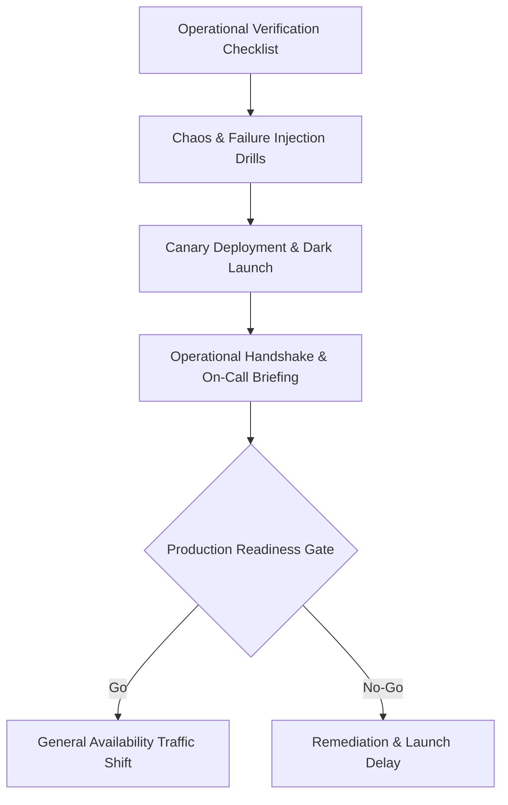

# Production Readiness

## 1. Purpose
The Production Readiness Review (PRR) is the ultimate operational validation checkpoint before a software system receives live production traffic. Its purpose is to guarantee that the system is resilient, secure, observable, compliant, and operationally maintainable by SRE and on-call engineering teams under real-world catastrophic failure modes.

---

## 2. Problem It Solves
Engineering teams routinely build technically sophisticated software that fails catastrophically upon production launch due to operational oversights:
* **"Throwing It Over the Wall"**: Development teams shipping features without runbooks, alerts, or on-call training for SRE and operations teams.
* **Unmonitored Black Swans**: Critical failure modes occurring in production with zero alerts firing until customers complain on social media.
* **Irreversible Deployments**: Systems deployed without verified rollback procedures, forcing teams into panicked live debugging during outages.
* **Capacity Cliff Crashes**: Systems collapsing under launch day marketing surges due to unconfigured connection pools or absent rate limits.

---

## 3. Inputs
* **Completed Architecture Review & Sign-off**: Evidence that architectural blockers have been resolved.
* **Load & Stress Testing Results**: Benchmarks proving performance under $2\times\text{--}5\times$ peak anticipated load.
* **Operational Runbooks & SOPs**: Step-by-step incident response procedures for known failure scenarios.
* **SLO & Alerting Definitions**: Configured Prometheus/Datadog monitors linked to escalation policies (PagerDuty/Opsgenie).
* **Rollback & Disaster Recovery Validation**: Documented proof of successful rollback and disaster recovery drills.

---

## 4. Decision Process
The Production Readiness evaluation follows a rigorous stage-gate model:

1. **Gate 1: Infrastructure & Capacity**:
   * Auto-scaling policies tested under dynamic loads.
   * Connection pool sizes mathematically aligned with database thread limits ($N_{\text{max\_conn}} \le \text{DB Capacity}$).
   * Rate limits and bulkheads configured at the API Gateway layer.
2. **Gate 2: Observability & Alerting**:
   * Golden signals (Latency, Traffic, Errors, Saturation) dashboards operational.
   * Every critical alert linked directly to an actionable runbook URL.
   * Trace context propagation verified end-to-end across synchronous and asynchronous paths.
3. **Gate 3: Resilience & Fault Tolerance**:
   * Graceful degradation verified: downstream dependencies killed in staging while confirming primary service functions in degraded mode.
   * Circuit breakers and exponential backoff retry policies validated under simulated network drops.
4. **Gate 4: Security & Compliance**:
   * Dynamic Application Security Testing (DAST) and static analysis (SAST) passed with zero critical/high CVEs.
   * Secrets rotated and managed via secure vaults with automated rotation policies.
5. **Gate 5: Rollback & Operations**:
   * Blue/green or Canary deployment verified with automated rollback on error rate spikes.
   * Primary and secondary on-call engineers trained and acknowledged ownership.

---

## 5. Important Questions
1. If the downstream payment processor or external API is down, does our system fail gracefully or crash with cascading thread pool exhaustion?
2. Can a rollback to the previous version be executed in $< 5\text{ minutes}$ without database schema corruption?
3. Are automated health checks probing real dependency vitality (deep checks) vs. superficial HTTP 200 process alive pings?
4. What happens when redis cache fails completely: does the database collapse under a cache stampede?
5. Has the on-call engineer successfully resolved a simulated high-severity incident using only the provided runbooks?

---

## 6. Metrics
* **Production Readiness Score**:
  $$\text{PRR Score} = \frac{\sum \text{Passed Verification Items}}{\text{Total Mandatory Gate Items}} \times 100\% \quad (\text{Threshold: } 100\%)$$
* **Mean Time to Detect (MTTD)**:
  Target: $< 2\text{ minutes}$ from synthetic fault injection to pager dispatch.
* **Mean Time to Recover (MTTR)**:
  Target: $< 15\text{ minutes}$ for automated rollback or failover.
* **Capacity Headroom Factor ($H$)**:
  $$H = \frac{\text{Stress Tested Peak RPS}}{\text{Projected Launch Peak RPS}} \quad (\text{Target: } H \ge 2.5)$$

---

## 7. Common Mistakes
* **The "Liveness Probe Trap"**: Configuring Kubernetes liveness probes to perform heavy database queries, causing cluster-wide pod restart cascades during transient database slowness.
* **Alerting on Symptoms Without Context**: Generating raw CPU alerts at 85% instead of SLO-impacting alerts on elevated user error rates or latency violations.
* **Neglecting Secrets Expiration**: Launching systems with TLS certificates or API tokens set to expire in 30 days without automated renewal automation.
* **Untested Cold Starts**: Sizing compute based on running JVM or container performance, ignoring that 100 new pods scaling up simultaneously crash under JIT compilation or cache warming.

---

## 8. Architecture Implications
* **Health Check Segregation**: Microservices must expose distinct `/healthz/live` (process is alive) and `/healthz/ready` (service is warmed up and ready to accept ingress traffic) endpoints.
* **Dark Launching & Feature Flags**: Production systems must incorporate feature flag architectures (LaunchDarkly, Unleash) allowing individual capabilities to be toggled off instantly without full service redeployment.
* **Zero-Downtime Database Migrations**: Relational schema updates must strictly follow the Expand/Contract (Parallel Run) pattern to maintain backward and forward compatibility.

---

## 9. Example: Production Readiness Verification Checklist

| Domain | Verification Check | Status | Evidence / Validation |
| :--- | :--- | :--- | :--- |
| **Resilience** | Circuit breakers trip when error rate > 50% | **PASS** | Chaos Mesh injection drill validated in staging. |
| **Capacity** | Load test sustained $3\times$ peak traffic for 4 hours | **PASS** | 15,000 RPS sustained; latency $p99 = 42\text{ ms}$. |
| **Data** | Zero-downtime rollback of schema migration verified | **PASS** | Expand/contract validated across v1.2 and v1.3 code. |
| **SRE** | PagerDuty rotation configured and escalations tested | **PASS** | Synthetic incident successfully paged primary on-call. |
| **Security** | Secrets stored in Vault; no hardcoded credentials | **PASS** | GitGuardian and Trivy scans passed with 0 findings. |
| **Observability** | SLO dashboards live; runbook links embedded in alerts | **PASS** | Grafana dashboard live with runbook URLs attached. |

---

## 10. Trade-offs
* **Rigorous Gate Gating vs. Time-to-Market**: Enforcing exhaustive PRR gates delays initial deployment but prevents catastrophic brand damage and multi-million-dollar outages.
* **Deep Health Checks vs. Cascading Failure Risks**: Deep checks ensure traffic is only sent to healthy pods, but if misconfigured, a backend blip can cause the entire frontend fleet to mark itself unready.
* **Synthetic Monitoring Cost vs. Production Telemetry**: Running continuous high-frequency synthetic probes consumes infrastructure resources but provides proactive alerting before real users are impacted.

---

## 11. Production Considerations
* **The "Two-Week Grace Period"**: After GA cutover, the development team maintains joint on-call rotation with SRE to resolve emergent operational friction.
* **Post-Mortem Culture**: Mandate blameless post-mortems for any incident occurring within the first 30 days of production launch to feed learnings back into the PRR standard.
* **Automated Production Readiness Scanners**: Integrate automated PRR scanners into the delivery pipeline to continuously check compliance against logging, tagging, and sizing rules.
