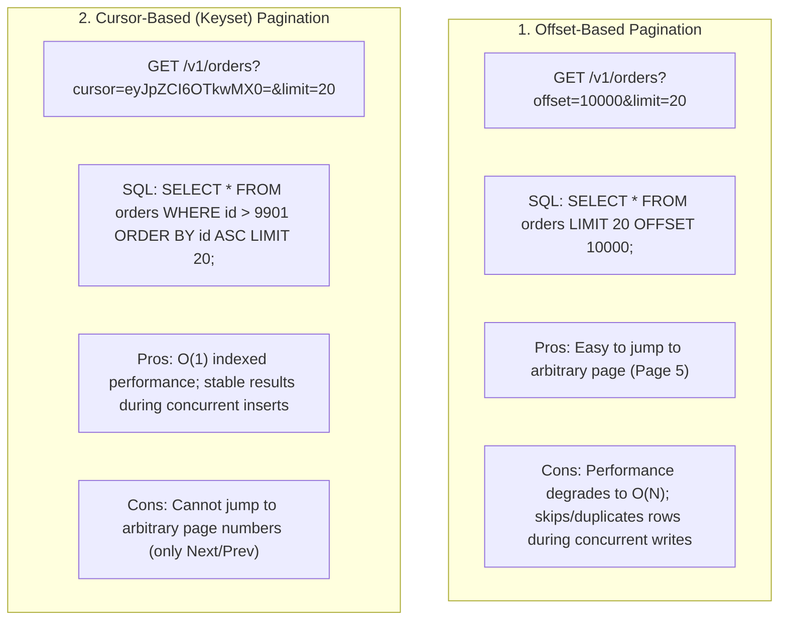
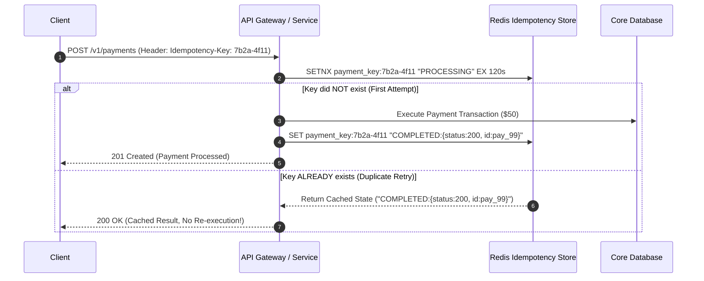

# API Design in System Design

## Overview

API Design is the discipline of specifying clear, reliable, secure, and evolution-friendly communication interfaces between software components, external consumers, and client applications. An API is an immutable contract: once a public API is deployed and consumed by external systems or millions of mobile apps, modifying it without breaking clients is extraordinarily difficult.

A robust system design must clearly specify protocol choices, endpoint URIs, request/response payloads, pagination mechanisms, idempotency controls, and error-handling standards.

---

## Protocol Selection Framework

```mermaid
graph TD
    Protocol{What are the communication requirements?}
    
    Protocol -->|Public web/mobile consumers, caching needed, standard CRUD| REST["REST over HTTP/1.1 or HTTP/2<br/>Standard, human-readable JSON, broad tooling"]
    
    Protocol -->|Internal microservices, ultra-low latency, streaming, strict schemas| gRPC["gRPC over HTTP/2<br/>Binary Protocol Buffers, bidirectional streaming, high performance"]
    
    Protocol -->|Client-driven querying, aggregating multiple services into 1 UI| GraphQL["GraphQL<br/>Eliminates over-fetching/under-fetching, flexible schema"]
    
    Protocol -->|Real-time bidirectional push (Chat, Live Dashboards, Gaming)| WebSockets["WebSockets<br/>Persistent full-duplex TCP connection, low overhead"]
    
    Protocol -->|Asynchronous server-to-server event notification| Webhooks["Webhooks<br/>HTTP POST with HMAC signature verification"]
```

---

## 1. RESTful API Best Practices

### URI Naming Conventions
- Use nouns, not verbs: `/v1/orders` (Good) vs. `/v1/createOrder` (Anti-pattern).
- Use plural nouns for collections: `/v1/users`, `/v1/products/{product_id}/reviews`.
- Use sub-resources for relations: `/v1/accounts/{account_id}/transactions`.

### HTTP Verbs and Status Codes

| HTTP Method | Idempotent? | Safe? | Success Code | Typical Use Case |
|:---|:---:|:---:|:---:|:---|
| **GET** | Yes | Yes | `200 OK` | Retrieve resource |
| **POST** | No | No | `201 Created` | Create resource or trigger action |
| **PUT** | Yes | No | `200 OK` / `204 No Content` | Complete replacement of resource |
| **PATCH** | No / Yes | No | `200 OK` | Partial update of fields |
| **DELETE** | Yes | No | `200 OK` / `204 No Content` | Delete resource |

### Key Enterprise HTTP Status Codes
- `200 OK`: Successful synchronous retrieval or update.
- `201 Created`: Resource successfully created (include `Location: /v1/orders/123` header).
- `202 Accepted`: Request accepted for asynchronous background processing (long-running batch).
- `400 Bad Request`: Client validation error (invalid schema, malformed JSON).
- `401 Unauthorized`: Missing or invalid authentication token.
- `403 Forbidden`: Authenticated identity lacks permission to access resource (RBAC).
- `404 Not Found`: Resource does not exist.
- `409 Conflict`: Business state conflict (e.g., duplicate unique email or optimistic lock failure).
- `429 Too Many Requests`: Rate limit exceeded (include `Retry-After: 30` header).
- `500 Internal Server Error`: Unhandled server exception.
- `503 Service Unavailable`: Circuit breaker tripped or service overloaded.

---

## 2. Pagination: Offset vs. Cursor-Based

When returning collections of records, unpaginated queries can crash servers by loading millions of records into memory:



> [!TIP]
> **Production Rule**: Use **Cursor-Based Pagination** for high-volume enterprise feeds, infinite scroll mobile feeds, and APIs exceeding 10,000 records.

---

## 3. Idempotency Keys in API Design

In distributed networks, clients cannot distinguish between a dropped request and a dropped response. A payment API must support **Idempotent Mutations** to avoid charging a customer multiple times during network timeouts:



---

## 4. Standardized Error Handling: RFC 7807 (Problem Details)

Never return inconsistent error payloads (`{"error": "bad"}` vs `{"msg": "failed"}`). Standardize on **RFC 7807 (Problem Details for HTTP APIs)**:

```json
{
  "type": "https://api.enterprise.com/errors/insufficient-funds",
  "title": "Insufficient Funds",
  "status": 400,
  "detail": "Account balance of $12.50 is insufficient for transaction amount of $50.00.",
  "instance": "/v1/accounts/acc_4821/transfers/tx_9912",
  "invalid_params": [
    {
      "name": "amount",
      "reason": "Exceeds current available balance"
    }
  ],
  "trace_id": "9f8a3c2b1a0e"
}
```

---

## 5. Rate Limiting Algorithms

To protect APIs from abuse and noisy neighbors, implement rate limiting at the API Gateway:
1. **Token Bucket**: Allows bursts of traffic while maintaining a steady average rate; ideal for general public REST APIs.
2. **Leaky Bucket**: Smooths out traffic into a constant, strictly steady output rate; ideal for egress calls to external third-party payment gateways.
3. **Sliding Window Log**: Highly accurate, memory-intensive tracking of timestamps; prevents edge bursts at minute boundaries.
