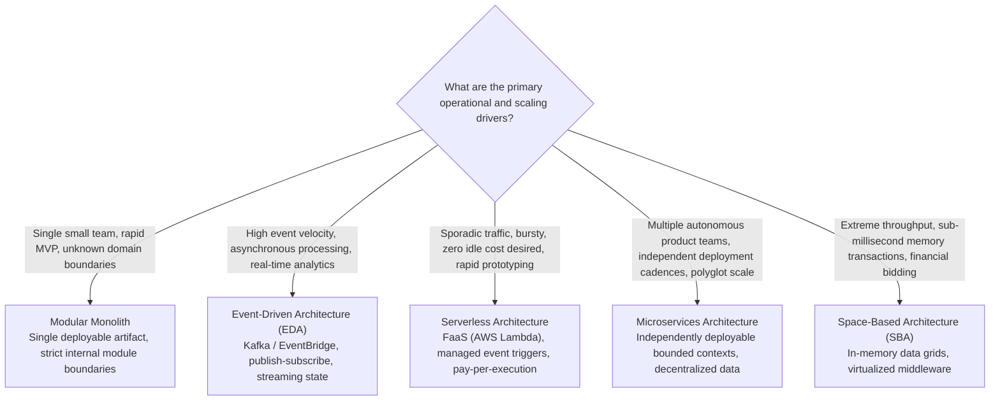

# Architecture Selection in System Design

## Overview

Architecture Selection is the critical decision-making stage where an architect chooses the overarching structural paradigm (style) for a system design. Selecting an inappropriate architecture style imposes immense structural friction: choosing microservices for an early-stage startup with 3 engineers results in crippling operational overhead; choosing a single monolithic database for a globally distributed platform with independent product teams results in organizational gridlock and deployment collisions.

The choice of architecture style must be guided by **empirical technical drivers, organizational topology (Conway's Law), and team operational maturity**, rather than current industry fashion.

---

## The Architecture Selection Decision Tree

---

## Comparative Selection Matrix

| Architectural Driver | Monolithic / Modular Monolith | Microservices | Event-Driven (EDA) | Serverless (FaaS) |
|:---|:---:|:---:|:---:|:---:|
| **Deployment Complexity** | Very Low | High | Medium | Very Low |
| **Operational & SRE Overhead** | Very Low | Very High | High | Low |
| **Data Consistency Simplicity** | Very High (ACID) | Low (Sagas / Eventual) | Low (Eventual) | Medium |
| **Independent Team Scalability** | Low | Very High | High | High |
| **Hardware / Cloud Cost Efficiency**| High | Medium | High | Variable (High if bursty) |
| **Fault Isolation (Blast Radius)** | Low | High | Very High | Very High |
| **Latency Predictability** | High | Low (Network hops) | Medium (Asynchronous) | Medium (Cold starts) |
| **Local Developer Experience (DX)**| Very High | Low | Medium | Medium |

---

## Key Selection Principles

### 1. Conway's Law Alignment
> *"Organizations which design systems are constrained to produce designs which are copies of the communication structures of these organizations."* — Melvin Conway

- If an organization has **one unified engineering team of 8 developers**, forcing a microservices architecture with 25 services will fail. The team will constantly battle cross-repository PRs and deployment synchronization.
- If an enterprise has **12 distributed teams across 4 countries**, a single monolithic repository will create merge contention, release train delays, and political disputes over deployment windows.

### 2. Operational Maturity Assessment
Microservices and complex event-driven streaming architectures require significant baseline platform engineering:
- Distributed tracing (OpenTelemetry)
- Centralized container orchestration (Kubernetes)
- Automated CI/CD pipelines with canary deployments
- Comprehensive SRE alerting and error budget governance

If an organization lacks this operational baseline, a **Modular Monolith** is the architecturally superior choice.

### 3. The "Monolith-First" Strategy (Martin Fowler)
Almost all successful microservice architectures in major tech giants (including Netflix, Uber, and Shopify) originated as monoliths:
1. Start with a clean **Modular Monolith** to discover true domain boundaries and user behaviors.
2. Refactor code into clean, isolated modules with zero circular dependencies.
3. Once a specific module exhibits unique scaling requirements (e.g., video encoding, fraud detection) or requires an independent delivery cadence, carve it out cleanly as a microservice using the **Strangler Fig pattern**.
