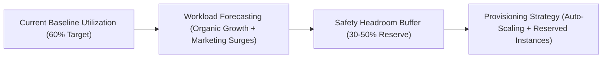
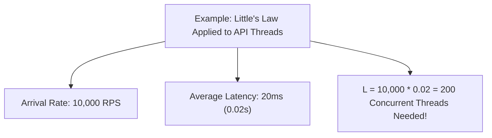
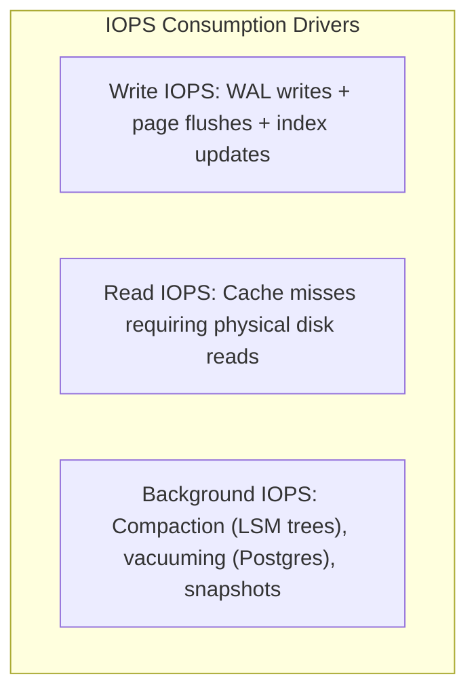

# Capacity Planning in System Design

## Overview

Capacity Planning is the disciplined operational and architectural process of estimating, forecasting, and provisioning the hardware, network, and cloud infrastructure resources required to support an enterprise system's workloads over a forward-looking operational horizon (typically 1 to 3 years). While **Scale Estimation** calculates theoretical order-of-magnitude numbers, **Capacity Planning** accounts for real-world operational factors: resource saturation knee-points, database connection pool limits, IOPS headroom, seasonal spikes, and financial procurement lead times.

---

## The Capacity Planning Horizon & Growth Modeling

### Growth Modeling Formulas
1. **Compound Organic Growth**:
   $$\text{Future Load } L(t) = L_0 \times (1 + r)^t$$
   Where $L_0$ is current baseline load, $r$ is the monthly growth rate, and $t$ is the number of months.
2. **Surge Multiplier (Peak-to-Average Ratio)**:
   $$\text{Peak Capacity Needed} = \text{Average Load} \times M_{\text{surge}} \times (1 + H)$$
   Where $M_{\text{surge}}$ is the historical surge factor (e.g., $3x$ to $10x$ for Black Friday/Cyber Monday) and $H$ is the safety headroom buffer (typically $0.30$ or $30\%$).

---

## 1. Connection Pool Sizing & Little's Law

One of the most catastrophic capacity bottlenecks in enterprise architectures is database connection exhaustion. Inexperienced teams configure application servers with 100 database connections each; across 50 container pods, this slams PostgreSQL with 5,000 connections, causing context-switching thrashing and total database lockup.

### Little's Law
$$L = \lambda \times W$$
Where:
- $L$ = Number of concurrent requests in the system.
- $\lambda$ = Arrival rate (Requests Per Second).
- $W$ = Average service time (latency) per request in seconds.

### Sizing Database Connections (The PostgreSQL Formula)
PostgreSQL and MySQL perform best with a small pool of active connections matching hardware CPU threads:

$$\text{Ideal DB Connections} = (\text{CPU Cores} \times 2) + \text{Effective Spindle Count}$$

For a 16-core database server with SSDs:
$$\text{Max DB Connections} = (16 \times 2) + 1 = \mathbf{33\text{ connections}}$$
To multiplex thousands of application requests across these 33 connections, architects insert an intermediate connection pooler (**PgBouncer** or **AWS RDS Proxy**).

---

## 2. Storage IOPS & Throughput Provisioning

In modern cloud environments (AWS EBS, Azure Managed Disks), databases are far more frequently throttled by **IOPS (Input/Output Operations Per Second)** and **I/O Throughput (MB/s)** than by raw disk gigabytes.

### IOPS Sizing Rules of Thumb
- **Calculate Read Cache Miss Rate**: If total queries = $10,000\text{ QPS}$ and cache hit ratio = $95\%$, disk reads = $5\% \times 10,000 = \mathbf{500\text{ Read IOPS}}$.
- **Write Amplification**: Writing 1 relational row typically incurs $3\times$ to $5\times$ write IOPS due to index updates (B-Tree splits) and transaction logging.
- **Provisioned IOPS vs. Burst**: Never rely on burstable disk tiers (e.g., AWS EBS `gp2` burst credits) for production databases. Always provision dedicated IOPS (`gp3` provisioned or `io2` Block Express) with cloud monitoring alerts set at 80% saturation.

---

## 3. Network Interface (NIC) & Bandwidth Saturation

Modern container orchestrators (Kubernetes) pack dozens of microservice pods onto a single virtual machine host. Architects must verify that aggregated container traffic does not saturate the host node's physical Network Interface Card (NIC):

$$\text{Host Bandwidth Saturation Ratio} = \frac{\sum_{i=1}^{k} \text{Peak Egress Pod } i}{\text{Host Instance Network Bandwidth limit}}$$

If 10 pods each emit $1\text{ Gbps}$ of telemetry and API traffic on an instance capped at $5\text{ Gbps}$, the hypervisor silently drops packets, resulting in inexplicable TCP retransmissions and 5-second socket timeout spikes.

---

## The Capacity Planning Checklist

| Component | Target Baseline Saturation | Knee-Point / Alert Threshold | Remediation Action |
|:---|:---|:---|:---|
| **Stateless CPU** | 50% – 60% | 75% sustained for 3 minutes | Horizontal Pod Autoscaler (HPA) triggers new replicas. |
| **Stateless Memory** | 60% – 70% | 85% | Auto-scale pods; trigger memory dump if leak suspected. |
| **Database CPU** | 40% – 50% | 70% | Spin up additional read replicas; optimize slow queries. |
| **DB Connection Pool**| 30% – 40% | 80% of pool capacity | Route reads to replicas; tune pooler timeouts; investigate slow queries. |
| **Disk Storage** | 50% | 80% | Cloud automated volume expansion (auto-grow EBS). |
| **Disk IOPS** | 50% | 75% sustained | Upgrade provisioned IOPS tier or partition large tables. |
