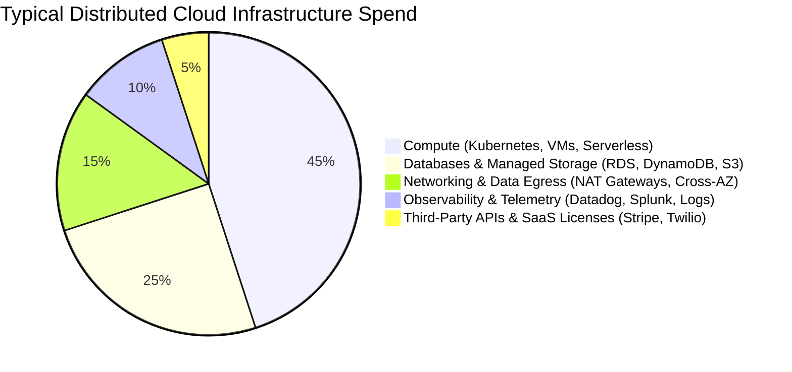
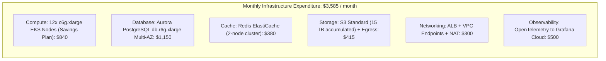

# Cost Analysis & FinOps in System Design

## Overview

Cost Analysis is the quantitative economic evaluation of a system architecture's operational and infrastructure expenditures. An architect who designs a technically flawless system that costs more to run than the business revenue it generates has failed. In cloud computing environments (AWS, Azure, GCP), infrastructure pricing is dynamic, multi-dimensional, and consumption-based.

System design requires formulating precise **Cloud FinOps models**, identifying hidden pricing traps (such as cross-AZ data transfer fees), and calculating the **Total Cost of Ownership (TCO)** across compute, storage, networking, and third-party APIs.

---

## 1. The Cloud Cost Breakdown Model

---

## 2. Hidden Cloud Cost Traps Architects Must Avoid

Experienced architects anticipate the non-obvious cost drivers that frequently blow out enterprise budgets:

| Cost Trap | Root Cause Mechanism | Financial Impact | Architectural Mitigation |
|:---|:---|:---|:---|
| **Managed NAT Gateways** | High-volume container traffic routing out through AWS NAT Gateway | $0.045/GB processed + hourly charge ($1,000s/month) | Deploy **VPC Endpoints (PrivateLink)** for AWS services (S3, DynamoDB); keep traffic off NAT Gateways. |
| **Cross-AZ Network Egress** | Microservices distributed across AZs chatting synchronously | $0.01 per GB in each direction | Group tightly coupled microservices within the same Availability Zone or adopt single-AZ worker pools with multi-AZ failover. |
| **High-Cardinality APM Metrics**| Emitting custom Datadog/NewRelic metric tags with unique User IDs | $0.05 per custom metric stream | Aggregate metrics client-side; strip high-cardinality tags from metric dimensions; store them in sampled traces only. |
| **Un-lifecycle'd S3 Buckets** | Storing raw JSON events and debug logs indefinitely in S3 Standard | Accumulates compound storage costs year-over-year | Implement automated S3 Lifecycle Rules: Transition to Glacier Instant Retrieval after 30 days, purge after 365 days. |

---

## 3. Worked Example: 3-Year Cloud TCO Calculation

### Workload Profile
- **Traffic**: 50,000,000 API requests/day (~580 RPS average, 1,500 RPS peak).
- **Data Volume**: 500 GB of new transactional data per month.
- **Egress Bandwidth**: 15 TB of outbound data to the internet per month.

### Monthly Cloud Cost Model (AWS Pricing Baseline)

### Unit Economics Calculation
$$\text{Total Monthly Requests} = 50,000,000 \times 30 = 1,500,000,000\text{ requests / month}$$
$$\text{Cost per Million Requests} = \frac{\$3,585}{1,500} \approx \mathbf{\$2.39\text{ per 1 Million Requests}}$$

If the business generates $\$50.00$ of revenue per million requests, the infrastructure margin is **$95.2\%$**, representing an exceptionally healthy, profitable unit economic model.

---

## 4. Cost Optimization Levers for Architects

1. **Commitment Strategy (Savings Plans / RIs)**: Never run steady-state production baseline compute on on-demand pricing. Commit to 1-year or 3-year Compute Savings Plans to slash compute costs by **40% to 65%**.
2. **Architecture Shift to Graviton (ARM64)**: Specify AWS Graviton3 or Azure Ampere instance families; they provide 20% lower cost and up to 40% better price-performance compared to comparable x86 instances.
3. **Edge Caching via CDN**: Serving responses from Cloudflare or CloudFront costs ~$0.02 to $0.08 per GB, while serving directly from origin application compute and databases costs $0.50+ per GB in compute and database query overhead.
