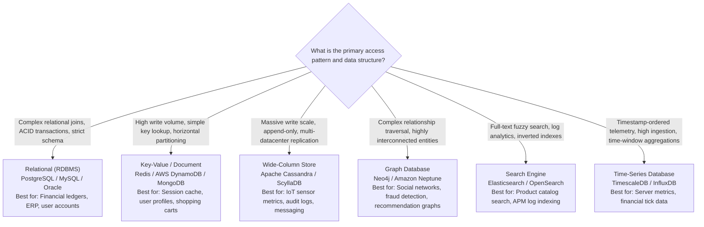
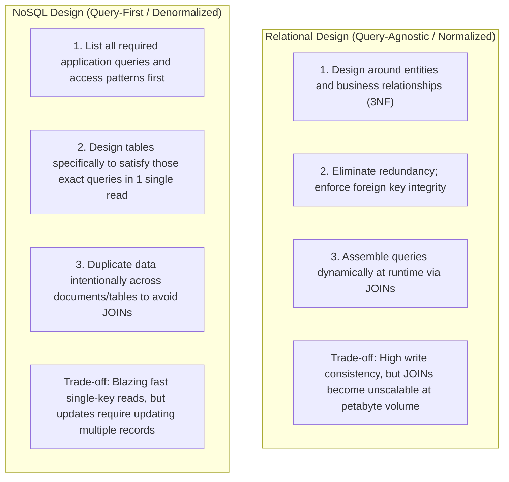
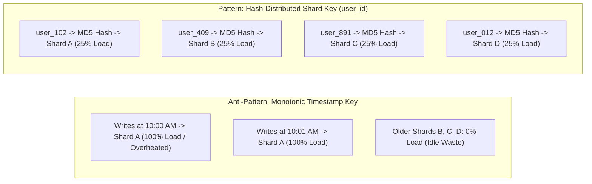
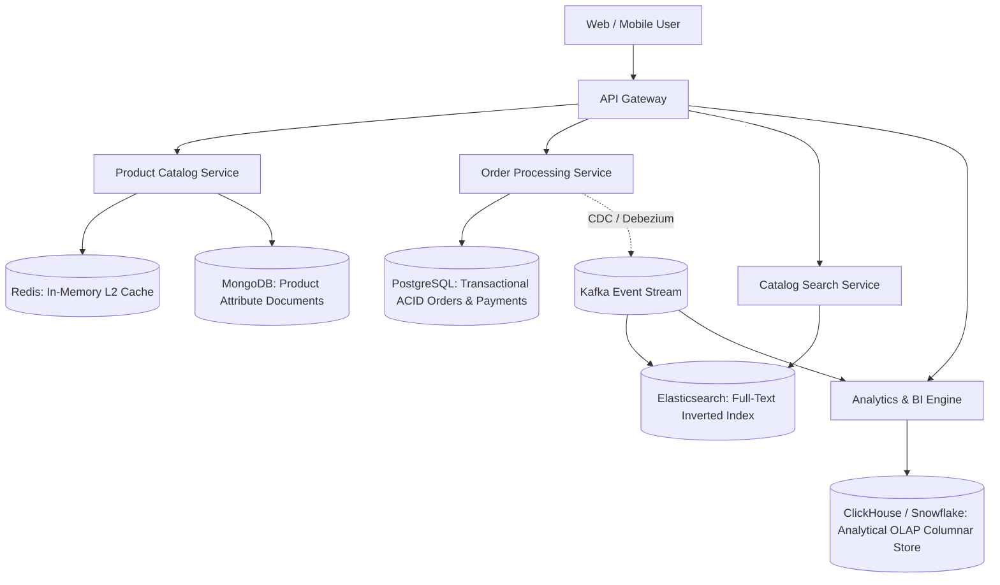

# Data Design & Modeling in System Design

## Overview

Data Design is the process of selecting appropriate storage paradigms, defining database schemas, optimizing access patterns, and partitioning data to satisfy system throughput, latency, and consistency requirements. In modern distributed systems, the myth of the "one-size-fits-all database" is dead. Architects practice **Polyglot Persistence**—matching specific domain data models and access patterns to the optimal underlying storage engine.

---

## The Database Selection Decision Matrix

---

## 1. Relational vs. NoSQL Schema Design

---

## 2. Choosing the Optimal Partition / Shard Key

When data exceeds the capacity of a single physical database instance, the dataset must be partitioned. The choice of **Shard Key (Partition Key)** is the single most important decision in distributed data architecture:

### Criteria for an Effective Shard Key
1. **High Cardinality**: The key must have millions of distinct values (e.g., `user_id` or `uuid`) to distribute evenly across dozens of physical nodes. Using `country_code` or `status` is disastrous because 90% of data pools into 2 or 3 hot shards.
2. **Even Write & Read Distribution**: Avoid monotonic sequence keys (e.g., auto-incrementing timestamps `created_at`). Monotonic keys cause 100% of current write traffic to slam the single shard holding the latest time window ("Hot Spotting").
3. **Query Colocation**: Choose a shard key that aligns with the primary read query filter. If 99% of queries filter by `WHERE tenant_id = ?`, sharding by `tenant_id` ensures queries are satisfied by a single physical node (Scatter-Gather queries avoided).

---

## 3. Database Indexing Strategies

Indexes trade write latency and disk space for lightning-fast read performance:
- **B-Tree Indexes**: Standard for relational databases; excellent for point lookups (`WHERE id = 42`) and range scans (`WHERE age BETWEEN 20 AND 30`).
- **Hash Indexes**: Extreme $O(1)$ point lookups; cannot support range queries or sorting.
- **Inverted Indexes**: Tokenizes text strings into individual words mapped to document IDs (core of Elasticsearch/Lucene).
- **Covering Indexes**: An index containing all columns requested in the `SELECT` clause (e.g., `INDEX (user_id, status) INCLUDE (email)`), allowing the database engine to satisfy the entire query directly from RAM without touching the underlying physical table pages.

---

## 4. Polyglot Persistence Architecture in Practice

A modern enterprise e-commerce platform utilizes specialized databases across its bounded contexts:

