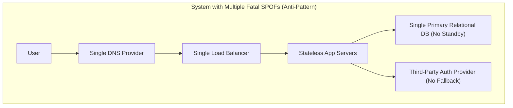
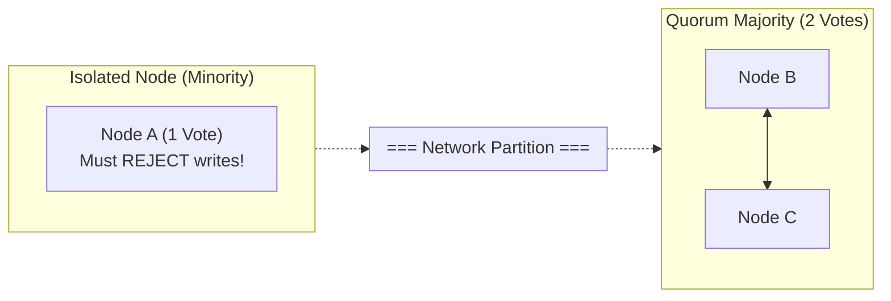
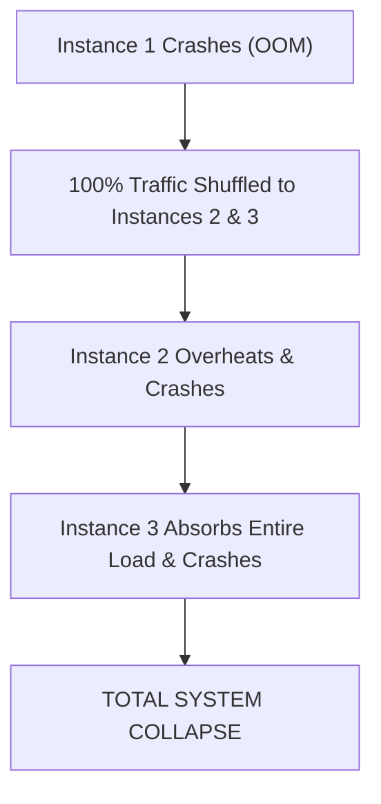

# Failure Analysis in System Design

## Overview

Failure Analysis is the architectural practice of stress-testing a system design against real-world hardware crashes, network partitions, software bugs, and operational disasters before a single line of code is written. In large-scale distributed systems, failure is not an anomaly; it is a statistical certainty. At Fortune 500 scale across thousands of servers, hard drives fail daily, optical fiber lines get severed, memory gets corrupted, and third-party APIs experience intermittent outages.

A senior architect designs systems that remain operational **despite continuous, concurrent failures of individual components**.

---

## 1. Single Point of Failure (SPOF) Auditing

A Single Point of Failure (SPOF) is any component whose failure will bring down the entire system or cause unrecoverable data loss.

### The SPOF Elimination Checklist
1. **DNS Tier**: Deploy dual-DNS providers (e.g., AWS Route 53 + Cloudflare) using Anycast routing to survive top-level registrar outages.
2. **Ingress Tier**: Place load balancers across multiple Availability Zones (AZs) with automated health probes.
3. **Compute Tier**: Auto-scale stateless worker pods across at least 3 distinct AZs.
4. **Database Tier**: Configure synchronous multi-AZ standby replication with automated failover (e.g., AWS Aurora Multi-AZ) and offsite WAL archival.
5. **Third-Party Integration Tier**: Protect all external API calls with circuit breakers and fallback default logic.

---

## 2. Failure Mode and Effects Analysis (FMEA)

Architects use FMEA to systematically evaluate every architectural building block:

| Architectural Component | Potential Failure Mode | Root Cause | Failure Effect (Blast Radius) | Architectural Mitigation Strategy |
|:---|:---|:---|:---|:---|
| **API Gateway** | Complete Ingress Outage | Memory leak under traffic spike | 100% of external customer traffic dropped | Multi-AZ auto-scaling group; Cloudflare edge worker fallback page |
| **Distributed Cache (Redis)**| Cache Stampede / Flush | Master node crash / OOM | Sudden surge of 50,000 QPS hits relational DB, causing DB crash | Probabilistic early expiration (XFetch algorithm); mutual exclusion mutex locks |
| **Primary Database** | Hardware Crash / Disk Failure | Underlying hypervisor termination | Writes fail immediately; read queries stall | Automated election of warm standby replica within 30s via Raft/RDS Multi-AZ |
| **Message Broker (Kafka)**| Broker Partition Leader Failure| Network switch failure in rack | Producers cannot publish to partitions | Min in-sync replicas (`min.insync.replicas=2`), replication factor = 3, `acks=all` |
| **Downstream Payment API**| Unresponsive / Hanging (30s) | External banking gateway degradation | Thread pools exhaust in caller services; cascading crash | Circuit Breaker trips after 5 consecutive timeouts; fallback to offline queue |

---

## 3. Distributed Failure Scenarios

### Scenario A: Split-Brain Condition during Network Partition
In a multi-node cluster (e.g., 3-node database), if a network switch severs communication between Node A and Nodes B/C:

- **The Split-Brain Trap**: If Node A believes it is still the primary and accepts writes while Node B is elected primary and also accepts writes, data branches into irreconcilable conflict.
- **Architectural Resolution**: **Strict Quorum Consensus ($Q = \lfloor N/2 \rfloor + 1$)**. A partition can only elect a leader or accept writes if it possesses a strict majority of votes. Node A (1 out of 3 votes) immediately steps down to read-only or shuts off.

### Scenario B: Cascading Failure (The Death Spiral)
When one service crashes, its load immediately shifts to surviving instances, overwhelming them and causing them to crash in a cascading wave:

- **Architectural Resolution**: **Load Shedding & Adaptive Rate Limiting**. Surviving nodes monitor their own CPU and queue latency; when CPU exceeds 85%, they aggressively drop non-essential traffic (returning `HTTP 429 / 503`) rather than attempting to process everything and crashing.
