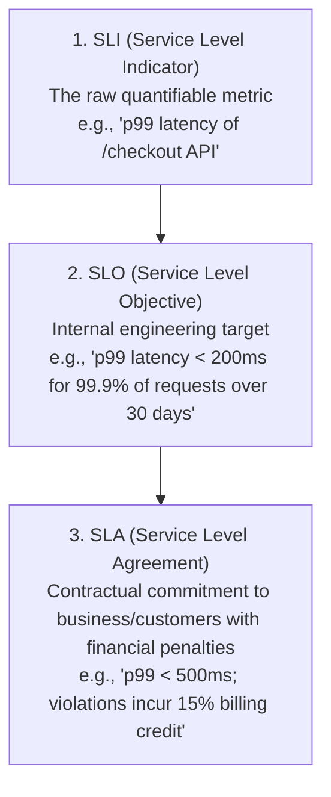
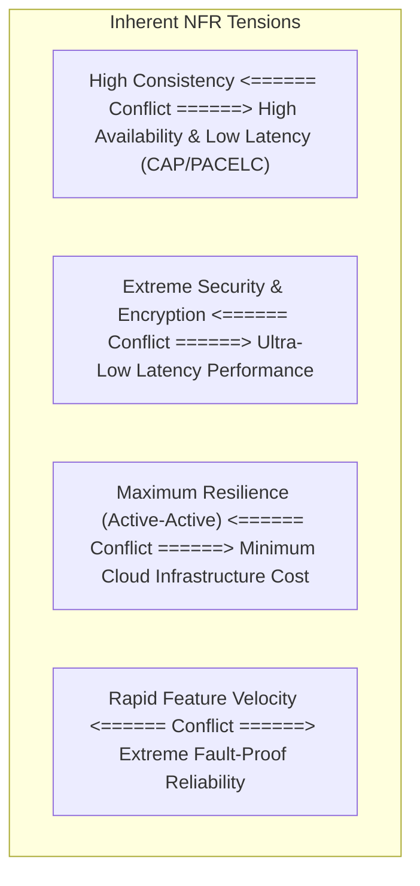

# Non-Functional Requirements Analysis in System Design

## Overview

Non-Functional Requirements (NFRs)—frequently termed **Quality Attributes** or **Architectural Characteristics**—define *how* a system performs its functions, rather than *what* it does. In distributed system design, NFRs exert vastly more structural gravity than functional user stories. A photo-sharing platform supporting 100 users requires a simple CRUD relational backend; the exact same platform supporting 500 million active users requires distributed caching, sharded storage, object storage CDNs, and asynchronous ingestion pipelines.

The Solution Architect must translate subjective business desires into rigorous, measurable NFRs and negotiate inevitable architectural conflicts.

---

## The SLI / SLO / SLA Hierarchy

Architects frame NFRs using the Google Site Reliability Engineering (SRE) measurement hierarchy:

---

## The Core NFR Matrix for System Design

During system design, architects systematically evaluate nine foundational quality dimensions:

| Dimension | Key System Design Metric | Typical Architectural Mechanism |
|:---|:---|:---|
| **Availability** | % Uptime (e.g., 99.99%) | Multi-AZ redundancy, active-active topologies, automated DNS failover |
| **Throughput** | Requests per second (RPS / TPS) | Horizontal auto-scaling, load balancers, queue-based buffering |
| **Latency** | Percentiles (p95, p99 in ms) | Distributed caching (Redis), CDN edge caching, read replicas, non-blocking I/O |
| **Consistency** | Linearizable vs. Eventual | Quorum consensus (Raft), distributed transactions vs. Saga / outbox |
| **Durability** | Data loss tolerance (RPO) | Write-ahead logging, multi-region synchronous replication, WORM storage |
| **Scalability** | Peak-to-average scale ratio | Shared-nothing stateless compute, database sharding, consistent hashing |
| **Security** | Zero trust, threat containment | mTLS, OAuth2/OIDC, KMS envelope encryption, network segmentation |
| **Maintainability**| DORA lead time, test coverage | Modular monolith / microservices, Clean Architecture, CI/CD automation |
| **Cost Efficiency** | Unit cost per transaction | Spot instances, FinOps right-sizing, auto-scaling, cold tier lifecycle |

---

## Resolving Conflicting NFRs (The Triage Matrix)

It is technically impossible to maximize all NFRs simultaneously. Attempting to build a system that is ultra-low latency, strongly consistent across multi-regions, 99.999% available, deeply encrypted, and ultra-cheap is an exercise in futility.

Architects use the **NFR Conflict Matrix** to identify and resolve inherent architectural tensions:

### Prioritization Technique: The "Top-3" Rule
In any system design exercise, force stakeholders to choose the **Top 3 non-negotiable architectural drivers**:
1. **Tier 1 (Non-Negotiable Core)**: The 1 or 2 attributes where failure means company failure (e.g., Data Consistency & Durability for a banking ledger; Ultra-Low Latency for an ad-bidding exchange).
2. **Tier 2 (Important Constraints)**: Attributes that must meet an acceptable threshold (e.g., Availability $\ge 99.9\%$, Cost within budget).
3. **Tier 3 (Deliberate Compromises)**: Attributes intentionally deprioritized to achieve Tier 1 (e.g., accepting eventual consistency and 2-second data propagation lag in exchange for unbounded horizontal read scale).
