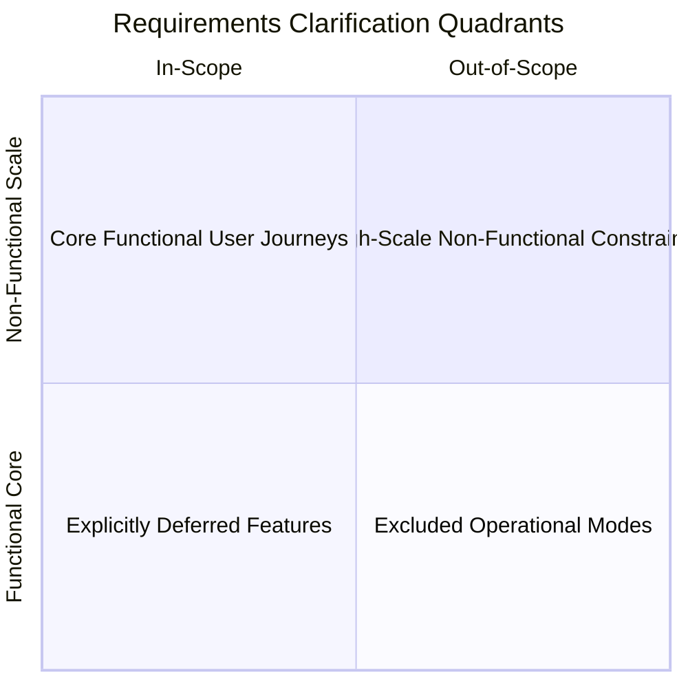
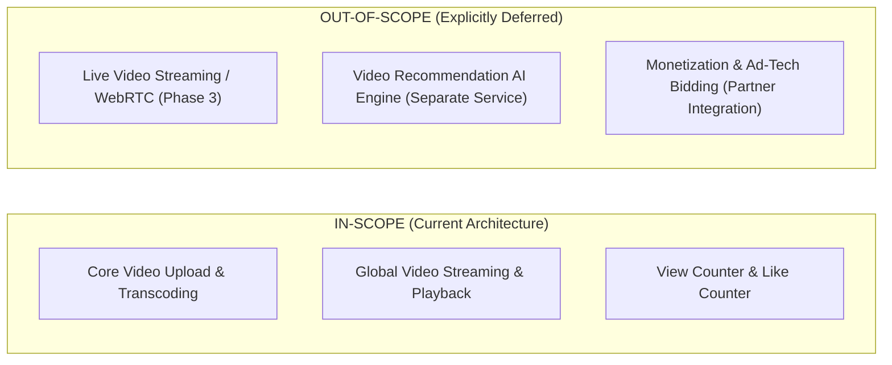

# Requirements Analysis in System Design

## Overview

Requirements Analysis is the foundational phase of the system design methodology. Designing a distributed system without clear, bounded requirements is the primary root cause of scope creep, costly refactoring, and project cancellation. The Solution Architect must act as an investigative analyst, extracting implicit assumptions, defining rigid system boundaries, and categorizing requirements into actionable architectural drivers.

---

## The Requirements Clarification Framework

When presented with a high-level system design prompt (e.g., "Design YouTube", "Design Uber", or "Build a Real-Time Payment Engine"), experienced architects apply the **4-Quadrant Clarification Framework**:



---

## 1. Functional Requirements (FR) Deconstruction

Functional requirements define **what the system does**—its inputs, behaviors, transformations, and outputs.

### Extraction Technique: User Flow Decomposition
Break down high-level business desires into sequential, atomic user actions:
1. **Primary Actor Actions**: What is the happy path for the primary user? (e.g., Rider requests ride $\rightarrow$ Driver matched $\rightarrow$ Trip tracked $\rightarrow$ Payment debited).
2. **Secondary Actor Actions**: What do back-office or administrative actors do? (e.g., Customer support refunds ride, compliance audits fraud).
3. **Automated Background Workflows**: What happens without human intervention? (e.g., Nightly billing reconciliation, automated driver payouts, geospatial index rebalancing).

---

## 2. Uncovering Hidden & Implicit Requirements

Junior designers only build for the happy path. Senior architects actively probe for edge cases and implicit constraints:

| Category | Typical Explicit Prompt | Critical Probing Questions by Architect |
|:---|:---|:---|
| **Data Retention & Purging** | "Store user ride history." | How many years must ride history be maintained? Can historical records older than 1 year be archived to cold storage? Are there GDPR deletion mandates? |
| **Concurrency Contention** | "Users can book concert tickets." | Can two users attempt to book the exact same seat simultaneously? How long is a seat held in a cart before release? What happens during a 50x flash surge? |
| **Geographic Scope** | "Global video streaming platform." | Are videos restricted by licensing geo-fences? Must user data reside strictly within their home region (e.g., EU GDPR vs. China CSL)? |
| **Failure Modes** | "Process credit card payments." | If the payment gateway times out after debiting the user, how do we prevent duplicate charges? Does the system support automated retries or manual human review? |

---

## 3. Defining the "Out-of-Scope" Boundary

Clearly documenting what the system **will not do** is as important as documenting what it will do:



By explicitly establishing out-of-scope boundaries, the architect prevents architectural bloat and ensures the design focuses deeply on the core technical bottlenecks.

---

## Transforming User Stories into System Contracts

Every accepted functional requirement must be translated into a formal system behavior specification:

```markdown
### FR-01: Vehicle Ride Request
- **Actor**: Mobile Passenger Application
- **Trigger**: Passenger clicks "Confirm Pickup"
- **Input Parameters**: `passenger_id`, `pickup_latitude`, `pickup_longitude`, `destination_latitude`, `destination_longitude`, `vehicle_type`
- **Invariants / Preconditions**: 
  1. Passenger account must have an active, verified payment method on file.
  2. Pickup coordinates must fall within an active operating metropolitan geo-fence.
- **System Actions**:
  1. Reserve an authorization hold on the passenger's payment card.
  2. Query the Geospatial In-Memory Index (H3/S2) to locate the 10 closest idle drivers within a 5km radius.
  3. Send atomic dispatch invites sequentially with a 15-second acceptance timeout.
- **Output / Postconditions**:
  1. Match confirmed: Ride state changes to `MATCHED`; driver telemetry stream assigned to passenger socket.
  2. Timeout: If no driver accepts within 60 seconds, gracefully return "No Drivers Available; retry in 2 minutes."
```
