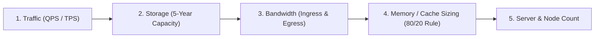

# Scale Estimation in System Design

## Overview

Scale Estimation is the mathematical process of calculating the computational, storage, memory, and network demands of a proposed system design. Accurate scale estimation transforms abstract architectural boxes on a whiteboard into physically viable engineering designs. It prevents both **catastrophic under-provisioning** (system crashes on launch day) and **wasteful over-engineering** (spending millions on a distributed NoSQL cluster for a workload that fits on a single PostgreSQL instance).

---

## The System Designer's Mathematical Toolkit

### Order of Magnitude Reference (Powers of 2 and 10)

| Power of 2 | Exact Value | Approximation | Storage / Scale Prefix |
|:---|:---|:---|:---|
| $2^{10}$ | 1,024 | 1 Thousand ($10^3$) | 1 Kilobyte (KB) |
| $2^{20}$ | 1,048,576 | 1 Million ($10^6$) | 1 Megabyte (MB) |
| $2^{30}$ | 1,073,741,824 | 1 Billion ($10^9$) | 1 Gigabyte (GB) |
| $2^{40}$ | 1,099,511,627,776 | 1 Trillion ($10^{12}$) | 1 Terabyte (TB) |
| $2^{50}$ | 1,125,899,906,842,624 | 1 Quadrillion ($10^{15}$) | 1 Petabyte (PB) |

### Time Constants
- **1 Day**: $24 \times 60 \times 60 = 86,400\text{ seconds } \approx \mathbf{10^5\text{ seconds (for quick mental math)}}$.
- **1 Month**: $2.5 \times 10^6\text{ seconds}$.
- **1 Year**: $365 \times 86,400 \approx 3.15 \times 10^7\text{ seconds} \approx \mathbf{3 \times 10^7\text{ seconds}}$.

---

## The 5-Step Scale Estimation Workflow

---

## Step-by-Step Worked Example: Global Photo-Sharing Platform (e.g., Instagram)

### Given Assumptions
- **Daily Active Users (DAU)**: $100,000,000$ ($10^8$ users).
- **User Activity**:
  - Each user views $40$ photos per day.
  - Each user uploads $1$ photo per day.
- **Read-to-Write Ratio**: $40:1$ (Heavily read-intensive).
- **Payload Sizes**:
  - Metadata record per photo: $1\text{ KB}$.
  - Image binary payload: $200\text{ KB}$ (compressed).

---

### Step 1: Throughput / QPS Estimation

#### Writes (Photo Uploads)
$$\text{Total Uploads / Day} = 100,000,000 \times 1 = 100,000,000\text{ photos/day}$$
$$\text{Average Write QPS} = \frac{100,000,000}{86,400} \approx \mathbf{1,160\text{ writes/second}}$$
$$\text{Peak Write QPS (Peak Factor = 2x)} = 1,160 \times 2 \approx \mathbf{2,320\text{ writes/second}}$$

#### Reads (Photo Views)
$$\text{Total Views / Day} = 100,000,000 \times 40 = 4,000,000,000\text{ views/day } (4 \times 10^9)$$
$$\text{Average Read QPS} = \frac{4,000,000,000}{86,400} \approx \mathbf{46,300\text{ reads/second}}$$
$$\text{Peak Read QPS (Peak Factor = 2x)} = 46,300 \times 2 \approx \mathbf{92,600\text{ reads/second}}$$

*Architectural Takeaway*: Read traffic (~93k RPS) dwarf writes (~2.3k RPS). System requires heavy caching (CDN + Redis) and read replicas.

---

### Step 2: Storage Sizing (5-Year Capacity)

#### Daily Binary Image Storage
$$\text{Daily Binary Storage} = 100,000,000 \times 200\text{ KB} = 20,000,000\text{ MB} = \mathbf{20\text{ TB / day}}$$

#### Daily Metadata Storage
$$\text{Daily Metadata Storage} = 100,000,000 \times 1\text{ KB} = 100,000\text{ MB} = \mathbf{100\text{ GB / day}}$$

#### 5-Year Storage Projection
- **Binary Media (S3 / Object Storage)**:
  $$20\text{ TB/day} \times 365 \times 5 = 36,500\text{ TB} \approx \mathbf{36.5\text{ Petabytes}}$$
- **Database Metadata Storage (5 Years)**:
  $$100\text{ GB/day} \times 365 \times 5 = 182,500\text{ GB} \approx \mathbf{182.5\text{ TB}}$$
- **Replication Overhead (3x replication factor)**:
  $$\text{Total Database Storage} = 182.5\text{ TB} \times 3 \approx \mathbf{547.5\text{ TB}}$$

*Architectural Takeaway*: Storing 36.5 PB requires low-cost cloud object storage (AWS S3) with cold lifecycle tiering. Metadata (182 TB) exceeds single-instance relational capacity and must be horizontally sharded (e.g., NoSQL or sharded MySQL).

---

### Step 3: Network Bandwidth Estimation

#### Inbound Bandwidth (Ingress)
$$\text{Average Ingress} = 1,160\text{ uploads/sec} \times 200\text{ KB} = 232,000\text{ KB/s} \approx \mathbf{232\text{ MB/s}} = \mathbf{1.85\text{ Gbps}}$$

#### Outbound Bandwidth (Egress)
$$\text{Average Egress} = 46,300\text{ views/sec} \times 200\text{ KB} = 9,260,000\text{ KB/s} \approx \mathbf{9.26\text{ GB/s}} = \mathbf{74.08\text{ Gbps}}$$
$$\text{Peak Egress (2x)} = 74.08 \times 2 \approx \mathbf{148.16\text{ Gbps}}$$

*Architectural Takeaway*: Handling 148 Gbps of egress from origin servers would saturate data center pipes and incur catastrophic cloud costs. An external multi-edge **Content Delivery Network (CDN)** is mandatory to serve 95%+ of image requests at the edge.

---

### Step 4: Memory & Cache Sizing (The Pareto 80/20 Rule)

According to the Pareto Principle, **20% of the photos generate 80% of daily read traffic**. We want to cache that top 20% in fast in-memory storage (Redis):

$$\text{Daily Cached Photos} = 20\% \times 100,000,000 = 20,000,000\text{ photos/day}$$
$$\text{Cache Memory Required (Daily Hot Set)} = 20,000,000 \times 200\text{ KB} = 4,000,000\text{ MB} = \mathbf{4\text{ TB of RAM}}$$

*Architectural Takeaway*: A 4 TB distributed Redis cluster (e.g., 16 instances with 256 GB RAM each) can easily cache the entire active working set for the day, shielding backend databases and object storage.

---

### Step 5: Server Instance Estimation

To estimate compute instances needed for stateless application API pods:
- Assume a modern containerized API worker (4 vCPU, 8 GB RAM) comfortably handles **$1,000\text{ RPS}$** with p99 latency $< 50\text{ms}$.
- Peak Read QPS = $92,600\text{ RPS}$.
- Assuming 80% of reads hit the CDN, origin receives $20\% \times 92,600 = 18,520\text{ RPS}$.
- Peak Write QPS = $2,320\text{ RPS}$.
- Total Origin Peak QPS = $18,520 + 2,320 \approx \mathbf{20,840\text{ RPS}}$.

$$\text{API Server Instances Required} = \frac{20,840\text{ RPS}}{1,000\text{ RPS/node}} \approx \mathbf{21\text{ instances}}$$
- Adding a **$2\times$ redundancy buffer** for fault tolerance and unexpected surges:
  $$\text{Target Provisioning} = 21 \times 2 \approx \mathbf{42\text{ container pods (EKS/ECS)}}$$
