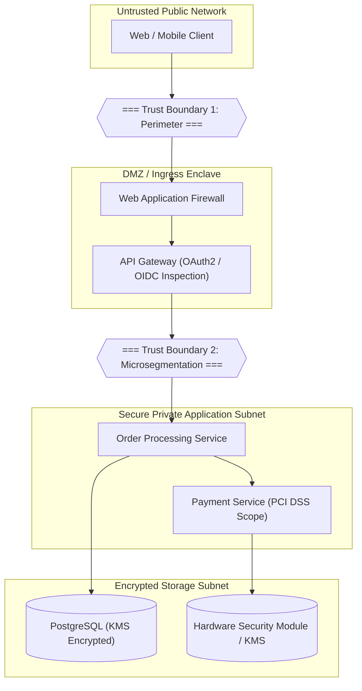
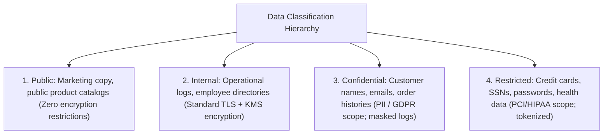
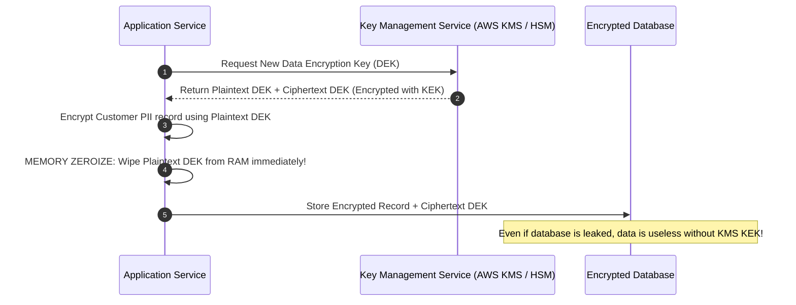

# Security Analysis in System Design

## Overview

Security Analysis is the deliberate architectural process of identifying threat vectors, evaluating trust boundaries, and designing preventative, detective, and responsive safeguards into a distributed system design. In modern enterprise environments, security cannot be "bolted on" after code is written; it is an architectural property that must be engineered from the inception of system design.

---

## 1. Architectural Threat Modeling: Data Flow STRIDE

Architects conduct threat modeling by mapping data flows, identifying trust boundaries, and evaluating each interaction against the **STRIDE** model:

### Threat Vector Mapping across Trust Boundaries

| Boundary Interaction | STRIDE Threat | Potential Attack Scenario | Architectural Defense |
|:---|:---|:---|:---|
| **Client to Ingress** | **Spoofing** | Attacker impersonates an authenticated customer using stolen session cookie. | Enforce short-lived JWT tokens signed via RS256 with OIDC identity verification and refresh token rotation. |
| **Client to Ingress** | **Denial of Service** | Botnet floods checkout endpoint with 50,000 requests/second. | Cloudflare WAF DDoS mitigation + Token Bucket rate limiting keyed by client IP and User ID. |
| **Gateway to Service**| **Tampering** | Man-in-the-middle attacker alters order price query parameters on internal network. | Mutual TLS (mTLS) with strict cipher suites (TLS 1.3) across all internal microservice communication. |
| **Service to Database**| **Information Disclosure** | SQL injection in user search parameter dumps the customer table. | Strict Parameterized Queries / ORM usage; Principle of Least Privilege database IAM credentials. |
| **Payment Service** | **Elevation of Privilege**| Compromised worker node attempts to read payment credit card keys from Vault. | Workload identity verification (AWS IAM Roles for Service Accounts - IRSA) ensuring only Payment pods can access KEK. |

---

## 2. Enterprise Data Classification Framework

Every data attribute stored or processed by the system must be classified into one of four tiers, dictating mandatory security controls:

---

## 3. Cryptographic Key Management & Envelope Encryption

Directly encrypting millions of customer records with a single static master key in code is an enterprise anti-pattern. Architects enforce **Envelope Encryption**:

---

## 4. Secrets Management Best Practices

1. **Zero Hardcoded Secrets**: Secrets (database passwords, API keys, private certificates) must never reside in source code, Docker images, or Git repositories.
2. **Dynamic Just-in-Time Credentials**: Applications authenticate to HashiCorp Vault or AWS Secrets Manager using workload identities to obtain short-lived credentials that rotate automatically every 60 minutes.
3. **Automated Secret Scanning**: Pre-commit hooks (TruffleHog, GitGuardian) and CI pipelines scan every commit to immediately block pull requests containing credentials.
