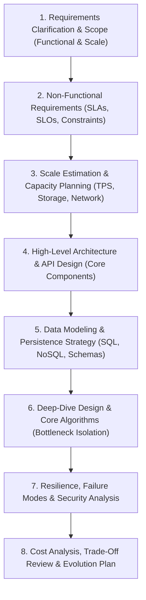
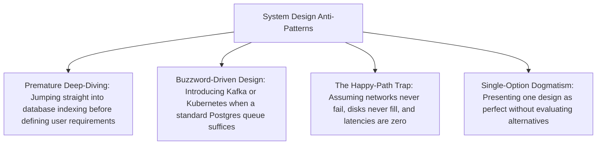

# System Design Process

## Overview

The System Design Process is an end-to-end, structured engineering framework used by Solution Architects and Principal Engineers to transform ambiguous business problems into scalable, reliable, secure, and cost-effective distributed systems. In both high-stakes enterprise project delivery and Tier-1 system design evaluations (FAANG / Fortune 500), following a rigorous, repeatable process prevents premature optimization, missed edge cases, and catastrophic architectural blind spots.

---

## The 8-Step System Design Lifecycle

---

## Step-by-Step Breakdown

### Step 1: Requirements Clarification & Scope
- **Objective**: Establish crisp boundaries. Never design in ambiguity.
- **Key Questions**:
  - What are the core user flows (Must-Haves) vs. secondary features (Nice-to-Haves)?
  - Who are the actors (Mobile users, B2B partners, automated IoT sensors)?
  - What is out of scope for the current architectural phase?

### Step 2: Non-Functional Requirements (NFRs)
- **Objective**: Establish the quantitative quality attributes that govern the system topology.
- **Key Parameters**:
  - **Availability**: 99.9% (standard) vs. 99.999% (multi-region active-active).
  - **Latency**: P95 / P99 response time targets under normal and surge conditions.
  - **Consistency**: Immediate linearizable ACID vs. Eventual Consistency (PACELC).
  - **Compliance & Durability**: PCI DSS, GDPR data residency, RPO $\le 0$, RTO $< 15\text{m}$.

### Step 3: Scale Estimation & Capacity Planning
- **Objective**: Use back-of-the-envelope calculations to size compute, storage, and network bandwidth.
- **Outputs**:
  - Read vs. Write Ratio (e.g., 100:1 read-heavy vs. 1:1 write-intensive).
  - Peak Requests Per Second (RPS / TPS).
  - Daily/Annual storage growth with replication overhead.
  - Network ingress and egress bandwidth requirements.

### Step 4: High-Level Architecture & API Design
- **Objective**: Define the primary structural components and system context boundary.
- **Deliverables**:
  - C4 Container-level diagram (Clients, API Gateway, Services, Message Buses, Data Stores).
  - RESTful / gRPC / GraphQL API endpoints with HTTP verbs, request payloads, and status codes.

### Step 5: Data Modeling & Persistence Strategy
- **Objective**: Select the appropriate storage engines based on access patterns (Polyglot Persistence).
- **Decisions**:
  - Relational (PostgreSQL/MySQL) for transactional ledgers and relational joins.
  - NoSQL Key-Value / Document (DynamoDB/MongoDB) for horizontally partitioned entities.
  - Distributed Cache (Redis) for hot read caching and session state.
  - Object Storage (S3) for binary assets.

### Step 6: Deep-Dive Design & Core Algorithms
- **Objective**: Zoom into the highest-risk or most computationally complex subsystem.
- **Examples**:
  - Distributed unique ID generation (Snowflake ID algorithm).
  - Consistent hashing ring for cache distribution.
  - Asynchronous event aggregation using the Transactional Outbox pattern.

### Step 7: Resilience, Failure Modes & Security Analysis
- **Objective**: Stress-test the design against hardware, network, and human failure.
- **Validation**:
  - What happens when a database node crashes? (Automated failover, read replicas).
  - What happens during a network partition? (Split-brain prevention, quorum).
  - How are cascading outages prevented? (Circuit breakers, bulkheads, rate limiting).
  - Threat Modeling (STRIDE): Zero-trust mTLS, KMS encryption, token validation.

### Step 8: Cost Analysis & Trade-Off Review
- **Objective**: Prove the architecture is commercially viable and summarize residual risks.
- **Deliverables**:
  - FinOps monthly infrastructure cost model at 1x, 5x, and 10x scale.
  - Explicit documentation of trade-offs made (e.g., latency vs. consistency) in an ADR.

---

## Anti-Patterns to Avoid

