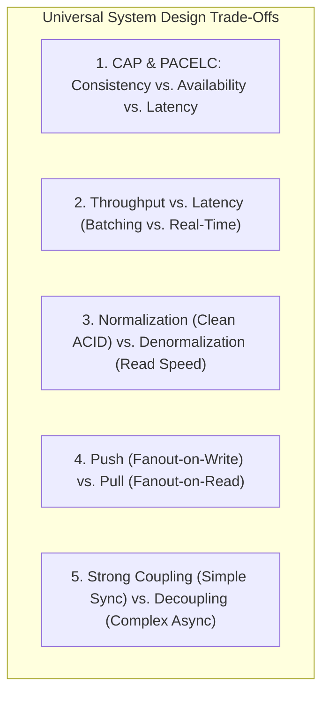
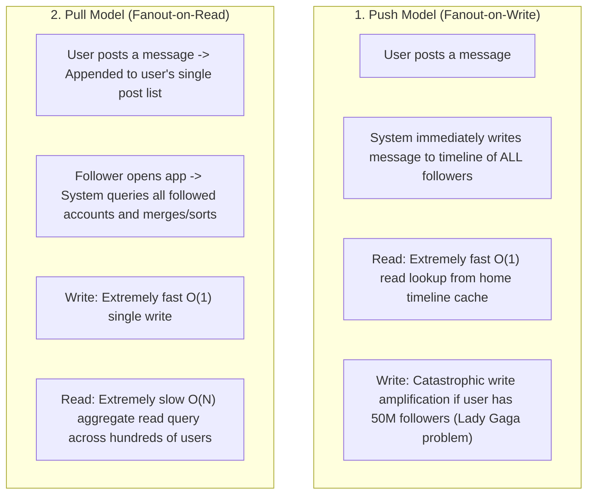

# Trade-Off Analysis in System Design

## Overview

In distributed system design, there are no optimal solutions; there are only trade-offs. Every architectural design decision—whether selecting a database engine, adopting an asynchronous messaging topology, or defining caching strategies—trades off one desirable quality attribute in order to optimize another. An architect's mastery is demonstrated not by knowing how to build a complex system, but by **knowing what to sacrifice and articulating why that sacrifice is acceptable for the business**.

---

## Canonical System Design Trade-Off Tensions



---

## 1. CAP Theorem & The PACELC Extension

The CAP Theorem states that in the presence of a network **Partition (P)**, a distributed system must choose between **Consistency (C)** and **Availability (A)**.

However, network partitions are rare. What happens during normal operational times? The **PACELC Theorem** (Daniel Abadi) completes the picture:

$$\text{If } \mathbf{P} \text{ (Partition): } \mathbf{A} \lor \mathbf{C}, \quad \text{EL} \text{se: } \mathbf{L} \lor \mathbf{C}$$

```
                +-------------------------------------------------------+
                |                    PACELC THEOREM                     |
                +-------------------------------------------------------+
                | If Partition (P):                                     |
                |   Choose between Availability (A) and Consistency (C) |
                |                                                       |
                | Else (E) under normal health:                         |
                |   Choose between Latency (L) and Consistency (C)      |
                +-------------------------------------------------------+
```

### System Classifications under PACELC
- **PC/EC (e.g., Spanner, CockroachDB)**: Chooses Consistency under partition; chooses Consistency (synchronous consensus) under normal health. (Sacrifices latency for absolute correctness).
- **PA/EL (e.g., Cassandra, DynamoDB with eventual consistency)**: Chooses Availability under partition; chooses Low Latency (asynchronous replication) under normal health. (Sacrifices consistency for blazing speed and high uptime).

---

## 2. Push vs. Pull Model (Fanout-on-Write vs. Fanout-on-Read)

A classic system design dilemma (e.g., Twitter / X Feed, LinkedIn Activity):



### The Architectural Resolution: The Hybrid Approach
- For regular users (followers $< 10,000$): Use **Push (Fanout-on-Write)** into Redis timeline caches.
- For celebrity / high-follower accounts ($> 10,000$ followers): Use **Pull (Fanout-on-Read)**; merge celebrity posts dynamically into the timeline when the user opens their app.

---

## 3. Structured Trade-Off Evaluation Matrix

When evaluating architectural candidates, use an explicit, weighted trade-off scoring matrix:

| Architectural Option | Consistency (Weight: 30%) | Latency (Weight: 25%) | Availability (Weight: 25%) | Operational Simplicity (Weight: 20%) | Weighted Total (out of 10) |
|:---|:---:|:---:|:---:|:---:|:---:|
| **Option A: Synchronous REST + Relational DB** | 9 / 10 | 6 / 10 | 7 / 10 | 9 / 10 | **7.75** |
| **Option B: Event-Driven Kafka + Microservices** | 5 / 10 | 9 / 10 | 9 / 10 | 4 / 10 | **6.80** |
| **Option C: Hybrid Outbox + Redis Read-Aside** | 8 / 10 | 9 / 10 | 8 / 10 | 7 / 10 | **8.05 (Winner)** |

---

## How to Articulate Trade-Offs in Architectural Reviews

Follow the **4-Sentence Trade-Off Defense**:
1. **The Choice**: *"We chose to adopt an asynchronous Kafka event-driven pipeline for order processing."*
2. **The Optimization**: *"This allows us to achieve 25,000 TPS write throughput with p99 latency under 50ms, ensuring our checkout UI never blocks during flash sales."*
3. **The Consequence**: *"The trade-off is that order status updates are eventually consistent, taking up to 2 seconds to propagate to the customer dashboard."*
4. **The Mitigation**: *"We mitigated this by showing an immediate optimistic 'Order Received' state in the mobile client UI while polling in the background."*
