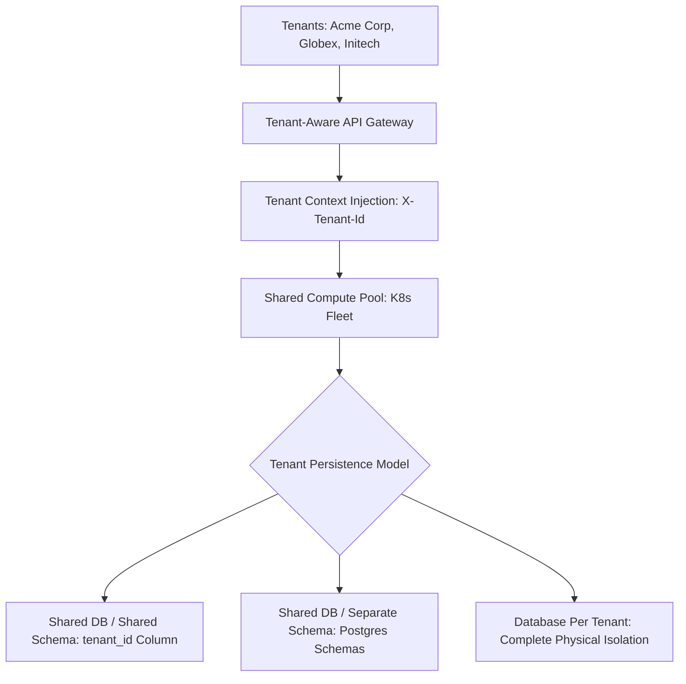

# Multi-Tenant Systems Architecture

## 1. Overview & Architectural Philosophy
Multi-tenancy is the architectural property where a single software instance serves multiple distinct customer organizations (tenants), providing each tenant with the illusion of a dedicated system while pooling underlying compute, storage, and networking resources for operational and cost efficiency.

---

## 2. Directory Structure
* [Multi-Tenant Architecture](multi-tenant-architecture.md)
* [Shared Database, Shared Schema](shared-database-shared-schema.md)
* [Shared Database, Separate Schema](shared-database-separate-schema.md)
* [Database per Tenant](database-per-tenant.md)
* [Tenant Isolation Strategies](tenant-isolation.md)
* [Tenant Routing](tenant-routing.md)
* [Tenant Context Propagation](tenant-context.md)
* [Tenant Onboarding Automation](tenant-onboarding.md)
* [Tenant Migration & Resharding](tenant-migration.md)
* [Noisy Neighbor Mitigation](noisy-neighbor-problem.md)
* [Tenant-Aware Rate Limiting](tenant-rate-limiting.md)
* [Tenant Data Partitioning](tenant-data-partitioning.md)
* [Tenant Security & Encryption](tenant-security.md)
* [Tenant Compliance (GDPR/HIPAA)](tenant-compliance.md)
* [Tenant Metering & Billing](tenant-billing.md)
* [Tenant Monitoring & Observability](tenant-monitoring.md)
* [Hybrid Multi-Tenancy](hybrid-multi-tenancy.md)
* [Cell-Based Architecture](cell-based-architecture.md)
