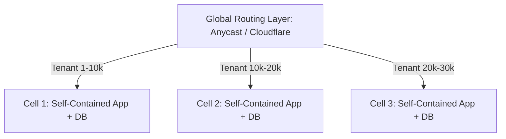

# Cell-Based Architecture for Multi-Tenancy

## 1. Blast Radius Elimination at Scale
Cell-based architecture (pioneered by AWS and Slack) divides a global multi-tenant system into $N$ completely independent, self-contained mini-deployments called **Cells**.

* **Zero Cross-Cell Failures**: If Cell 2 suffers a catastrophic database corruption, Cell 1 and Cell 3 continue operating with zero degradation.
