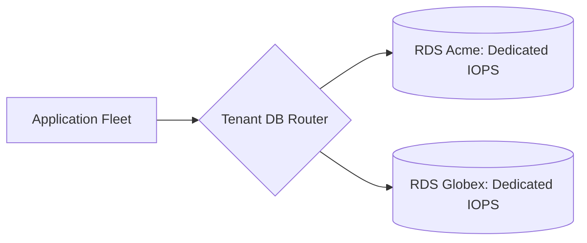

# Database per Tenant Architecture

## 1. Physical Isolation
Each tenant receives a completely independent physical or virtual database server (e.g., dedicated AWS RDS instance).

---

## 2. Production Fit
* **Target Tenants**: Fortune 500 enterprise customers, defense, government, and banking clients requiring cryptographic and physical data isolation.
* **Operational Constraint**: Connection pooling becomes complex; $1,000$ tenant databases with 10 connections each require $10,000$ open connections.
