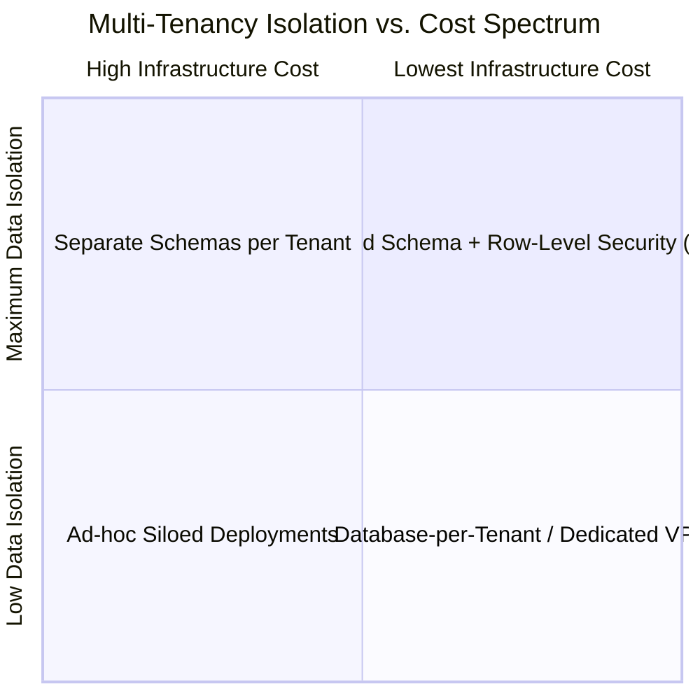

# Multi-Tenant Architectural Models

## 1. The Multi-Tenancy Spectrum

| Model | Description | Isolation | Cost Efficiency | Operational Complexity |
| :--- | :--- | :--- | :--- | :--- |
| **Shared DB, Shared Schema** | All tenants share same tables; partitioned by `tenant_id` column. | Low (RLS required) | **Highest** | Low initially; high at scale. |
| **Shared DB, Separate Schema**| Single DB instance; distinct PostgreSQL schema per tenant. | Medium | Moderate | High (Migration scripts run $N$ times). |
| **Database per Tenant** | Physically independent database instance per tenant. | **Highest** | Lowest | High (Thousands of connection pools). |
