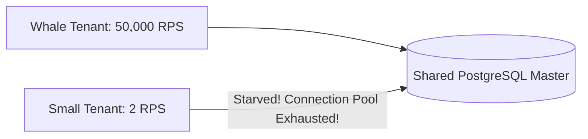

# The Noisy Neighbor Problem

## 1. Root Cause
In shared multi-tenant pools, a single tenant executing unindexed bulk reporting queries or a massive promotional campaign consumes 100% of shared CPU and database IOPS, starving adjacent tenants.

---

## 2. Defensive Measures
* Strict per-tenant Token Bucket rate limiting.
* Dynamic query cost governors (PostgreSQL `statement_timeout = 5000ms`).
* Dedicated worker queues per tenant tier.
