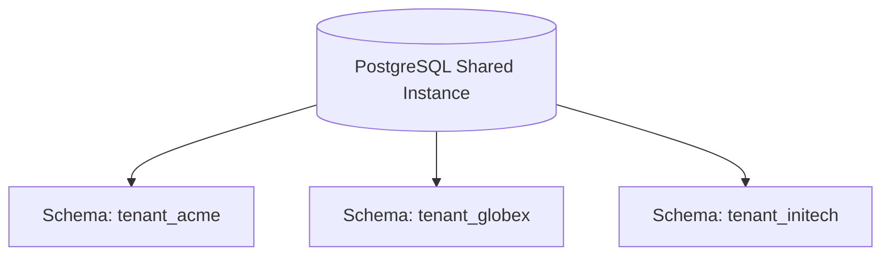

# Shared Database, Separate Schema Architecture

## 1. Logical Isolation via Namespaces
In PostgreSQL or SQL Server, each tenant is provisioned an isolated logical schema within the same shared database cluster:
* `tenant_acme.orders`
* `tenant_globex.orders`

---

## 2. Trade-offs & Migration Penalties
* **Advantage**: Zero risk of row-level data leaks; table names do not need `tenant_id` foreign keys.
* **Fatal Penalty at Scale**: Executing a schema migration across $5,000$ schemas requires executing $5,000$ `ALTER TABLE` statements, often locking the database catalog and stalling deploys for hours.
