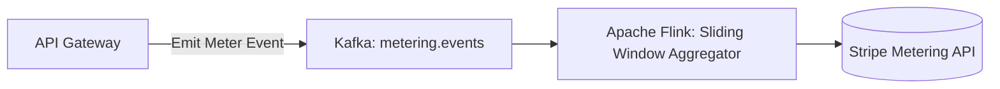

# Tenant Metering & Billing Architecture

## 1. Usage-Based Metering Architecture
Modern SaaS bills on consumption (compute minutes, API calls, storage gigabytes):

```mermaid
flowchart LR
    Gateway[API Gateway] -->|Emit Meter Event| Kafka[Kafka: metering.events]
    Kafka --> Flink[Apache Flink: Sliding Window Aggregator]
    Flink --> StripeBilling[(Stripe Metering API)]
```
