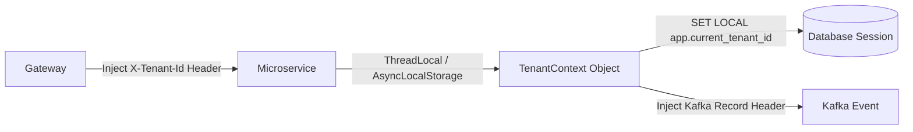

# Tenant Context Propagation

## 1. Ambient Context Lifecycle
Once identified at the API gateway, the tenant identity must propagate across asynchronous threads, database connections, and downstream RPCs.

