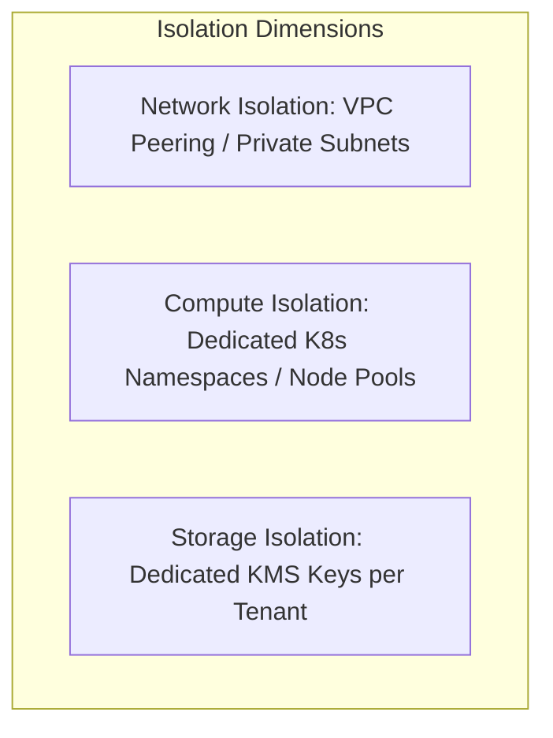

# Tenant Isolation Strategies

## 1. Blast Radius Containment
Tenant isolation prevents a breach, failure, or bug in Tenant A from exposing or degrading Tenant B.

```mermaid
flowchart TD
    subgraph Isolation Dimensions
        D1[Network Isolation: VPC Peering / Private Subnets]
        D2[Compute Isolation: Dedicated K8s Namespaces / Node Pools]
        D3[Storage Isolation: Dedicated KMS Keys per Tenant]
    end
```
