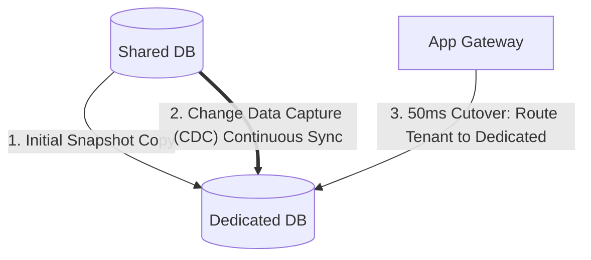

# Tenant Migration & Resharding

## 1. Migrating a Growing Tenant to Dedicated Hardware
When a startup tenant expands into a Fortune 500 enterprise, it must be migrated from a shared multi-tenant database to a dedicated database cluster without downtime.

