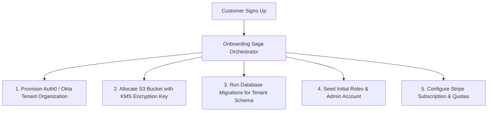

# Tenant Onboarding Automation

## 1. Automated Provisioning Pipeline
Manual tenant onboarding is unscalable. Modern SaaS platforms execute a zero-touch onboarding workflow:

```mermaid
flowchart TD
    Signup[Customer Signs Up] --> Workflow[Onboarding Saga Orchestrator]
    Workflow --> Step1[1. Provision Auth0 / Okta Tenant Organization]
    Workflow --> Step2[2. Allocate S3 Bucket with KMS Encryption Key]
    Workflow --> Step3[3. Run Database Migrations for Tenant Schema]
    Workflow --> Step4[4. Seed Initial Roles & Admin Account]
    Workflow --> Step5[5. Configure Stripe Subscription & Quotas]
```
