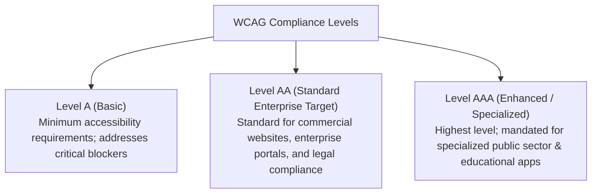
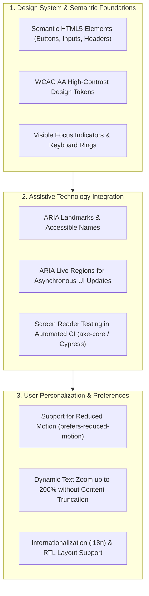

# Accessibility (a11y)

## Definition

Accessibility (often abbreviated as **a11y**) is the degree to which a software system, digital product, user interface, and supporting services can be effectively understood, navigated, and used by people with the widest possible range of visual, auditory, motor, cognitive, and neurological abilities.

In modern enterprise software, accessibility is not merely a frontend styling concern; it is a foundational architectural requirement spanning semantic DOM structure, internationalization, screen reader compatibility, and low-bandwidth resilience.

---

## Why It Matters

- **Legal Compliance & Liability**: In the United States, ADA (Americans with Disabilities Act) Title III and Section 508 lawsuits against inaccessible enterprise platforms have increased exponentially. In the European Union, the European Accessibility Act (EAA) enforces strict penalties for non-compliant digital services.
- **Market Expansion & Inclusivity**: Over **16% of the global population (1.3 billion people)** experience significant disabilities. Designing for accessibility expands the addressable enterprise customer base and improves usability for all users (e.g., situational disabilities, low light, noisy environments).
- **SEO & Machine Readability**: Accessible, semantically rich web architectures drastically improve search engine indexing and automated web scraping.

---

## How to Measure

Accessibility is evaluated against the international W3C **Web Content Accessibility Guidelines (WCAG)** standard (currently WCAG 2.1 / 2.2):



### Empirical Metrics
1. **Automated a11y Audit Score (axe-core / Lighthouse)**: Percentage of automated WCAG 2.1 AA rules satisfied across all rendered routes (target: 100% zero critical/serious violations).
2. **Keyboard Navigability Index**: 100% of interactive user workflows (e.g., checkout, account registration, form submissions) executable strictly via keyboard navigation (`Tab`, `Shift+Tab`, `Enter`, `Space`, `Escape`) without focus traps.
3. **Screen Reader Task Completion Rate**: Percentage of core tasks successfully completed by visually impaired users using NVDA, JAWS, or Apple VoiceOver.
4. **Color Contrast Ratio**: Text-to-background contrast meeting minimum ratios (4.5:1 for normal text, 3:1 for large text).

---

## Architecture Implications

Building accessible digital platforms requires architecture-level decisions:
- **Server-Side Rendering (SSR) & Semantic Markup**: Over-reliance on client-side single-page applications (SPAs) with nested `<div>` tags breaks screen reader parsing. Architects prioritize SSR or progressive hydration with native semantic HTML (`<main>`, `<nav>`, `<article>`, `<button>`).
- **Design System Governance**: Establishing an enterprise design system (tokens, components) with pre-baked accessibility primitives (ARIA labels, focus rings, contrast validation) so product engineering teams cannot accidentally introduce inaccessible UI components.
- **Dynamic Content & Announcers**: Single-page state transitions and toast notifications must leverage ARIA live regions (`aria-live="polite"`) to notify assistive technologies without disrupting page focus.

---

## Design Strategies



1. **Enterprise Design System Enforcement**: Build accessibility directly into the shared component library (e.g., React/Angular design system). When a developer imports `<EnterpriseModal>`, the component automatically traps focus, manages `aria-modal="true"`, and listens for the `Escape` key natively.
2. **Reduced Motion Compliance**: Respect operating system accessibility preferences using CSS media queries:
   ```css
   @media (prefers-reduced-motion: reduce) {
     * {
       animation-duration: 0.01ms !important;
       transition-duration: 0.01ms !important;
     }
   }
   ```
3. **Automated CI/CD Accessibility Linting**: Integrate `axe-core` into end-to-end testing pipelines (Playwright / Cypress) to break pull requests if unlabelled buttons or invalid contrast ratios are detected.

---

## Trade-offs

| Gained Benefit | Sacrificed Dimension | Why the Tension Exists |
|:---|:---|:---|
| **High Accessibility (WCAG AA/AAA)**| **Visual Avant-Garde Flexibility** | Ultra-subtle gray-on-gray typography, auto-playing video backgrounds, and unconventional custom scrollbars must be constrained to meet contrast and motion standards. |
| **Complete ARIA Semantic Coverage** | **Frontend Component Overhead** | Writing accessible custom controls (e.g., multi-select comboboxes) requires up to 3x more code to handle keyboard events, focus states, and ARIA attributes properly. |
| **Deep Screen Reader Support** | **Rapid Prototyping Velocity** | Fast prototyping shortcuts (turning a clickable `<div>` into a button) are strictly forbidden; developers must properly structure markup. |

---

## Example Requirements

- **ASR-A11Y-01**: "The web and mobile applications must achieve **100% compliance with WCAG 2.2 Level AA**, with zero critical or serious accessibility violations detected by automated CI `axe-core` testing gates on all public routes."
- **ASR-A11Y-02**: "All interactive workflows, modal dialogues, and form validations must be **100% operable via keyboard navigation alone**, ensuring visible focus indicators and zero keyboard focus traps."
