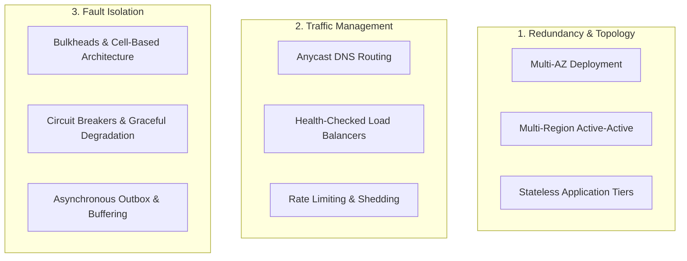

# Availability

## Definition

Availability is the percentage of time that a system, service, or infrastructure component remains operational, accessible, and capable of successfully performing its required functions when requested by authorized users. It is an indicator of system uptime and resilience against unplanned outages and scheduled maintenance.

---

## Why It Matters

In enterprise and Fortune 500 environments, system downtime directly translates to immediate financial loss, customer churn, contractual SLA penalties, and brand erosion:
- **E-Commerce**: An outage of 1 hour on Amazon or Walmart during peak shopping events results in tens of millions of dollars in direct lost sales.
- **Financial Services**: Core banking or brokerage downtime breaches regulatory requirements (e.g., FINRA, FCA), leading to heavy fines and market instability.
- **B2B SaaS**: Enterprises commit to customer Service Level Agreements (SLAs). Violating availability thresholds triggers financial penalty payouts (service credits).

---

## How to Measure

Availability is calculated mathematically over a given measurement window (monthly, quarterly, or annually):

$$\text{Availability} = \frac{\text{Uptime}}{\text{Total Time}} \times 100 = \frac{\text{Total Time} - \text{Downtime}}{\text{Total Time}} \times 100$$

Alternatively, using reliability and recoverability metrics:

$$\text{Availability} = \frac{\text{MTBF}}{\text{MTBF} + \text{MTTR}} \times 100$$

Where:
- **MTBF (Mean Time Between Failures)**: Average operating time between system crashes.
- **MTTR (Mean Time to Repair / Recover)**: Average time required to restore the system to full operation after an outage.

---

## Typical Metrics: The "Nines" of Availability

| "Nines" | Availability % | Downtime per Year | Downtime per Month | Downtime per Day | Typical Enterprise System Tier |
|:---|:---|:---|:---|:---|:---|
| **One Nine** | 90.0% | 36.5 days | 72 hours | 2.4 hours | Internal batch prototypes, non-critical dev |
| **Two Nines** | 99.0% | 3.65 days | 7.2 hours | 14.4 minutes | Internal back-office tools, batch reporting |
| **Three Nines** | 99.9% | 8.76 hours | 43.8 minutes | 1.44 minutes | Standard enterprise SaaS, standard e-commerce |
| **Four Nines** | 99.99% | 52.56 minutes | 4.38 minutes | 8.64 seconds | Tier-1 Mission-Critical: Core Banking, ERP, Identity |
| **Five Nines** | 99.999% | 5.26 minutes | 25.9 seconds | 0.86 seconds | Telecommunications core, Life-safety, Stock exchanges |

---

## Architecture Implications

Achieving higher availability imposes exponential architectural complexity and financial cost:

```mermaid
graph LR
    subgraph CostCurve["Availability vs. Architectural Cost"]
        N3["99.9% ($)<br/>Single Region Multi-AZ<br/>Standard Read-Replicas"]
        N4["99.99% ($$$)<br/>Active-Passive Multi-Region<br/>Automated DNS Failover"]
        N5["99.999% ($$$$$$)<br/>Active-Active Multi-Region<br/>Distributed Consensus DB"]
        N3 --> N4 --> N5
    end
```

- **Elimination of Single Points of Failure (SPOF)**: Every critical path component (DNS, load balancers, web servers, databases, caching layers) must have redundant hot/warm counterparts.
- **Automated Health Probes & Failovers**: Human reaction time (15–30 minutes) makes four or five nines impossible with manual intervention. Detection and failover must occur automatically in seconds.
- **Zero-Downtime Deployments**: Software upgrades, database schema changes, and security patches must execute without taking services offline (e.g., Blue-Green, Canary).

---

## Design Strategies



1. **Cell-Based Architecture**: Subdivide the platform into fully independent, self-contained "cells" (e.g., 50,000 users per cell). An outage in one cell affects only 2% of the user base, protecting overall enterprise availability.
2. **Graceful Degradation**: If the AI recommendation engine or fraud scoring engine is down, fall back to default product lists or delayed validation rather than failing the entire checkout request.
3. **Canary Releases**: Route 1% of production traffic to the new version. If error rates or latency spikes are detected, automated rollbacks revert within 30 seconds before broad impact.

---

## Trade-offs

| Gained Benefit | Sacrificed Dimension | Why the Tension Exists |
|:---|:---|:---|
| **High Availability (99.999%)** | **Cloud & Infrastructure Cost** | Requires running idle or duplicated compute and multi-region database replication continuously. |
| **High Availability** | **Data Consistency (CAP Theorem)** | In a network partition, choosing Availability (AP) means accepting stale reads or eventual consistency across distributed nodes. |
| **High Availability** | **Architectural Simplicity** | Introduces distributed consensus, quorum health checking, cross-region routing, and complex deployment pipelines. |

---

## Example Requirements

- **ASR-AVAIL-01**: "The Customer Payment Processing API must maintain **99.99% availability** measured over any rolling 30-day window, excluding planned maintenance windows that must not exceed 2 hours per quarter."
- **ASR-AVAIL-02**: "In the event of a total AWS Availability Zone failure, the system must automatically fail over to surviving AZs with zero data loss (RPO = 0) and restore full request capacity within **60 seconds** (RTO < 60s)."
