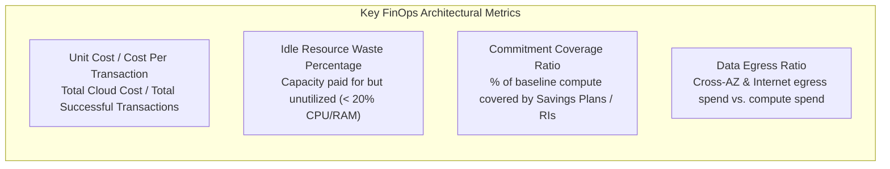
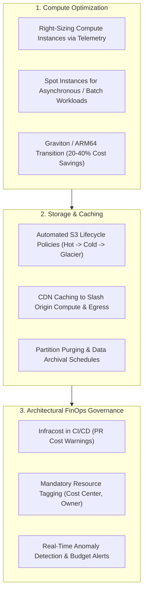

# Cost Efficiency & FinOps

## Definition

Cost Efficiency is the architectural discipline of maximizing business value and computational throughput while minimizing infrastructure, operational, licensing, and cloud hosting expenditures throughout a software system's lifecycle. 

In the era of variable-cost cloud computing, cost is no longer a post-deployment procurement concern; it is a **first-class non-functional architectural requirement (NFR)** governed by the discipline of **FinOps (Cloud Financial Operations)**.

---

## Why It Matters

- **Eliminating Unchecked Cloud Sprawl**: In on-premises data centers, spend was constrained by physical hardware budgets (CAPEX). In the cloud (OPEX), an unoptimized auto-scaling group or an infinite loop in a serverless function can run up a $50,000 bill in a single weekend.
- **Enterprise Unit Economics**: Profitability in modern SaaS and digital commerce depends on keeping the **Cost per Transaction** or **Cost per Active User** lower than the revenue generated by that user.
- **Competitive Advantage**: An enterprise platform that can process 1,000,000 transactions for $100 has a decisive commercial advantage over a competitor spending $1,500 for the same workload.

---

## How to Measure

Cost efficiency is measured through unit economics rather than raw total spend:

### 1. Cost per Transaction (Unit Economic Metric)
$$\text{Cost per Transaction} = \frac{\text{Total Monthly Infrastructure Spend (\USD)}}{\text{Total Monthly Completed Business Transactions}}$$
- **Target**: Continuous downward trend over time as system scale increases (economies of scale).

### 2. Cloud Waste Factor
$$\text{Waste Factor} = \frac{\text{Unallocated Provisioned Resources (Idle CPU/RAM)}}{\text{Total Provisioned Resources}} \times 100$$
- **Target**: Maintain waste factor **$< 20\%$** through rightsizing and dynamic auto-scaling.

---

## Architecture Implications

Cost efficiency dictates choices across every layer of the architecture:
- **Serverless vs. Provisioned Compute**: Workloads with highly variable or sporadic traffic (e.g., batch jobs, webhook handlers) are vastly more cost-efficient on Serverless (AWS Lambda / Azure Functions) because cost drops to zero when idle. Steady, predictable 24/7 workloads are 60–80% cheaper on provisioned container nodes (EKS/ECS) with Reserved Instances.
- **Data Lifecycle Tiers**: Storing petabytes of data in hot relational storage or standard S3 indefinitely is financially toxic. Architects design automated lifecycle rules moving older data to warm (S3 Infrequent Access) and cold (S3 Glacier Deep Archive) storage.
- **Network Egress Containment**: Cross-region and cross-AZ network traffic in AWS/Azure incurs substantial egress fees ($0.01 to $0.02 per GB). Architecting services to communicate within the same availability zone or using VPC Endpoints saves tens of thousands of dollars monthly.

---

## Design Strategies

1. **Shift to ARM64 Architecture**: Migrating container workloads from x86_64 to ARM64 (AWS Graviton3 / Azure Ampere) yields a **20% to 40% price-performance improvement** with zero code changes for interpreted runtimes (Java, .NET, Node.js, Python).
2. **Infracost in CI/CD**: Run automated cost estimators on Terraform pull requests. If an engineer modifies an instance type or adds a managed NAT Gateway that increases monthly spend by $2,000, the CI bot comments on the PR with the exact dollar impact before merge.
3. **Spot Instance Orchestration**: Run non-critical batch processing and stateless worker nodes on Spot instances (up to 90% discount compared to On-Demand pricing), using graceful shutdown handlers to intercept 2-minute termination warnings.

---

## Trade-offs

| Gained Benefit | Sacrificed Dimension | Why the Tension Exists |
|:---|:---|:---|
| **Maximized Cost Efficiency (Spot Instances)**| **Reliability & Availability** | Spot instances can be reclaimed by the cloud provider with only 2 minutes' notice, requiring robust re-queueing architectures. |
| **Aggressive Cold Storage Archival** | **Data Retrieval Latency** | Restoring records from deep archive (Glacier) requires hours, conflicting with immediate ad-hoc historical queries. |
| **Commitment Savings (3-Year RIs)** | **Technological Agility & Flexibility** | Committing to a specific instance family for 3 years locks the enterprise in, preventing rapid pivots to newer instance types. |

---

## Example Requirements

- **ASR-COST-01**: "The production infrastructure must maintain a **Cost per Completed Order of $\le \$0.025$** at a baseline throughput of 10,000,000 orders per month, modeled and tracked monthly in CloudWatch FinOps dashboards."
- **ASR-COST-02**: "All database transaction logs and historical order records older than **90 days** must automatically transition to cold object storage (S3 Glacier Deep Archive), reducing long-term storage expenditures by at least **80%**."
