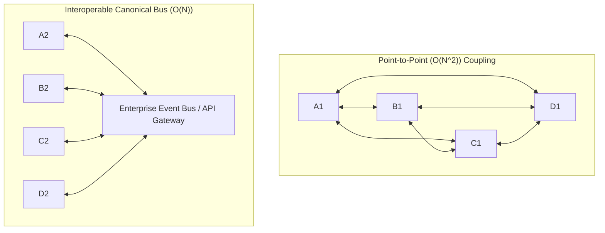
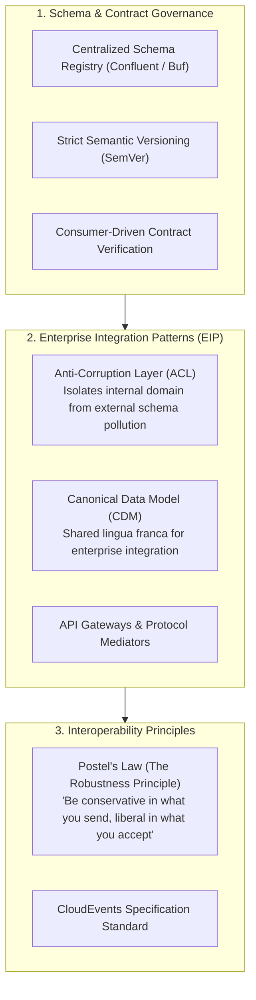

# Interoperability

## Definition

Interoperability is the degree to which two or more heterogeneous systems, microservices, platforms, or organizational applications can securely, reliably, and seamlessly exchange information and mutually utilize the data that has been exchanged without specialized, bespoke integration logic or manual human intervention.

In large-scale enterprise IT, interoperability enables disparate systems—spanning modern cloud-native Kubernetes clusters, legacy on-premise mainframes, third-party SaaS platforms, and partner APIs—to function as a cohesive ecosystem.

---

## Why It Matters

- **M&A and Legacy Integration**: Enterprises continuously acquire new subsidiaries and inherit legacy applications. High interoperability ensures newly acquired platforms integrate into the corporate ecosystem in weeks rather than years.
- **B2B Ecosystem Expansion**: Enables partners, suppliers, and enterprise clients to integrate directly with corporate APIs, unlocking new programmatic revenue streams.
- **Eliminating Point-to-Point Spaghetti**: Prevents the $O(N^2)$ integration explosion where $N$ systems require $N(N-1)/2$ custom point-to-point connectors.



---

## How to Measure

1. **Integration Cycle Time**: Time required for an external team or partner to build, test, and launch a working integration with a system's public APIs (target: $< 2\text{ weeks}$).
2. **Schema Breaking Change Frequency**: Number of breaking API schema modifications deployed per year (target: 0 breaking changes without a deprecation window).
3. **Open Standards Compliance Score**: Percentage of exposed interfaces utilizing standard protocols (REST/JSON, gRPC/Protobuf, CloudEvents, OAuth2) vs. proprietary socket protocols (target: 100%).
4. **Data Semantic Reconciliation Overhead**: Computational time and mapping logic required to translate external entity models into the internal domain model.

---

## Architecture Implications

Architecting for high interoperability requires establishing shared, standardized contracts:
- **Standard Protocol Ubiquity**: Standardize on HTTP/REST, gRPC, and Kafka wire protocols; eliminate proprietary binary formats across system boundaries.
- **Strict Schema Governance**: Schemas (OpenAPI 3.0, Protobuf, Avro) must be treated as first-class, immutable artifacts stored in a centralized Schema Registry.
- **Semantic Data Interoperability**: Syntactic compatibility (both speaking JSON) is useless if entities lack shared meaning. The architecture must bridge semantic differences using the **Anti-Corruption Layer (ACL)** pattern.

---

## Design Strategies



### 1. Postel's Law (The Robustness Principle)
> *"Be conservative in what you do, be liberal in what you accept from others."*
- Systems emitting data must strictly adhere to specification contracts.
- Systems consuming data must tolerate non-breaking additions (e.g., ignore unexpected JSON keys rather than crashing with deserialization exceptions).

### 2. The Anti-Corruption Layer (ACL - Eric Evans)
When integrating a modern solution with a legacy SAP or Mainframe system, never allow the legacy data structures to bleed into your clean domain model. Place an ACL between them that translates legacy schemas into clean domain objects.

### 3. CloudEvents Specification
Standardize event metadata across all asynchronous message buses using the CNCF CloudEvents standard:

```json
{
  "specversion": "1.0",
  "type": "com.enterprise.order.created",
  "source": "/services/checkout",
  "id": "A234-1234-1234",
  "time": "2026-09-05T09:35:00Z",
  "datacontenttype": "application/json",
  "data": {
    "order_id": "ord_9901",
    "total_amount": 149.50,
    "currency": "USD"
  }
}
```

---

## Trade-offs

| Gained Benefit | Sacrificed Dimension | Why the Tension Exists |
|:---|:---|:---|
| **High Interoperability (Canonical Models)**| **Data Model Evolution Agility** | Establishing enterprise-wide canonical schemas requires extensive cross-team consensus, slowing down individual team schema changes. |
| **Protocol Translation & ACL Adapters** | **Latency & Computational Overhead** | Translating schemas between XML, JSON, and Protobuf at gateway boundaries introduces serialization CPU overhead. |
| **Strict Backwards Compatibility** | **Codebase Cleanliness & Tech Debt** | Maintaining legacy API versions ($v1, v2, v3$) forces engineering teams to maintain legacy code paths for extended deprecation windows. |

---

## Example Requirements

- **ASR-INTEROP-01**: "All public REST APIs must publish **OpenAPI 3.1 specifications** registered in the corporate developer portal, enforcing **Semantic Versioning (SemVer)** with a guaranteed **12-month deprecation window** prior to any breaking contract alteration."
- **ASR-INTEROP-02**: "All asynchronous domain events published to Kafka must strictly conform to the **CNCF CloudEvents 1.0 specification** and validate against an Avro schema in the enterprise Schema Registry prior to publication."
