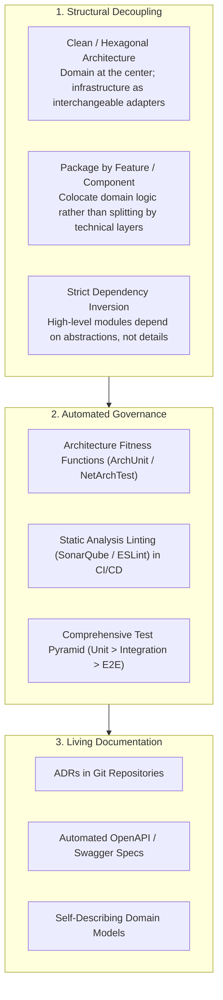

# Maintainability

## Definition

Maintainability is the degree of ease and efficiency with which a software system can be analyzed, understood, modified, corrected, enhanced, or adapted to changing environments, business rules, and technical requirements throughout its operational lifecycle. 

Software maintenance accounts for **70% to 80% of the total lifetime cost of an enterprise system**. An architecture that is fast and functional on Day 1 but unmaintainable by Year 2 becomes an existential organizational liability.

---

## Why It Matters

- **Developer Velocity & Morale**: In unmaintainable systems ("spaghetti code"), making a simple one-line change requires weeks of archaeology, breaks unrelated features, and frustrates top engineering talent into leaving the company.
- **Time to Market for Business Features**: High maintainability enables enterprises to respond to competitive disruptions in days or weeks rather than quarters.
- **Cost of Onboarding**: When domain logic is cleanly decoupled and documented, new engineers contribute production code within their first week instead of spending 6 months understanding tribal knowledge.

---

## How to Measure

Maintainability is evaluated through empirical static analysis and DORA engineering delivery metrics:

### 1. Maintainability Index (MI)
A composite logarithmic metric (0 to 100) calculated from Halstead volume, Cyclomatic Complexity, and lines of code:
$$\text{MI} = 171 - 5.2 \ln(V) - 0.23(G) - 16.2 \ln(\text{LOC})$$
- **Target**: Maintain an MI score **$\ge 75$** (Green: highly maintainable). Scores below 50 indicate brittle, toxic codebases.

### 2. Cyclomatic Complexity ($M$)
Measures the number of linearly independent paths through a program's source code:
$$M = E - N + 2P$$
- **Target**: Individual methods should maintain a cyclomatic complexity of **$\le 10$**. Methods exceeding 25 require mandatory refactoring.

### 3. DORA Lead Time for Changes
The time elapsed from a code commit passing code review to that code running in production.
- **Elite Performers**: $< 1\text{ hour}$.
- **Unmaintainable Legacy Systems**: $1\text{ to }6\text{ months}$.

---

## Architecture Implications

Architectural maintainability is fundamentally about **containment of change**:
- **Separation of Concerns (SoC)**: Business rules must be isolated from presentation frameworks (React/Angular) and persistence mechanisms (SQL/MongoDB).
- **Loose Coupling & High Cohesion**: Changes to the `Billing` subsystem should never require recompilation, testing, or redeployment of the `Notification` or `Catalog` subsystems.
- **Explicit Domain Boundaries**: Adopting Domain-Driven Design (DDD) to align code structures directly with business domains.

---

## Design Strategies

1. **The Dependency Rule (Hexagonal Architecture)**: Source-code dependencies must point only inward toward the Domain model. Domain entities must never import database drivers, web frameworks, or third-party cloud SDKs.
2. **Automated Layer Enforcement**: Use tools like ArchUnit to fail continuous integration builds if an engineer introduces a circular dependency or allows a Controller to query an ORM entity directly.
3. **Decoupled Release Cadences**: Design service boundaries so that individual domain components can be upgraded and deployed independently without lockstep multi-team synchronization.

---

## Trade-offs

| Gained Benefit | Sacrificed Dimension | Why the Tension Exists |
|:---|:---|:---|
| **High Maintainability & Layering** | **Initial Delivery Speed** | Structuring code into Ports, Adapters, Interfaces, and DTOs requires more upfront boilerplate than quick CRUD scripts. |
| **Domain Isolation** | **Query Performance** | Forbidding cross-boundary database joins forces developers to aggregate data via application-level APIs or CQRS view models. |
| **Strict Architecture Standards** | **Junior Developer Friction** | Enforcing strict architectural fitness functions requires higher developer maturity and continuous peer code reviews. |

---

## Example Requirements

- **ASR-MAINT-01**: "The core business domain layer must have **zero external compile-time dependencies** on persistence libraries (Entity Framework, Hibernate) or web presentation frameworks, verified automatically via automated CI fitness tests."
- **ASR-MAINT-02**: "The codebase must maintain an average **Maintainability Index of $\ge 80$** and a **Cyclomatic Complexity of $\le 10$** per function, with CI pipelines blocking pull requests that fail these static thresholds."
