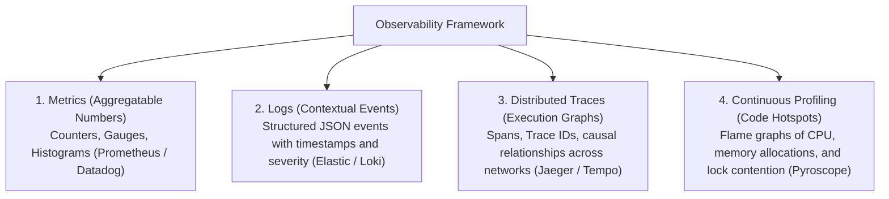
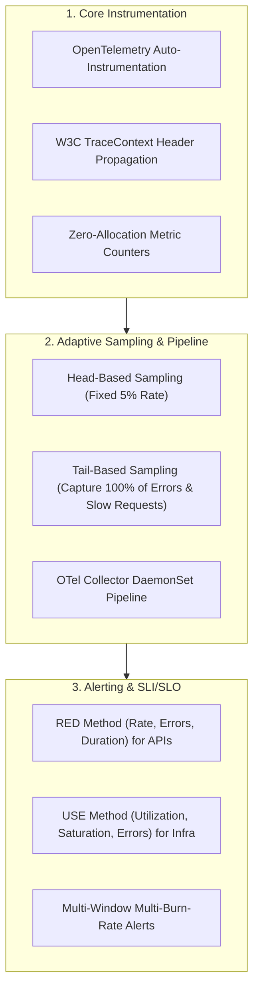

# Observability

## Definition

Observability is a measure of how well the internal states, execution paths, and failure modes of a software system can be inferred solely from knowledge of its external outputs (telemetry data). In modern distributed systems, observability goes beyond traditional passive monitoring ("is the server up?") to answer deep, exploratory questions about "why is this specific request failing or experiencing 2 seconds of latency across 12 microservices?"

---

## The Three Pillars of Observability (and the Fourth)



---

## Why It Matters

- **Mean Time to Resolution (MTTR)**: Without distributed tracing, debugging a latency spike or data inconsistency in a microservices ecosystem takes hours or days of cross-team finger-pointing. Observability pinpoints the exact offending line of code or slow database query in minutes.
- **Proactive Incident Prevention**: Modern observability platforms detect anomalous latency trends and memory leaks before they trigger customer-facing outages.
- **Cost & Capacity Optimization**: Telemetry illuminates idle compute capacity, unindexed queries, and excessive network round-trips.

---

## How to Measure

Observability effectiveness is measured through incident velocity and operational telemetry coverage:

1. **Mean Time to Detect (MTTD)**: Time elapsed from the occurrence of an incident to automated alerting (target: $< 2\text{ minutes}$).
2. **Mean Time to Identify / Diagnose (MTTI)**: Time required for an engineer to isolate the root cause component using telemetry (target: $< 10\text{ minutes}$).
3. **Trace Propagation Completeness**: Percentage of production requests that maintain an unbroken, end-to-end W3C TraceContext across all microservice hops (target: $> 99\%$).
4. **Cardinality Management Efficiency**: Ability to query by high-cardinality attributes (`user_id`, `order_id`, `tenant_id`) without causing observability platform crashes or exponential storage costs.

---

## Architecture Implications

Achieving deep observability requires building telemetry directly into the architectural fabric:
- **Ubiquitous OpenTelemetry (OTel)**: Standardize on OpenTelemetry APIs and SDKs to avoid proprietary vendor lock-in with APM vendors.
- **Context Propagation**: Every ingress point (API Gateway, message consumer) must extract or generate a standardized trace identifier (W3C `traceparent` header) and propagate it across all downstream HTTP, gRPC, and Kafka interactions.
- **Structured JSON Logging**: Ban unstructured text logs (`log.info("Processing order for " + id)`). All logs must emit structured JSON schemas with embedded `trace_id` and `span_id`.

```json
{
  "timestamp": "2026-09-05T09:30:00.123Z",
  "level": "ERROR",
  "service": "billing-service",
  "trace_id": "4bf92f3577b34da6a3ce929d0e0e4736",
  "span_id": "00f067aa0ba902b7",
  "user_id": "usr_8921",
  "order_id": "ord_9901",
  "message": "Payment gateway timeout after 5000ms",
  "exception": "java.net.SocketTimeoutException"
}
```

---

## Design Strategies



1. **Tail-Based Sampling**: In high-throughput systems handling 100,000 requests/sec, logging every trace creates gigabytes of network egress. Use the OpenTelemetry Collector to buffer spans in memory and sample only 1% of successful fast requests, but **100% of requests that result in errors or exceed 500ms latency**.
2. **The RED Method**: Standardize API dashboards on **Rate** (requests/sec), **Errors** (failed requests/sec), and **Duration** (latency distribution).
3. **Correlation Links**: Embed trace IDs directly inside application log payloads so an engineer viewing an error log in Grafana Loki can click directly to the exact distributed trace in Tempo.

---

## Trade-offs

| Gained Benefit | Sacrificed Dimension | Why the Tension Exists |
|:---|:---|:---|
| **Deep Telemetry & Tracing** | **Compute & Network Overhead** | Generating traces, capturing heap profiles, and formatting JSON logs consumes 2–5% of application CPU and network I/O. |
| **Complete High-Cardinality Data**| **Observability SaaS Cost** | Ingesting billions of metric series with custom tags (e.g., Datadog custom metrics) can result in unexpected six-figure monthly bills. |
| **Ubiquitous Logging** | **PII / Data Privacy Compliance** | Uncontrolled logging can accidentally capture sensitive passwords, credit card numbers, or social security numbers. |

---

## Example Requirements

- **ASR-OBS-01**: "100% of inbound HTTP, gRPC, and Kafka events must propagate a **W3C TraceContext `traceparent` header**, ensuring unbroken end-to-end distributed tracing across all microservices, with **tail-based sampling capturing 100% of requests resulting in HTTP 5xx or exceeding 500ms latency**."
- **ASR-OBS-02**: "All application services must expose standardized Prometheus metrics conforming to the **RED method (Rate, Errors, Duration)** on an internal `/metrics` scrape endpoint, with automated alerts triggering when the Error Budget burn rate exceeds **2.0 over a 1-hour window**."
