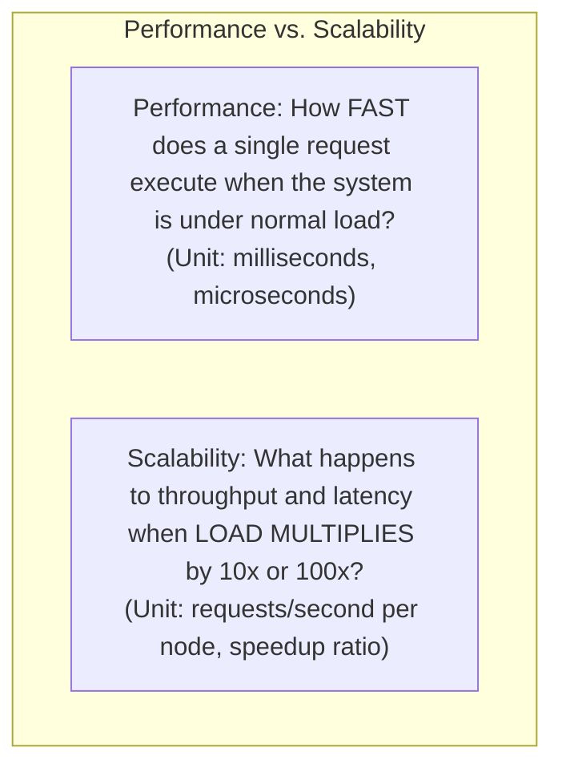
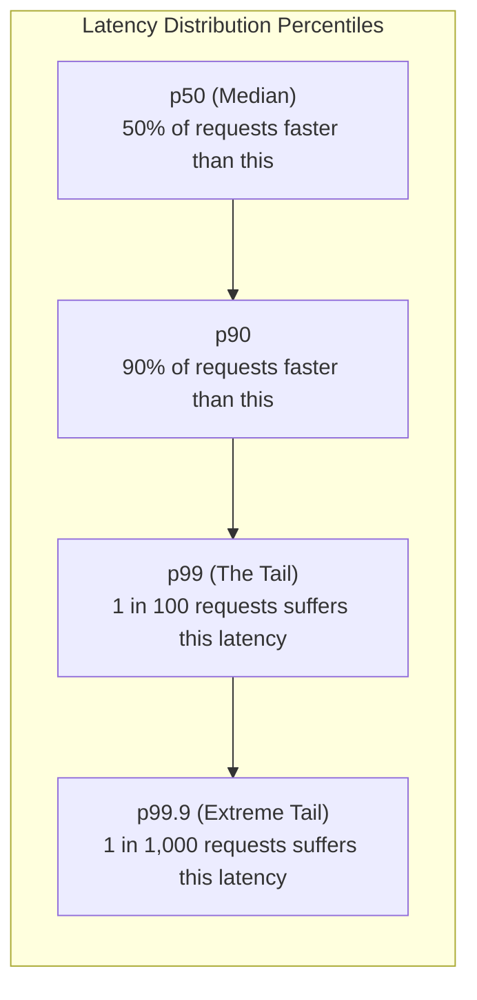
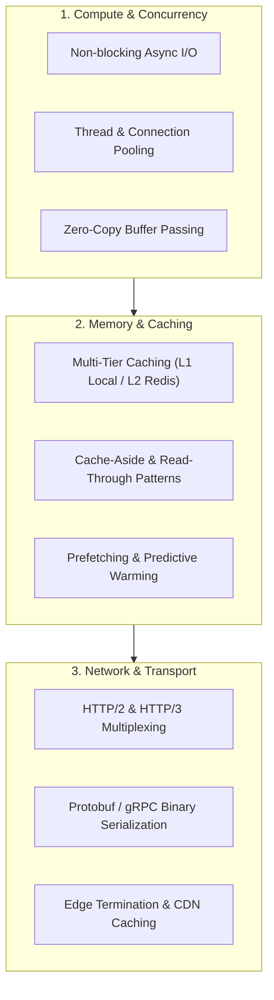

# Performance

## Definition

Performance is the measure of a software system's operational efficiency, responsiveness, and resource utilization when executing required computational tasks under specific workload conditions. It is typically expressed in terms of **Latency** (how quickly a request is processed) and **Throughput** (how many requests are processed per unit of time).

---

## Performance vs. Scalability: The Crucial Difference

While often conflated, Performance and Scalability address fundamentally different architectural concerns:

- A system can have **exceptional performance** (p99 latency of 2ms for 1 user) but **terrible scalability** (crashes completely when 50 concurrent users connect due to a single database thread lock).
- A system can have **exceptional scalability** (can scale horizontally to 10,000 nodes handling 1,000,000 requests/second) with **moderate performance** (every request takes 350ms due to distributed network hops).

---

## Why It Matters

- **User Conversion & Revenue**: Amazon famously observed that every 100ms of latency reduction increased sales by 1%. Google found an extra 500ms of search latency dropped traffic by 20%.
- **Infrastructure Cost Reduction**: High-performance software requires significantly less CPU and memory to handle identical transaction volumes, cutting enterprise cloud spend by hundreds of thousands of dollars annually.
- **Resource Exhaustion Prevention**: Slow database queries hold database connections open longer; during traffic surges, this quickly exhausts connection pools and causes cascading outages.

---

## How to Measure

Never measure performance using the "mean" (average) response time. Averages hide outliers and give a dangerously misleading sense of system health. Always use **Latency Percentiles**:

### The "Tail at Scale" Effect (Jeffrey Dean - Google)
In a microservices architecture where a single user request fans out to 100 backend services in parallel:
- Even if each individual service has a **p99 latency of 10ms** (meaning only 1% of requests are slow), the probability that the user's overall request hits at least one slow service is:
  $$\text{Probability of Delay} = 1 - (1 - 0.01)^{100} = 1 - (0.99)^{100} \approx \mathbf{63.4\%}$$
- Over **63% of your users will experience the p99 tail latency**!

---

## Architecture Implications

Optimizing for high performance dictates decisions across the entire technical stack:
- **Zero-Allocation & Memory Management**: Avoiding excessive garbage collection (GC) pauses in runtimes like Java, .NET, and Go.
- **Serialization Efficiency**: Moving away from bulky text formats (JSON, XML) to binary serialization (Protocol Buffers, FlatBuffers, Avro) for internal RPC.
- **I/O Modernization**: Shifting from blocking synchronous I/O threads to non-blocking asynchronous event loops (Netty, Node.js, epoll, kqueue).

---

## Design Strategies

1. **Connection Pooling**: Pre-allocate and reuse database and HTTP connections (e.g., HikariCP for Java, PgBouncer for PostgreSQL). Handshakes (TCP + TLS) consume up to 3 round-trips; never open a new connection per incoming request.
2. **Indexing & Query Optimization**: Eliminate full table scans using B-Tree and Hash indexes; enforce covered indexes where queries are satisfied entirely from the index tree without touching table storage.
3. **Optimistic Caching with Cache-Aside**: Check distributed memory (Redis) before hitting relational disk; cache computed results for read-heavy endpoints.

---

## Trade-offs

| Gained Benefit | Sacrificed Dimension | Why the Tension Exists |
|:---|:---|:---|
| **Ultra-Low Latency** | **Architectural Simplicity** | Requires multi-tier caching, asynchronous queues, memory pre-allocation, and complex cache invalidation. |
| **High Performance Caching** | **Data Freshness / Consistency** | Read caches introduce eventual consistency windows where users may observe slightly stale data. |
| **Binary Protocol Speed (gRPC)**| **Developer Ergonomics & Debugging** | Binary payloads cannot be easily inspected in browser network tabs or piped through standard CLI tools without decoding schemas. |

---

## Example Requirements

- **ASR-PERF-01**: "The Search Product Catalog API must respond with a **p95 latency of $\le 50\text{ms}$** and a **p99 latency of $\le 120\text{ms}$** under a sustained load of 8,000 requests per second."
- **ASR-PERF-02**: "Payment authorization processing must complete end-to-end within **300ms at the 99.9th percentile**, inclusive of third-party tokenization and fraud scoring."
