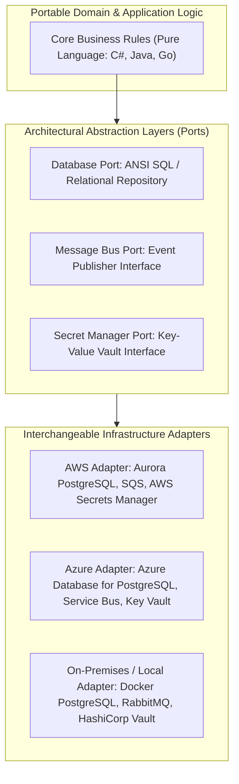
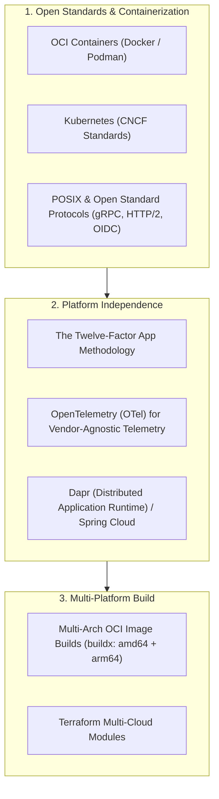
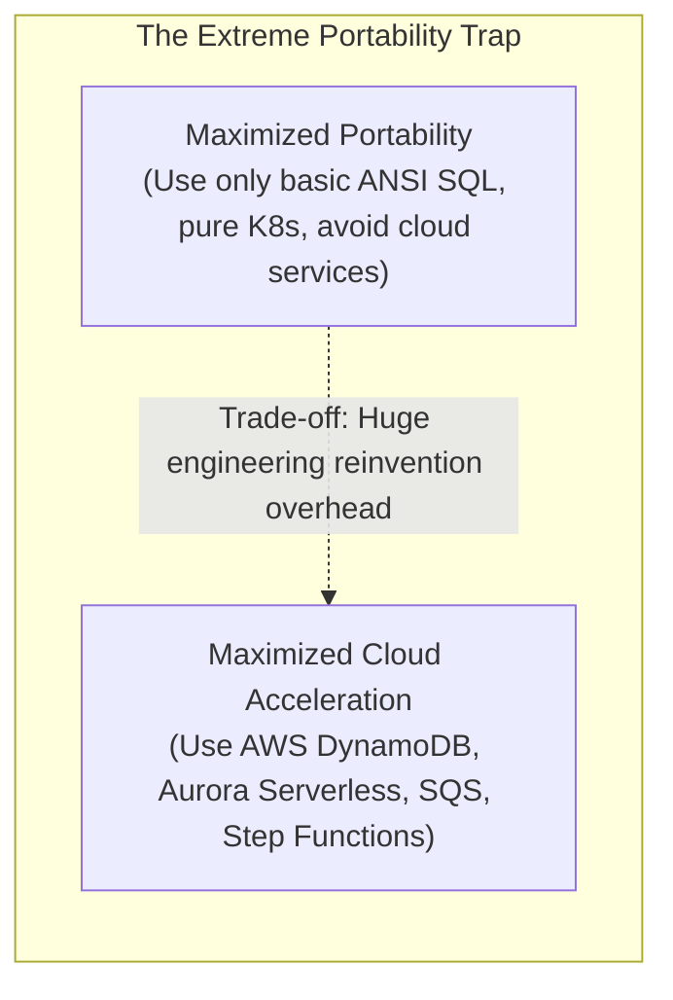

# Portability

## Definition

Portability is the ease with which a software application, service, or system can be transferred from one operational environment, hardware architecture, operating system, or cloud provider to another without requiring fundamental architectural redesign or extensive source-code modifications.

In modern enterprise cloud strategy, portability primarily addresses **multi-cloud viability and cloud vendor lock-in mitigation**.

---

## Why It Matters

- **Cloud Vendor Lock-In & Commercial Leverage**: If an enterprise is 100% locked into proprietary cloud APIs (e.g., AWS DynamoDB streams, Step Functions, CloudWatch metrics), the cloud provider holds immense pricing leverage during enterprise contract renewals.
- **Geopolitical & Sovereign Data Mandates**: Regulators in the EU (e.g., EU Cloud Rulebook, GAIA-X) increasingly require financial institutions and healthcare systems to prove they can migrate core workloads out of US-owned hyperscalers to regional infrastructure if requested.
- **Hardware Architecture Shifts**: Transitioning from x86_64 to ARM64 (e.g., AWS Graviton, Apple Silicon) cuts compute hosting costs by 20–40%, but requires multi-arch portable build pipelines.

---

## How to Measure

Portability is quantified by the engineering friction and capital expenditure required to execute an environment migration:

1. **Migration Cost Ratio (MCR)**:
   $$\text{MCR} = \frac{\text{Cost to Migrate Application to New Environment}}{\text{Cost to Rebuild Application from Scratch}} \times 100$$
   - **Target**: An application with high portability maintains an MCR of **$< 10\%$**.
2. **Proprietary API Dependency Density**: Number of direct, unabstracted calls to vendor-specific proprietary SDKs per 1,000 lines of code (target: 0 in domain logic).
3. **Environment Parity Index**: Percentage of configuration differences between local development (Docker Compose) and cloud production (Kubernetes) (target: $< 5\%$).

---

## Architecture Implications

Portability requires strict abstraction layers separating core business logic from underlying platform primitives:

---

## Design Strategies

1. **The Twelve-Factor App (Factor III: Config)**: Store all environment configuration in environment variables rather than hardcoded configuration files, allowing identical container binaries to execute unchanged across laptop, staging, AWS, or Azure.
2. **OpenTelemetry for Telemetry**: Instrument services using OpenTelemetry APIs rather than proprietary SDKs (e.g., Datadog or New Relic agent libraries). Swapping APM backends requires only modifying the OpenTelemetry Collector config, not editing application source code.
3. **Containerization (OCI Compliance)**: Package every service into an Open Container Initiative (OCI) image, decoupling the software runtime from the underlying host operating system.

---

## Trade-offs: The "Lowest Common Denominator" Dilemma

Portability involves severe architectural trade-offs that architects must actively balance:

| Gained Benefit | Sacrificed Dimension | Why the Tension Exists |
|:---|:---|:---|
| **High Portability** | **Cloud Native Velocity & Leverage** | Banning proprietary managed cloud services (e.g., DynamoDB, BigQuery) forces teams to spend millions running and patching self-managed clusters. |
| **Strict Multi-Cloud Abstraction** | **Platform Specific Optimizations**| Abstracting databases behind generic repositories prevents utilizing proprietary performance optimizations (e.g., Aurora parallel query). |
| **Container Layer Overhead** | **Raw Bare-Metal Performance** | Running everything inside container overlays introduces slight networking and memory overhead compared to native hypervisor virtualization. |

> [!TIP]
> **Pragmatic Architect Rule**: Maximize portability at the **Compute tier** (OCI containers, Kubernetes) and **API protocol tier** (REST, gRPC, JSON, Kafka), but intentionally leverage managed cloud PaaS for the **Storage tier** (managed PostgreSQL, managed object storage) where operational maintenance is burdensome.

---

## Example Requirements

- **ASR-PORT-01**: "All microservices must be packaged as **OCI-compliant multi-architecture container images (linux/amd64 and linux/arm64)**, capable of running unmodified on any CNCF-certified Kubernetes cluster version 1.28+."
- **ASR-PORT-02**: "Application code must not directly import cloud-specific SDKs (AWS SDK, Azure SDK) inside domain business logic; all interactions with object storage, secrets, and messaging must be routed through **abstracted internal interfaces (Ports & Adapters)**."
