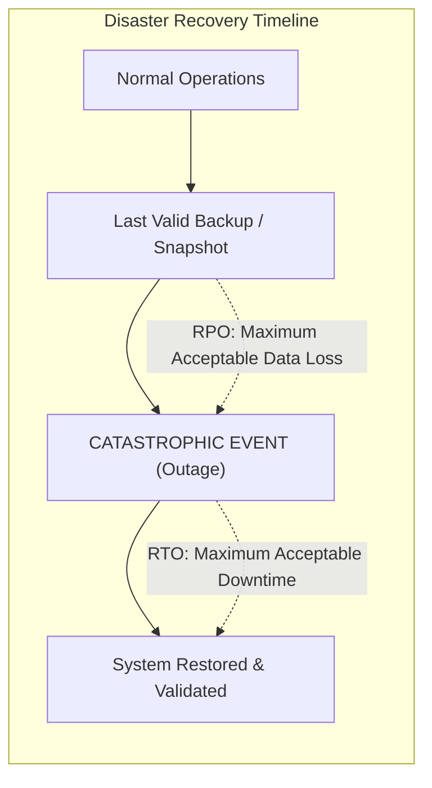
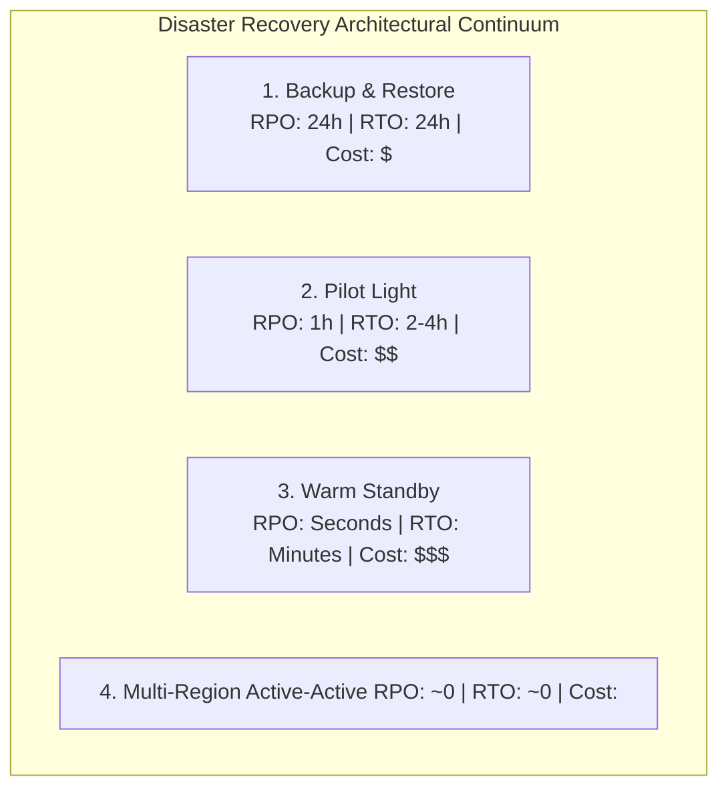
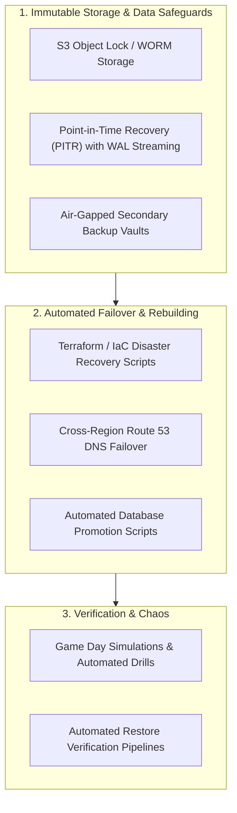

# Recoverability

## Definition

Recoverability is the ability of an enterprise software system, data tier, and infrastructure environment to be restored to a fully operational, consistent, and validated state following a catastrophic event—such as data corruption, ransomware attack, accidental deletion, primary data center destruction, or natural disaster.

While **Resilience** focuses on surviving transient faults and node crashes during normal runtime, **Recoverability** focuses on disaster recovery (DR) and rebuilding state after catastrophic failure.

---

## Core DR Dimensions: RPO and RTO

Recoverability is anchored by two fundamental business parameters:

1. **Recovery Point Objective (RPO)**: The maximum acceptable period of data loss measured in time. It defines how far back in time data can be lost without threatening enterprise viability (e.g., "RPO = 5 minutes means no more than 5 minutes of transaction data may be lost").
2. **Recovery Time Objective (RTO)**: The maximum acceptable elapsed duration between the declaration of a disaster and the restoration of full operational service.

---

## Why It Matters

- **Ransomware Protection**: Modern ransomware specifically targets online databases and shadow copies. Recoverability requires immutable, air-gapped backups that cannot be encrypted or deleted by compromised admin credentials.
- **Enterprise Regulatory Mandates**: Financial institutions (DORA in the EU, SEC in the US) mandate regular, audited disaster recovery failover exercises with severe penalties for failure.
- **Business Survival**: Studies show that over 60% of companies experiencing catastrophic, unrecoverable data loss declare bankruptcy within six months of the event.

---

## Disaster Recovery Strategies & Architectural Tiers

| DR Strategy | Operational Topology | RPO | RTO | Cost Profile | Best Used For |
|:---|:---|:---|:---|:---|:---|
| **Backup & Restore** | Daily automated snapshots replicated to secondary region S3 Glacier. No compute running in DR region. | 12–24 hours | 12–24 hours | Lowest ($) | Non-critical internal tools, historical archives, dev/staging |
| **Pilot Light** | Core database continuously replicates to secondary region; minimal compute (e.g., 1 tiny instance) running. | $< 15\text{ minutes}$ | 1–2 hours | Low ($$) | Standard enterprise back-office applications, non-tier-1 apps |
| **Warm Standby** | Scaled-down production replica running 24/7 in secondary region. Can scale up quickly via auto-scaling. | $< 1\text{ minute}$ | 5–15 minutes | High ($$$) | Important customer-facing e-commerce, core SaaS applications |
| **Multi-Site Active-Active**| Full production traffic routed across two or more active regions simultaneously. Real-time consensus. | $\approx 0$ | $\approx 0$ (Instant) | Extreme ($$$$) | Tier-0 Mission-Critical: Stock trading, payment ledgers, life safety |

---

## Architecture Implications

Architecting for high recoverability mandates:
- **Write-Once-Read-Many (WORM) Storage**: Backups must be placed in object locks that prevent modification or deletion, even by root/administrator accounts, for a defined retention period.
- **Continuous Write-Ahead Log (WAL) Archival**: Databases must stream WAL segments continuously to offsite storage, enabling **Point-in-Time Recovery (PITR)** to the exact second prior to a data corruption event.
- **Infrastructure as Code (IaC)**: Compute environments must never be configured manually. The entire cloud topology (VPCs, subnets, route tables, IAM roles, EKS clusters) must be completely deployable via automated Terraform or Pulumi pipelines.

---

## Design Strategies

1. **Automated Restore Verification**: An unverified backup is not a backup. Implement automated weekly CI pipelines that take the latest database backup, restore it into an isolated VPC, run automated integrity tests, and tear it down, alerting on-call engineers if restoration fails.
2. **Cross-Region Read-Replicas with Automated Promotion**: Configure asynchronous cross-region replication. If the primary region experiences a catastrophic blackout, an automated orchestrator promotes the read-replica to primary and updates DNS routing.

---

## Trade-offs

| Gained Benefit | Sacrificed Dimension | Why the Tension Exists |
|:---|:---|:---|
| **Zero RPO / Zero RTO (Active-Active)**| **Cloud Hosting & Egress Cost** | Doubles all production compute, introduces multi-region cross-cloud egress bandwidth bills, and requires complex data conflict engines. |
| **Immutable WORM Backups** | **Storage Cost & Compliance Flexibility** | Locked files cannot be purged even if accidentally populated with PII, creating tensions with GDPR data deletion mandates. |
| **Rapid Automated Failover** | **Risk of Split-Brain / Flapping** | Overly aggressive automated DNS failovers can trigger false-alarm failovers during transient network blips, causing split-brain data divergence. |

---

## Example Requirements

- **ASR-REC-01**: "The Customer Database must support **Point-in-Time Recovery (PITR)** with an **RPO of $\le 5\text{ minutes}$**, streaming WAL transaction logs to an immutable cross-region WORM bucket with a 30-day retention lock."
- **ASR-REC-02**: "The secondary disaster recovery environment must achieve an **RTO of $\le 30\text{ minutes}$**, with complete infrastructure reconstitution automated via Terraform and verified in quarterly unannounced failover drills."
