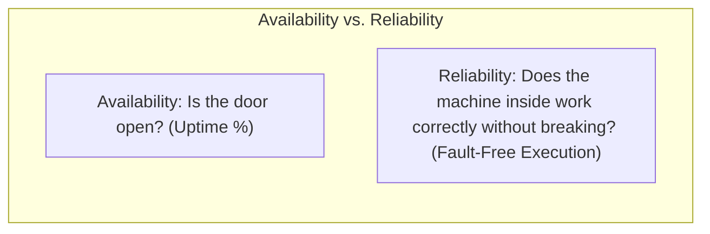
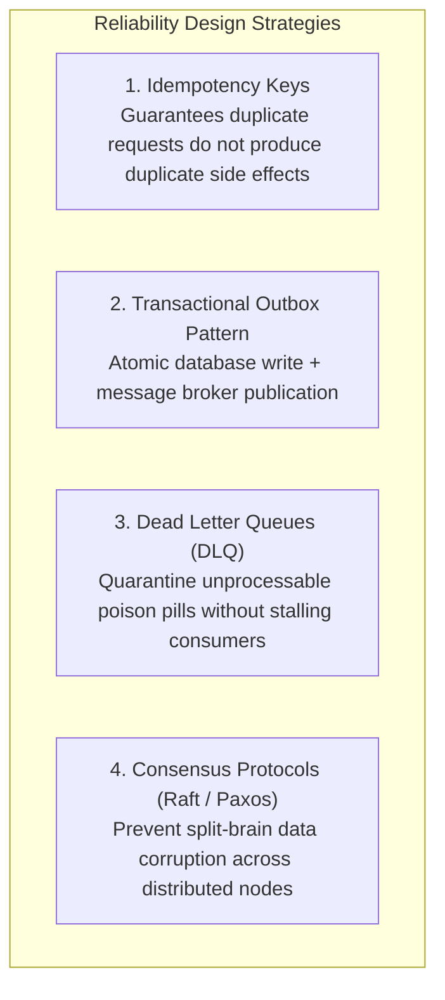

# Reliability

## Definition

Reliability is the probability that a software system or component will perform its specified functions correctly, without failure, under defined operating conditions for a specified period of time. 

While **Availability** simply measures whether a system is *reachable* (answering requests), **Reliability** measures whether the system performs *correctly and consistently* without producing corrupted data, silent errors, or dropped transactions.

---

## Reliability vs. Availability: The Essential Distinction

A system can be 100% available but 0% reliable:
- If an API returns `HTTP 200 OK` instantly for every request, but the payload contains corrupted calculations or blank data, the service is **100% Available** but **0% Reliable**.
- If an API crashes for 2 minutes every day, but processes 100% of all submitted transactions with absolute mathematical accuracy and zero corrupted records, it has lower Availability (99.86%) but **High Reliability**.

---

## Why It Matters

In mission-critical enterprise systems, silent data corruption, dropped financial events, and partial distributed writes are far more dangerous than simple outages:
- **Banking / Payments**: A dropped message or non-idempotent retry that debits a customer's account twice results in severe regulatory sanctions and financial liability.
- **Healthcare & Aviation**: An incorrect sensor calculation or dropped telemetry event risks human life.
- **Supply Chain**: Inventory phantom records cause warehouses to accept orders that cannot be physically fulfilled.

---

## How to Measure

Reliability is quantified using empirical probability and failure metrics:

### 1. Mean Time Between Failures (MTBF)
$$\text{MTBF} = \frac{\text{Total Operational Time}}{\text{Total Number of Failures}}$$

### 2. Failure Rate ($\lambda$)
$$\lambda = \frac{1}{\text{MTBF}}$$

### 3. Reliability Function $R(t)$
Assuming a constant failure rate (exponential distribution):
$$R(t) = e^{-\lambda t} = e^{-\frac{t}{\text{MTBF}}}$$
Where $R(t)$ is the probability that the system survives from time $0$ to time $t$ without a single failure.

### 4. SRE Error Budget
In Google SRE methodology, reliability is tracked via Service Level Objectives (SLOs):
$$\text{Error Budget} = 100\% - \text{SLO}$$
If an SLO is 99.9% successful transactions, the error budget is 0.1%. When the error budget is exhausted by production failures, all feature deployments are blocked until reliability work restores stability.

---

## Architecture Implications

Building high-reliability software requires shifting from "preventing all failures" to **"designing for failure"**:
- **Defensive Programming & Fail-Fast Boundaries**: Validate all inputs strictly at the boundary; terminate corrupted internal states immediately rather than allowing corruption to propagate.
- **Data Integrity Guarantees**: Enforce transactional invariants using two-phase locking, snapshot isolation, or transactional outbox patterns.
- **Eliminating Cascading Failures**: Isolate unreliable third-party integrations with circuit breakers, timeouts, and fallback caches.

---

## Design Strategies

1. **Idempotent Consumers**: Every mutating API and message handler must accept an `Idempotency-Key`. If a network timeout causes a client to retry, the server recognizes the key, skips re-execution, and returns the cached result.
2. **Transactional Outbox**: Never perform a database update and a message broker publish in the same application method without distributed coordination. Write the event to an outbox table within the same local database transaction, then rely on a reliable CDC relay (e.g., Debezium) to stream to Kafka.
3. **Poison Pill Quarantine**: When a malformed message repeatedly crashes a worker, route it to a Dead Letter Queue (DLQ) after 3 retries, alerting on-call engineers while allowing the pipeline to continue processing healthy events.

---

## Trade-offs

| Gained Benefit | Sacrificed Dimension | Why the Tension Exists |
|:---|:---|:---|
| **Absolute Data Reliability** | **Throughput & Latency** | Strong ACID transactions, distributed locking, and synchronous fsync replication degrade write performance. |
| **Fault Tolerance & Redundancy** | **Development Velocity** | Writing comprehensive retry logic, compensations, Sagas, and DLQ tooling requires substantially more engineering effort. |
| **Strict Correctness** | **Availability (CAP)** | Under network partitions, a reliable system will reject writes rather than risk accepting corrupted or conflicting states. |

---

## Example Requirements

- **ASR-REL-01**: "The Ledger Service must ensure **zero double-entry or duplicate balance adjustments** across all payment flows. 100% of payment mutation requests must be idempotent using unique transaction tokens."
- **ASR-REL-02**: "The system must maintain an **Error Budget burn rate of $\le 1.0$** over any rolling 30-day window, ensuring that unhandled 5xx server exceptions account for less than **0.01%** of total transaction volume."
