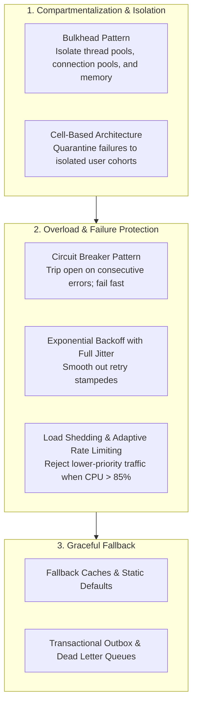

# Resilience

## Definition

Resilience is the architectural capacity of a software system to withstand, adapt to, absorb, and recover gracefully from internal component failures, external dependency outages, network disruptions, and unforeseen operational stress, while continuing to provide essential business functionality without catastrophic collapse.

Where traditional engineering focused on "fault prevention" (trying to build unbreakable components), resilient architecture embraces **"fault tolerance and containment"**—accepting that in large-scale distributed systems, hardware, networks, and services fail continuously.

---

## Why It Matters

- **Blast Radius Containment**: Without resilience mechanisms, a minor glitch in a non-essential service (e.g., an avatar upload service hanging) causes thread pool exhaustion that cascades upward, taking down the entire enterprise portal.
- **Continuous Business Continuity**: Ensures that during third-party payment gateway downtime or regional data center disruptions, customers can still browse catalogs, place items in carts, and queue orders.
- **Mitigating the "Thundering Herd" Problem**: Prevents recovering systems from being immediately re-crashed by millions of queued, simultaneous client retries.

---

## How to Measure

1. **Mean Time to Recover (MTTR)**: Time elapsed from a component crash or network partition to automatic self-healing and restoration of service (target: $< 30\text{ seconds}$).
2. **Failure Blast Radius**: Percentage of total enterprise revenue or user transactions impacted when any single non-critical microservice crashes (target: $< 5\%$).
3. **Degradation Success Ratio**: Percentage of customer requests successfully fulfilled with a graceful fallback during an upstream dependency outage (target: $> 95\%$).
4. **Resilience Score via Chaos Engineering**: Percentage of automated chaos experiments (e.g., node termination, packet loss injection) survived without human intervention or SLA violations.

---

## Architecture Implications

Building resilient software requires eliminating tight temporal, spatial, and data coupling:
- **Temporal Decoupling**: Systems must communicate asynchronously where possible via durable message queues, decoupling caller execution from callee availability.
- **Fail-Soft & Graceful Degradation**: Architecting features to drop non-essential enhancements (e.g., personalized recommendations) when under stress, preserving the core transaction path (checkout).
- **Self-Healing Infrastructure**: Designing compute layers to be cattle, not pets—stateless containers automatically replaced by orchestrators upon health probe failure.

---

## Design Strategies

### 1. Circuit Breaker Pattern
Monitors outbound calls to external dependencies. If failure rates cross a defined threshold (e.g., 50% failures over 10 seconds), the circuit **Trips Open**. Subsequent requests immediately fail fast or return fallback responses without placing any load on the dying dependency. After a sleep window, it enters **Half-Open** to test recovery.

### 2. Exponential Backoff with Jitter
Retrying a failed service immediately at fixed intervals synchronizes all callers into a massive traffic wave ("thundering herd"). Always add randomized jitter:

$$t_{\text{wait}} = \text{random}(0, \min(t_{\text{max}}, t_{\text{base}} \times 2^{\text{attempt}}))$$

### 3. Bulkhead Pattern
Like watertight compartments in a ship, separate critical workloads into independent pools. If an analytics query exhausts its thread pool, the customer payment thread pool remains completely unaffected.

---

## Trade-offs

| Gained Benefit | Sacrificed Dimension | Why the Tension Exists |
|:---|:---|:---|
| **High Resilience & Fail-Soft** | **Data Consistency** | Graceful degradation often requires serving stale cached data or accepting orders into queues without real-time inventory validation. |
| **Circuit Breakers & Retries** | **Mental & Architectural Complexity** | Developers must design fallback states, compensation flows, idempotency keys, and error-handling paths for every call. |
| **Bulkhead Isolation** | **Hardware Resource Efficiency** | Partitioning thread and connection pools prevents full resource sharing, resulting in slightly lower overall hardware utilization under normal load. |

---

## Example Requirements

- **ASR-RES-01**: "All external HTTP and gRPC service integrations must be protected by a **Circuit Breaker** that opens when the failure rate exceeds **50% over a 10-second rolling window**, with a **5-second half-open probe interval** and an immediate fallback to cached responses."
- **ASR-RES-02**: "All network retries must enforce **Exponential Backoff with Full Jitter** capped at a maximum of 3 attempts, preventing thundering herd stampedes during upstream service recovery."
